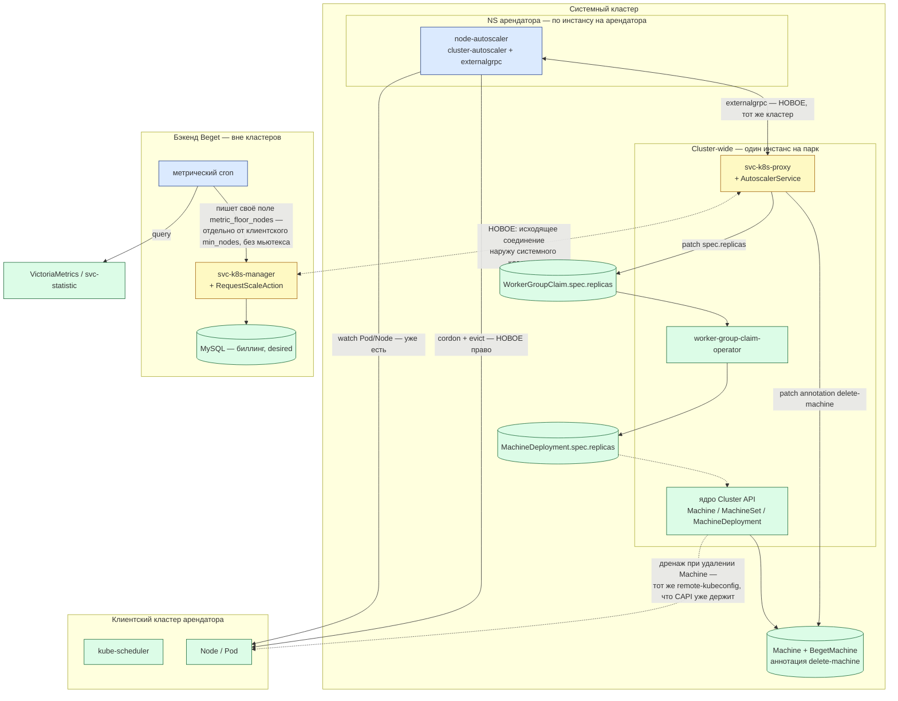
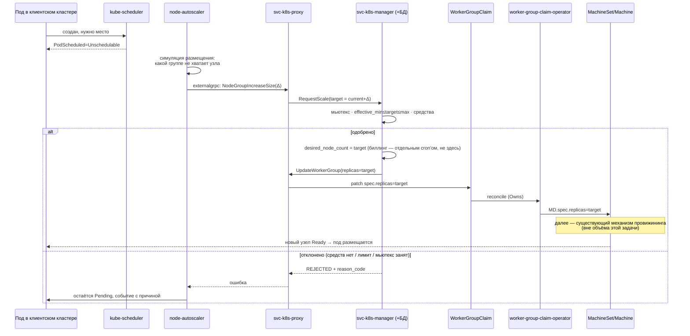
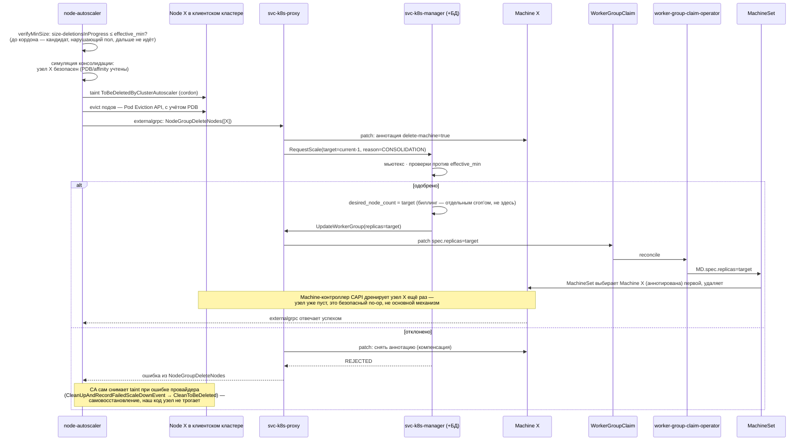
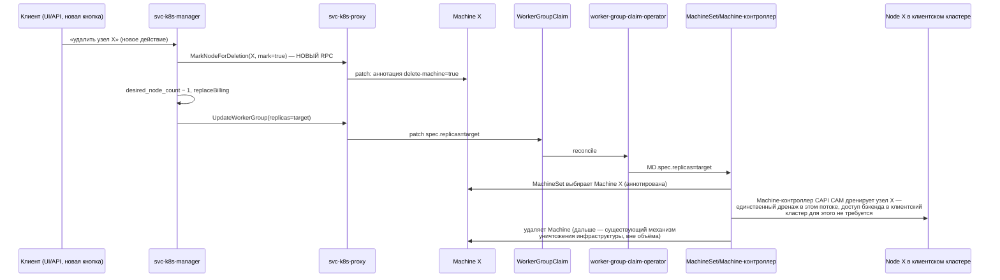

# K8S-728: архитектурная схема автоскейлинга узлов

Компаньон к [K8S-728-signal-based-autoscaling.md](K8S-728-signal-based-autoscaling.md) — тот
документ отвечает «что и почему», этот — «что где стоит, что с чем соединено и что будет, если
компонент откажет или будет скомпрометирован». Читать оба вместе; здесь решения не переобосновываются
заново, только раскладываются по месту. Пользовательские сценарии —
[K8S-728-user-scenarios.md](K8S-728-user-scenarios.md). Перечень и порядок работ —
[K8S-728-work-breakdown.md](K8S-728-work-breakdown.md). Синтезирующее ТЗ —
[K8S-728-implementation-spec.md](K8S-728-implementation-spec.md).

В инвентарь и на схемы включены только компоненты, которые предложенные изменения **создают, меняют
или через которые проходит новый сигнал**. Существующая инфраструктура на соседних участках
(провижининг самого VPS, разметка узла после регистрации и т. п.) в объём не входит и не называется —
она не меняется и не нужна для понимания предложения.

Статус: черновик для обсуждения, синхронизирован с основным документом на момент написания.

---

## 0. Как читать схемы

- 🔵 **синим** — новые компоненты и связи, которых сегодня нет;
- 🟢 **зелёным** — существующие компоненты, код которых не меняется;
- 🟡 **жёлтым** — существующие компоненты, в которые добавляется новая функциональность (не с нуля, но правится код);
- пунктир — существующая связь, показанная для контекста, но не являющаяся предметом этой задачи.

---

## 1. Инвентарь компонентов

| Компонент | Статус | Где физически живёт | Роль в этой задаче | Учётные данные |
|---|---|---|---|---|
| **`node-autoscaler`** | 🔵 новый | Системный кластер, **NS арендатора**, по инстансу на арендатора | Ядро `cluster-autoscaler` (флаг `--enforce-node-group-min-size=true`) + `externalgrpc`-клиент. Решает «сколько узлов нужно группе прямо сейчас» и физически дренирует узел перед уменьшением; сам же активно доращивает группу до `effective_min`, если он поднялся, даже без Pending-подов | **Один** kubeconfig — клиентский кластер того же арендатора (чтение Pod/Node уже есть; cordon+evict — новое право). Никаких прав в системный кластер не требуется вовсе — все CAPI-объекты трогает `svc-k8s-proxy` |
| `worker-group-claim-operator` | 🟢 существующий | Системный кластер, **один инстанс на весь парк** | Реплицирует `WorkerGroupClaim.spec` в `MachineDeployment.spec` — единственный писатель `MD.spec.replicas`; сигнал автоскейлинга идёт только через это поле | только объекты системного кластера — remote-креды не нужны вовсе |
| Ядро Cluster API (Machine/MachineSet/MachineDeployment-контроллеры) | 🟢 существующий, upstream-проект | Системный кластер, **один инстанс на весь парк** | Управляет жизненным циклом `Machine`; читает аннотацию `delete-machine`, которую ставит наш новый примитив (§3.5 основного документа); при удалении `Machine` **сам** дренирует узел, независимо от того, кто попросил удаление | remote-kubeconfig клиентского кластера — тот же самый, что CAPI уже создаёт и хранит при провижининге кластера |
| `svc-k8s-proxy` | 🟡 существующий + новое | **Системный кластер, один инстанс на весь парк** (та же форма, что `worker-group-claim-operator`) | Единственная точка, говорящая **и** с системным кластером (CAPI-объекты, in-cluster), **и** наружу — с бэкендом Beget. Новое: сервер `AutoscalerService` (принимает `externalgrpc` от CA — тот же кластер, соседний под), новый исходящий клиент к `svc-k8s-manager` | in-cluster ServiceAccount на CAPI-объекты (уже есть) + новое **исходящее сетевое соединение наружу кластера**, к manager'у (раньше proxy было только сервером, входящих соединений снаружи не открывал). **⚠️ Известная брешь, решения нет:** `AutoscalerService` — один процесс на весь парк, а `externalgrpc` не несёт идентичности вызывающей стороны — ничем не подтверждено, что `node-autoscaler` арендатора А не достучится через этот канал до группы арендатора Б (детали — §5.4 основного документа) |
| `svc-k8s-manager` | 🟡 существующий + новое | **Бэкенд Beget — вне кластеров** | Владелец БД и биллинга. Новое: `RequestScaleAction` — internal-ручка, принимающая запрос на скейлинг и решающая, одобрить ли его | доступ к MySQL, к `PriceFetcher`/биллинг-сервисам — уже есть |
| Метрический cron (пол) | 🔵 новый | Бэкенд Beget, внутри `svc-k8s-manager` | Периодически читает загрузку группы и пишет **своё** поле `autoscale_metric_floor_nodes` — отдельное от клиентского `min_nodes`, без общего мьютекса; эффективный пол считает `svc-k8s-proxy` (§2.2 основного документа) | доступ к VictoriaMetrics через `svc-statistic` (существующий канал) |
| MySQL | 🟢 существующий | Бэкенд Beget | Источник истины: биллинг, `desired_node_count`, границы `min`/`max` | — |
| VictoriaMetrics / `svc-statistic` | 🟢 существующий | Observability-контур | Источник загрузки для метрического пола | — |

---

## 2. Почему `node-autoscaler` — per-tenant, а не общий процесс

Компоненты в системном кластере делятся на две формы по одному критерию: держит ли компонент
remote-kubeconfig в чужой (клиентский) кластер конкретного арендатора.

- **Компоненты, которые трогают только объекты самого системного кластера** — `worker-group-claim-operator`,
  ядро CAPI, `svc-k8s-proxy` — не нуждаются в разделении по арендаторам: один набор прав безопасен
  для всех сразу, разделять нечего.
- **`node-autoscaler` держит remote-kubeconfig в клиентский кластер** конкретного арендатора (чтение
  Pod/Node, а для scale-down — cordon+evict). Общий процесс держал бы в себе credentials на всех
  арендаторов сразу — баг или компрометация одного процесса стали бы проблемой всего парка. По
  одному инстансу на арендатора периметр компрометации ограничен структурно: максимум один арендатор.

`node-autoscaler` ходит в чужой кластер — значит он обязан быть во второй форме, выбора здесь нет.

**Оговорка к аргументу «периметр компрометации ограничен одним арендатором».** Она верна для
доступа `node-autoscaler` **в клиентский кластер** (remote-kubeconfig, K8s RBAC — там изоляция
инстансов настоящая, по независимым учётным данным). Она **не** доказана для канала
`node-autoscaler ↔ AutoscalerService`: последний — общий процесс на весь парк, и то, привязывает ли
он входящий запрос к конкретному арендатору, пока не решено — известная брешь без решения, §5.4
основного документа.

---

## 3. Топология

Схема намеренно останавливается на `Machine`/`BegetMachine`: что происходит дальше (фактическое
создание или уничтожение VPS) — существующий, не меняющийся механизм, вне объёма этой задачи.

**Свежая граница на этой схеме — не системный кластер сам по себе (он и так уже граница), а стрелка
`PRX ⇄ MGR`.** До этой задачи `svc-k8s-proxy` не открывал исходящих соединений наружу вообще — только
принимал входящие от manager'а. Теперь у процесса внутри системного кластера появляется исходящее
сетевое соединение к бэкенду за его пределами — это единственная точка, где периметр кластера
пересекается новым трафиком, и именно её стоит проверять сетевыми политиками в первую очередь.

---

## 4. Поток «рост» (scale-up)

**Комментарий.** Ни один шаг здесь не создаёт узел в обход `WorkerGroupClaim` — сигнал только
двигает `target_replicas`, а весь путь дальше (`WGC → оператор → MachineDeployment → CAPI`) — тот же
самый, что при ручном изменении группы клиентом. Именно поэтому биллингу не нужна новая модель: это
тот же код, что уже считает деньги за ручной скейл.

**Второй, независимый триггер того же `NodeGroupIncreaseSize`.** Кроме Pending-пода, тот же путь
запускает сам CA на каждом reconcile-цикле, если метрический пол (§2.2 основного документа) поднялся
выше текущего числа узлов, а флаг `--enforce-node-group-min-size` включён — без Pending-подов и без
участия `kube-scheduler` на этой диаграмме. Дальше по цепочке (`PRX → MGR → WGC → OP → CAPI`) —
шаги идентичны.

---

## 5. Поток «уменьшение через CA» (scale-down)

**Комментарий.** Дренаж здесь делает **сам CA**, используя свой кредит на клиентский кластер — это
не опция, а встроенное поведение ядра (проверено по исходному коду). Аннотация на `Machine`
гарантирует, что `MachineSet`, уменьшая число реплик, снесёт именно тот узел, который CA уже
опустошил, а не случайный по своей политике удаления.

---

## 6. Поток «удаление узла» — новая кнопка, без CA

Сегодня во фронте нет кнопки «удалить узел» — есть «Пересоздать узел», и её текущая реализация
(прямое удаление `Machine`, `MachineDeployment` создаёт такую же замену) для этой семантики
корректна и не меняется. Поток ниже — **новая** возможность: настоящее удаление, уменьшающее размер
группы, которую только сейчас становится чем реализовать.

**Комментарий.** Здесь CA не участвует вовсе, поэтому и его дренаж не нужен — узел безопасно снимает
штатный Machine-контроллер CAPI. Существующая кнопка «Пересоздать узел» этот поток не использует и
никак не меняется — новый примитив (аннотация) живёт рядом, для отдельной новой кнопки.

---

## 7. Влияние: что произойдёт, если компонент недоступен или скомпрометирован

| Компонент | Недоступен | Скомпрометирован |
|---|---|---|
| `node-autoscaler` (одна инстанция) | Автоскейлинг **только этого арендатора** останавливается (ни вверх, ни вниз); ручной скейл через API продолжает работать; остальные арендаторы не задеты | Атакующий получает cordon+evict в клиентском кластере **одного** арендатора — периметр компрометации структурно ограничен, шире не расползается (§2) |
| `svc-k8s-proxy` (`AutoscalerService`) | Все `node-autoscaler` теряют канал к бэкенду — растить/уменьшать нельзя нигде через CA; ручной путь через внешний API продолжает работать, он им не пользуется | Может слать `RequestScale` от имени любого арендатора, но manager всё равно применяет мьютекс/лимиты/проверку средств — ущерб ограничен «нежелательным скейлингом в пределах уже действующих лимитов», не бесконтрольным созданием ресурсов |
| `svc-k8s-manager` (`RequestScaleAction`) | Сигналы от CA отклоняются на связи (fail-safe: раз ответа нет, ничего не меняется) | Даёт контроль над биллингом конкретной группы — периметр не шире уже существующего `UpdateConfigurationAction`, новый код лишь переиспользует тот же путь |
| `worker-group-claim-operator` | Изменения `WGC.spec` не долетают до `MachineDeployment` — скейлинг не работает ни для одного арендатора **вообще**, включая ручной. Это уже так сегодня — не новый риск от автоскейлинга | — (не новый периметр) |
| Ядро Cluster API | Останавливается весь жизненный цикл `Machine` — не только автоскейлинг, а вообще создание/удаление узлов платформой | — (существующий риск, платформа и так на нём стоит) |
| Метрический cron (пол) | `metric_floor_nodes` перестаёт обновляться и застывает на последнем значении — не опасно само по себе, эффективный пол просто устаревает | Может задрать/занизить `metric_floor_nodes`, но эффективный пол всё равно зажат `max_nodes` (§2.2 основного документа) — предел ущерба структурный, не зависит от бдительности проверки |

---

## 8. Источники

Компонентный состав, потоки и находки о дренаже — из
[K8S-728-signal-based-autoscaling.md](K8S-728-signal-based-autoscaling.md) (§1–§5), включая проверку
по исходному коду `sigs.k8s.io/cluster-autoscaler`
(`pkg/core/scaledown/actuation/{actuator,group_deletion_scheduler,delete_in_batch}.go`,
`pkg/core/scaleup/orchestrator/{orchestrator,executor}.go`, `pkg/core/static_autoscaler.go`) и
топологию системного кластера, уточнённую в диалоге при подготовке этих документов.
