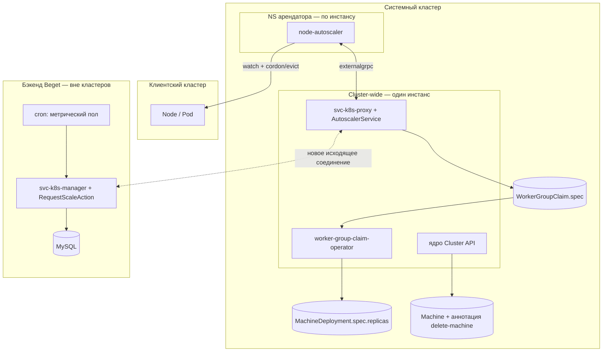

# K8S-728: техническое задание на реализацию

**Статус: черновик для обсуждения.** Синтезирует три компаньон-документа в единую спецификацию,
готовую к разбивке на задачи трекера. Обоснование решений здесь не повторяется — только сведено к
тому, что нужно **построить** и по какому критерию считать построенное **готовым**.

Источники синтеза:
[K8S-728-signal-based-autoscaling.md](K8S-728-signal-based-autoscaling.md) (механизм и контракт),
[K8S-728-architecture-diagram.md](K8S-728-architecture-diagram.md) (расположение и связи),
[K8S-728-work-breakdown.md](K8S-728-work-breakdown.md) (компоненты и порядок),
[K8S-728-user-scenarios.md](K8S-728-user-scenarios.md) (поведение).

---

## 1. Предмет и цель

Автоскейлинг узлов для кластеров под ClusterAPI, при котором решение «нужно больше/меньше узлов»
никогда не создаёт и не удаляет ресурсы в обход бэкенда: сигнал только поднимает/опускает `replicas`
существующей `WorkerGroupClaim` — тем же путём, каким сегодня работает ручное изменение конфигурации.
Биллинг не требует новой модели, потому что это тот же код, что уже считает деньги за ручной скейл.

Движок — `cluster-autoscaler`, подключённый штатным протоколом `externalgrpc`, без форка ядра.
Метрики владеют нижней границей (полом), планировщик (CA) — фактическим числом в её пределах.

---

## 2. Границы задачи

| Входит | Не входит | Почему |
|---|---|---|
| Механизм сигнала CA → бэкенд → биллинг → кластер (рост и уменьшение) | Реализация фронта (UI-контролы диапазона, кнопка «удалить узел») | Контракт самодостаточен, фронт — фаза 5 work-breakdown, отдельная задача |
| Метрический пол как предохранитель от опасной консолидации без `requests` | Полное решение проблемы «нет роста без `requests`» | Известное, задокументированное ограничение (§2.4 основного документа), закрывается частично (пол) и требует отдельного эпика VPA для остального |
| Примитив выбора конкретного узла на удаление (`cluster.x-k8s.io/delete-machine`) | Финальное продуктовое решение по гранулярности тарификации (О2), упреждающему буферу (О6) | Продуктовые решения вне технического периметра, не блокируют реализацию |
| Новый узкий RBAC на cordon+evict в клиентском кластере | Расширение прав существующих контроллеров ярусов арендатора (ccm/csrc) | Не трогаются вовсе, см. К2 основного документа |
| Фикс четырёх no-regret дефектов (Фаза 0 work-breakdown) | Полная переработка биллинг-модели или per-node биллинга | Существующая per-WorkerGroup модель достаточна, см. §4 основного документа |

---

## 3. Архитектура (сводно)



Полная топология, обе стороны компрометации/влияния и все три sequence-диаграммы —
[architecture-diagram.md](K8S-728-architecture-diagram.md).

---

## 4. Контракты — спецификация

### 4.1 `RequestScale` — новый internal-контракт (`api0/cloud/k8s-manager`)

```proto
message RequestScaleRequest {
  string cluster_id       = 1;
  string worker_group_id  = 2;
  int32  target_replicas  = 3;
  string reason           = 4;   // "UNSCHEDULABLE_PODS" | "CONSOLIDATION" | "METRIC_FLOOR"
  string request_id       = 5;   // идемпотентность
}

message RequestScaleResponse {
  int32  accepted_replicas = 1;
  string state              = 2; // "ACCEPTED" | "CLAMPED" | "REJECTED"
  string reason_code        = 3;
}
```

Обработчик — новое действие на `WorkerGroupController` (internal), переиспользует стек
`UpdateConfigurationAction` (`WorkerGroupServiceFactory`, `SharedMutexTrait`,
`PriceFetcher`/`BillingServiceFactory`), но ищет группу по `cluster_id`/`worker_group_id`, а не по
`CustomerID` сессии. **Проверка границ — против `effective_min`** (та же формула, что в §4.3, по
собственным полям manager'а в MySQL, без обращения к proxy), не против сырого `min_nodes` — иначе
второй уровень защиты слабее, чем задуман (§2.2 основного документа).

**Биллинг здесь не вызывается.** `RequestScaleAction` пишет только `desired_node_count` и толкает
`UpdateWorkerGroup` — синхронно, без задержки. `replaceByTemplateId` (создание billing-опции)
вызывает отдельный периодический cron, полностью декаплированный от этого обработчика; ручной путь
клиента (`UpdateConfigurationAction`) биллит как сегодня, синхронно. Выбор и отклонённые
альтернативы — §4.1 основного документа.

### 4.2 `MarkNodeForDeletion` — новый RPC (`api0/cloud/k8s-proxy`, `WorkerGroupService`)

```proto
message MarkNodeForDeletionRequest {
  Metadata meta = 1;
  bool     mark = 2;   // true — пометить, false — снять (компенсация)
}

message MarkNodeForDeletionResponse {
  bool success = 1;
}
```

Обёртка над `Service.MarkMachineForDeletion` (§4.5 ниже). Вызывается manager'ом для новой
возможности «удалить узел» (В2 в user-scenarios); `node-autoscaler` этот RPC не вызывает — его путь
идёт напрямую вызовом того же метода в процессе `svc-k8s-proxy`, без сети.

### 4.3 `AutoscalingSpec` — расширение `UpdateWorkerGroupRequest` (`api0/cloud/k8s-proxy`, `workerGroup.proto`)

```proto
message AutoscalingSpec {
  bool  enabled            = 1;  // редактирует клиент
  int32 min_nodes          = 2;  // редактирует клиент
  int32 max_nodes          = 3;  // редактирует клиент
  int32 metric_floor_nodes = 4;  // пишет только cron, не выставляется во внешнем контракте
}
```

Добавляется полем `15` в `UpdateWorkerGroupRequest` (следующий свободный номер после `k8s_version`
= `14`). `svc-k8s-proxy` при ответе на `NodeGroupMinSize` считает:

```
effective_min = min( max(min_nodes, metric_floor_nodes), max_nodes )
```

### 4.4 Покрытие `externalgrpc` (CA-facing, `AutoscalerService`)

| RPC | Реализуется | Источник значения |
|---|---|---|
| `NodeGroups` | да | WG с `autoscale_enabled=true` |
| `NodeGroupTargetSize` | да | `desired_node_count` |
| `NodeGroupMinSize` | да | `effective_min` (§4.3) |
| `NodeGroupMaxSize` | да | `max_nodes` |
| `NodeGroupIncreaseSize` | да | `RequestScale`, всё-или-ничего (§4.6) |
| `NodeGroupDeleteNodes` | да | `MarkMachineForDeletion` + `RequestScale`, всё-или-ничего |
| `NodeGroupNodes` | да | список `Machine`/`Node` группы |
| `NodeGroupGetOptions` | да, дефолты до решения О8 | `ScaleDownUtilizationThreshold`/`ScaleDownUnneededTime` — константы CA до продуктового решения |
| `PricingNodePrice` | опционально MVP | `Calculator`, нужен только для `Balanced`-consolidation |
| остальные 6 RPC | `Unimplemented` | протокол это допускает |

### 4.5 `Service.MarkMachineForDeletion` (новый метод, `svc-k8s-proxy`, `internal/service`)

```go
func (s *Service) MarkMachineForDeletion(actx *appctx.Context, meta Meta, mark bool) error {
    const deleteMachineAnnotation = "cluster.x-k8s.io/delete-machine"
    machine := &clusterv1.Machine{}
    if err := s.Client.Get(actx.Context, client.ObjectKey{Name: meta.Name, Namespace: meta.Namespace}, machine); err != nil {
        return fmt.Errorf("failed to get Machine %s/%s: %w", meta.Namespace, meta.Name, err)
    }
    patch := client.MergeFrom(machine.DeepCopy())
    if mark {
        if machine.Annotations == nil {
            machine.Annotations = map[string]string{}
        }
        machine.Annotations[deleteMachineAnnotation] = "true"
    } else {
        delete(machine.Annotations, deleteMachineAnnotation)
    }
    return s.Client.Patch(actx.Context, machine, patch)
}
```

### 4.6 Инвариант «всё-или-ничего»

`NodeGroupIncreaseSizeResponse`/`NodeGroupDeleteNodesResponse` — пустые тела (проверено по
`externalgrpc.proto`), протокол не умеет передать частичное исполнение. `AutoscalerService` обязан:
при `CLAMPED`/`REJECTED` от `RequestScale` — не применять запрошенное изменение частично, вернуть
gRPC-ошибку на весь вызов, для `DeleteNodes` — снять все выставленные в этом вызове аннотации перед
возвратом ошибки.

### 4.7 Миграция БД (`worker_group`)

```sql
ALTER TABLE worker_group
  ADD COLUMN autoscale_metric_floor_nodes INT UNSIGNED NOT NULL DEFAULT 0;
```

Отдельная колонка, свой писатель (cron), не связана мьютексом с `autoscale_min_nodes`/
`autoscale_max_nodes` — резолюция О1.

---

## 5. Компоненты и порядок работ

Пять фаз, зависимости между ними — [work-breakdown.md](K8S-728-work-breakdown.md#порядок-фаз-и-почему-именно-такой).
Кратко: **0** no-regret фиксы (независимо, первым) → **1** контракты (§4 этого документа, блокирует
всё) → **2**/**3** `svc-k8s-manager`/`svc-k8s-proxy` (параллельно после 1) → **4** `node-autoscaler`
(после готового `AutoscalerService`) → **5** продукт/фронт (не блокирует техническую часть).

---

## 6. Поведение — критерии приёмки

Формат: **Дано / Когда / Тогда**, по сценариям [user-scenarios.md](K8S-728-user-scenarios.md).

### Рост

| # | Дано | Когда | Тогда |
|---|---|---|---|
| А1 | Группа ниже `max_nodes`, под с `requests` не помещается | Планировщик выставил `Unschedulable` | Новый узел создаётся, биллинг обновлён тем же путём, что ручной скейл |
| А2 | Группа на `max_nodes` | Под с `requests` не помещается | Под остаётся `Pending`, событие `AT_MAX_NODES`, новый узел не создаётся |
| А3 | Под без `requests`, реальная нагрузка высокая | — | `Unschedulable` не возникает, рост не запускается — задокументированное ограничение, не регрессия |
| А4 | Под без `requests`, метрический пол выше текущего числа узлов, `--enforce-node-group-min-size=true` | Cron поднял `metric_floor_nodes` | Узел создаётся без Pending-пода, через `NodeGroupIncreaseSize`, `reason=METRIC_FLOOR` |
| А5 | Клиент заблокирован за неуплату | Триггер роста (А1 или А4) | `RequestScale` отклонён с `INSUFFICIENT_FUNDS`; уже работающие узлы не трогает — это отдельная линия защиты от роста, не от механизма остановки (А7) |
| А6 | А5 повторяется несколько циклов | — | CA переходит в backoff на группу (5→30 мин, сброс через 3 ч), реактивный рост той же группы тоже не срабатывает в этом окне — ожидаемо, не баг |
| А7 | Блокировка клиента доходит до реальной остановки | Биллинг ставит `ClusterClaim.spec.extraEnvs.begetCltSuspend=true` | Все узлы останавливает **внешний механизм**, вне периметра `RequestScaleAction`/`node-autoscaler`; `replicas`/`desired_node_count` не меняются. Реакция `node-autoscaler` на это — не проверена (О10) |

### Уменьшение

| # | Дано | Когда | Тогда |
|---|---|---|---|
| Б1 | Узел недогружен по `requests`, PDB/affinity разрешают | CA завершил симуляцию | CA сам дренирует и вызывает `NodeGroupDeleteNodes`; `Machine` помечена аннотацией до уменьшения `replicas` |
| Б2 | Узел недогружен по `requests`, но PDB/anti-affinity не разрешают | — | Ни один узел не удаляется, `reason_code=SCALE_DOWN_BLOCKED`; обхода нет ни через CA, ни через В2 (О11) — известное ограничение, не регрессия |
| Б3 | Cron опустил `metric_floor_nodes` | — | Число узлов не меняется само по себе — снято только ограничение снизу |
| Б4 | Клиент меняет `max_nodes`, cron одновременно меняет `metric_floor_nodes` | Оба изменения приходят почти одновременно | Оба применяются без потери, гонки нет (раздельные колонки, §4.7) |
| Б5 | Клиент понижает `max_nodes` ниже текущего факта | — | Дальнейший рост выше нового потолка запрещён немедленно; существующие узлы принудительно не сносятся |
| Б6 | Одновременно найдено N кандидатов на удаление за один цикл | Симуляция консолидации CA | Отбор кумулятивный (`size − deletionsInProgress ≤ effective_min`, счётчик уменьшается по ходу пачки) — группа не опустится ниже `effective_min`, даже если по отдельности каждый кандидат выглядел безопасным |

### Ручное управление узлом

| # | Дано | Когда | Тогда |
|---|---|---|---|
| В1 | Клиент нажимает «Пересоздать узел» | — | Поведение не меняется: `Machine` удаляется напрямую, `MachineDeployment` создаёт замену того же размера |
| В2 | Клиент нажимает «Удалить узел» (новая кнопка, фаза 5) | — | `MarkNodeForDeletion(mark=true)` → `desired_node_count - 1` → штатный дренаж CAPI-контроллером; при отказе — `mark=false`. Если узел заблокирован PDB — зависает в `Terminating` (О11), предварительной проверки PDB в В2 нет |

### Эксплуатация

| # | Дано | Когда | Тогда |
|---|---|---|---|
| Г1 | `node-autoscaler` арендатора недоступен | — | Автоскейлинг только этого арендатора не работает; ручной API продолжает работать; остальные арендаторы не задеты |
| Г2 | `AutoscalerService`/`RequestScaleAction` недоступны | — | Все `node-autoscaler` отклоняются на связи, ничего не меняется молча (fail-safe) |
| Г3 | Нагрузка часто колеблется | Несколько `RequestScale` подряд за короткое время | Сам скейл применяется без задержки на каждый запрос; запись в биллинг — по окну дебаунса (О3), не на каждое изменение |
| Г4 | Новая группа с `autoscale_enabled=true`, cron ещё не считал пол | — | `effective_min = min_nodes` (без метрической надбавки) до первого прогона cron'а |

---

## 7. Конфигурация

### 7.1 Флаги `node-autoscaler`

```
--cloud-provider=externalgrpc
--cloud-provider-gid=<адрес AutoscalerService>
--enforce-node-group-min-size=true   # обязателен — без него пол не создаёт узлы, только тормозит сжатие
--kubeconfig=<клиентский кластер того же арендатора>
```

Остальное — дефолты CA (`--initial-node-group-backoff-duration=5m`,
`--max-node-group-backoff-duration=30m`, `--node-group-backoff-reset-timeout=3h`,
`--cordon-node-before-terminating=true`) — не переопределять без отдельного обоснования (О8).

### 7.2 RBAC в клиентском кластере (новый, узкий)

```yaml
rules:
  - apiGroups: [""]
    resources: ["nodes"]
    verbs: ["get", "list", "watch", "patch"]     # patch — только cordon
  - apiGroups: [""]
    resources: ["pods/eviction"]
    verbs: ["create"]
  - apiGroups: [""]
    resources: ["pods"]
    verbs: ["get", "list", "watch"]
```

Отдельно от существующего read-only `beget:metrics-reader`, не расширяет права `capi-ccm`/
`capi-csr-approver`.

### 7.3 Размещение

`node-autoscaler` — per-tenant, NS арендатора в системном кластере, та же форма, что у остальных
контроллеров ярусов арендатора. `AutoscalerService` (в составе `svc-k8s-proxy`) — cluster-wide, один
инстанс на весь парк.

---

## 8. Риски и открытые вопросы

| # | Вопрос | Статус |
|---|---|---|
| О1 | Кто пишет метрический пол и как избежать гонки с ручным путём | **Закрыт** — отдельная колонка, свой писатель, эффективный пол считается на чтении |
| О2 | Гранулярность тарификации elastic-узлов при дневных ставках | Открыт — продукт + биллинг |
| О3 | Место вызова биллинга — **решено**: полный декаплинг, отдельный cron (§4.1 основного документа), ручной путь клиента не тронут. Открыт только конкретный период cron'а | Частично закрыт — период открыт, техкоманда |
| О4 | p99 «создание узла → Ready» и доля подов с `requests` в реальных кластерах | Открыт — отдельный замер, ops/observability |
| О5 | Семантика кнопки «удалить узел» | **Закрыт** — новая кнопка, существующая «Пересоздать» не трогается |
| О6 | Упреждающий запас (буфер) сверх пола | Открыт — продукт, конфликтует с К1, решение — отдельный аддон |
| О7 | Дренаж узла: кто и как — CA или CAPI | **Закрыт** — проверено по коду, CA дренирует сам, CAPI-дренаж вторичен |
| О8 | Стратегия `ScaleDownUtilizationThreshold`/`ScaleDownUnneededTime` через `NodeGroupGetOptions` | Открыт — техкоманда, не блокирует MVP (`GetOptions` может отдавать дефолты) |
| **О9 ⚠️** | **Известная брешь, решения нет** (§5.4 основного документа): `externalgrpc`-канал между `node-autoscaler` (per-tenant) и `AutoscalerService` (один на парк) не несёт идентичности арендатора — ничем не подтверждено, что арендатор А не может обратиться к группе арендатора Б через общий сервис | **Блокирует старт Фазы 3** (§5 этого документа) до явного решения |
| О10 | Поведение `node-autoscaler` при остановке узлов группы внешним механизмом `begetCltSuspend` (А7 в user-scenarios.md, §5.3 основного документа) — не проверено по коду CA | Открыт — техкоманда, отдельный замер/чтение кода |
| **О11 ⚠️** | **Известное ограничение без решения.** Клиент с нереализуемыми PDB на всех узлах группы не может сжаться ни через CA, ни через В2 (узел зависает в `Terminating`) — `nodeDrainTimeout` не в контракте этой задачи, платформенная настройка админов, пересмотр отложен до фичи с CSI | Продукт + владельцы CSI-фичи, не блокирует MVP — существующее ограничение платформы |
| О12 | Реконсиляция биллинга (§4.1) обязана сверяться с фактическим списком `Machine`, а не с `desired_node_count`, иначе зависший в `Terminating` узел (О11) останется недосчитан в биллинге бессрочно | Техкоманда, при реализации cron'а реконсиляции |

---

## 9. Явно вне объёма этой задачи

- Реализация фронта (§6 основного документа) — контракт самодостаточен, отдельная задача.
- Полное закрытие проблемы «нет роста без `requests`» — метрический пол закрывает только опасное
  сжатие и частичный рост; полный ответ — отдельный эпик VPA.
- Внутреннее устройство провижининга VPS (`capi-provider-beget`, `svc-vps-manager`) — не меняется,
  не описывается (см. вводную оговорку в architecture-diagram.md).
- Расширение прав существующих контроллеров ярусов арендатора — не трогаются.
- Продуктовые решения О2, О6, О8 в финальном виде — технический периметр их не блокирует.

---

## 10. Источники

Все технические решения этого документа проверены по коду платформы (`svc-k8s-proxy`,
`svc-k8s-manager`, `worker-group-claim-operator`) и по исходному коду `sigs.k8s.io/cluster-autoscaler`
— полный список файлов и предикатов проверки в
[K8S-728-signal-based-autoscaling.md §9](K8S-728-signal-based-autoscaling.md#9-источники).
