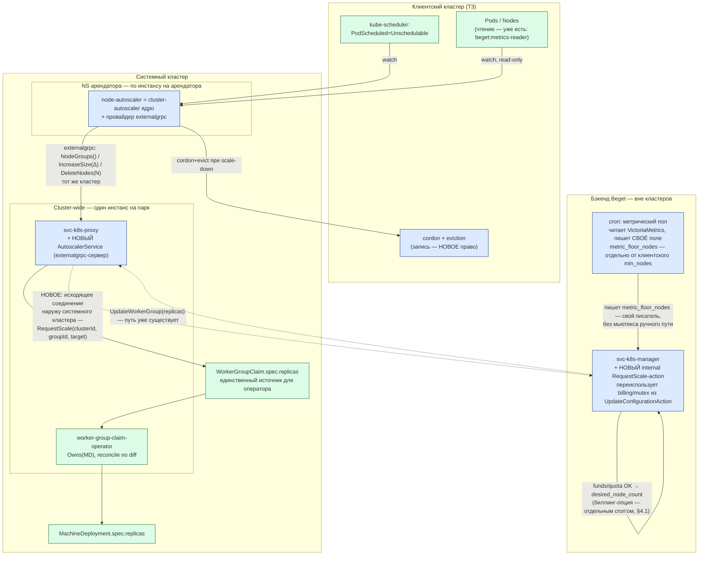

# K8S-728: автоскейлинг узлов через сигнал во внешний бэкенд

Статус: **черновик для обсуждения**. Не PoC, не финальная архитектура — основа для решения по стыкам и контракту.

Схема размещения компонентов, топология и диаграммы потоков — отдельным документом:
[K8S-728-architecture-diagram.md](K8S-728-architecture-diagram.md). Пользовательские сценарии —
[K8S-728-user-scenarios.md](K8S-728-user-scenarios.md). Перечень и порядок работ —
[K8S-728-work-breakdown.md](K8S-728-work-breakdown.md). Синтезирующее ТЗ —
[K8S-728-implementation-spec.md](K8S-728-implementation-spec.md).

Задача: реализовать автоскейлинг узлов для кластеров под ClusterAPI так, чтобы решение «нужно
больше/меньше узлов» никогда не создавало и не удаляло ресурсы в обход бэкенда — потому что биллинг
платформы считает факт из БД `svc-k8s-manager`, а не из кластера. Биллинг узлов сегодня строго
per-WorkerGroup: одна `customerOption` на группу (`count = worker_group.desired_node_count`, ставка
за узел в день), `count` меняется только через `Updater::replaceBilling` из ручного
`updateConfiguration`; per-node биллинга нет. Любой путь, который меняет число узлов мимо этого
механизма, для биллинга не существует.

Ядро предложения: **компонент-наблюдатель никогда не создаёт и не удаляет ресурсы сам** — он только
просит бэкенд изменить число реплик воркер-группы, тем же путём, каким это делает ручное изменение
конфигурации через API. Биллинг не требует новой модели — он корректен настолько, насколько
корректен уже существующий путь «клиент меняет `desired_node_count`».

---

## 1. Ограничения, с которых начинается архитектура

Это не список пожеланий — это то, что уже верно про платформу и не обсуждается:

| # | Ограничение | Источник |
|---|---|---|
| **К1** | В клиентский кластер арендатора нельзя деплоить ничего, кроме аддонов, явно опубликованных в маркетплейсе. Автоскейлинг — не аддон, значит **никакого своего компонента внутри клиентского кластера** | решение владельца платформы |
| **К2** | Компонент, которому нужен доступ в клиентский/infra-кластер конкретного арендатора (remote-kubeconfig), обязан жить **per-tenant, в NS арендатора в системном кластере** — общий процесс на весь парк держал бы в себе credentials на всех арендаторов сразу | решение владельца платформы |
| **К3** | Биллинг узлов строго per-WorkerGroup: одна `customerOption` на группу, `count = worker_group.desired_node_count`, ставка за узел в день. `count` меняется только через `Updater::replaceBilling` из `updateConfiguration`. Per-node биллинга нет | `svc-k8s-manager`, `app/handlers/external/controllers/k8s/v1/actions/workerGroup/UpdateConfigurationAction.php` |
| **К4** | `WorkerGroupClaim`-оператор при каждом расхождении конфигурации перезаписывает `MachineDeployment.Spec.Replicas` значением, посчитанным из `WorkerGroupClaim.spec` (`ensureMachineDeployment`, `existing.Spec.Replicas = desired.Spec.Replicas`), и владеет `MachineDeployment` через `Owns()` без фильтрующего предиката — то есть замечает такое расхождение на своём следующем reconcile. Значит **любой путь, минующий `WGC.spec.replicas`, будет откачен оператором** | `worker-group-claim-operator`, `internal/controller/workergroupclaim_controller.go` (`ensureMachineDeployment`, `SetupWithManager`) |
| **К5** | Наивный двухконтурный скейлинг («метрики двигают число вверх, планировщик — вниз») — известный антипаттерн: он вызывает бесконечную борьбу двух контуров за одно и то же число, и первые лица облачных платформ (GCP, AKS) явно предостерегают от смешивания managed-автоскейлера узлов с внешними метрическими скейлерами той же группы. У числа реплик обязан быть **один** источник решения в любой момент времени | общее свойство систем с двумя независимыми контурами управления одной переменной |
| **К6** | Механизма «убрать конкретный узел из группы, уменьшив её размер» сегодня не существует вовсе. `DeleteNode` в proxy умеет только пересоздать узел (удаляет CAPI Machine напрямую, `replicas` не меняется — `MachineDeployment` создаёт такую же замену) — этим и обеспечивается существующая кнопка «Пересоздать узел», не более и не менее — см. §3.5 | `svc-k8s-proxy`, `internal/service/workergroup.go` (`Service.DeleteNode`) |

---

## 2. Целевая архитектура

### 2.1 Компонент принятия решения — per-tenant в системном кластере

Новый контроллер (условное имя **`node-autoscaler`**) разворачивается **per-tenant, в NS арендатора
в системном кластере**, используя remote-kubeconfig от CAPI на клиентский кластер того же
арендатора.

Размещение per-tenant (не общий процесс на весь парк) ограничивает взрывной радиус одним
арендатором и **не требует новой инфраструктуры сертификатов**: кубконфиг на клиентский кластер
арендатора уже выпускается CAPI при провижининге кластера. Альтернатива (разместить в infra-кластере)
потребовала бы отдельно решать выпуск сертификатов для доступа туда — этой инфраструктуры сегодня
нет.

### 2.2 Разделение ответственности: пол и число

Один источник решения в каждый момент (К5) достигается разделением **что** от **сколько**:

> **Метрики владеют полом (минимумом). Планировщик (`cluster-autoscaler` + провайдер) владеет
> числом в границах `[пол, max]`.**

- **Пол — два независимых поля, не одно.** `autoscale_min_nodes` — как сегодня, меняет только
  клиент вручную. Рядом заводится **новое** поле `autoscale_metric_floor_nodes` — его пишет
  **только** метрический cron, периодически (не в реальном времени), по существующему каналу
  метрик (`k8s.victoria_workergroup_node_{cpu,memory}_used_percent` через `svc-statistic`). Двум
  писателям физически нечего делить — общий мьютекс между клиентским путём и cron'ом не нужен
  вовсе, у каждого своя колонка.
- **Эффективный пол** для CA — `svc-k8s-proxy` считает его **локально**, из полей
  `WorkerGroupClaim.spec`, которые и так уже читает при ответе на `NodeGroupMinSize` (§3.2):
  ```
  effective_min = min( max(autoscale_min_nodes, autoscale_metric_floor_nodes), autoscale_max_nodes )
  ```
  Внешнее `min(...)` обязателен: без него метрический пол мог бы потребовать больше узлов, чем
  клиент оплатил (`max_nodes`) — противоречивое состояние `min > max`, которое CA, скорее всего,
  обработает некорректно. Побочный эффект зажатия полезен сам по себе — это готовый сигнал «клиенту
  не хватает оплаченного потолка при текущей нагрузке», отдельный от объёма этого документа.
- **Число** — решает `cluster-autoscaler` через симуляцию размещения (Pending-поды вверх, PDB/affinity-aware
  consolidation вниз), никогда не опускаясь ниже `effective_min`, никогда не поднимаясь выше `max_nodes`.

**Проверка пола перед выселением — есть, и она надёжнее, чем «одна нода — один узел ниже пола».**
Проверено по коду (`pkg/core/scaledown/unneeded/nodes.go`, `unremovableReason` → `verifyMinSize`):
CA отбирает кандидатов на удаление **до** дренажа, в фазе классификации «unneeded», и на каждом
кандидате в пачке проверяет `size - deletionsInProgress ≤ nodeGroup.MinSize()`, где `size` —
счётчик, который **уменьшается по ходу отбора той же пачки** (не статичное число на начало прохода)
и `deletionsInProgress` учитывает удаления, уже идущие в фоне. Значит CA не одобрит групповое
удаление, которое **кумулятивно** увело бы группу ниже `effective_min`, даже если по отдельности
каждый кандидат выглядел бы безопасным. Узел, не прошедший эту проверку, **не кордонируется и не
дренируется вовсе** — не тратится на него ни один шаг актуации (§5.1).

**Поднятие пола обязано быть активным, иначе он не защищает от того, ради чего заведён.** У CA
есть флаг `--enforce-node-group-min-size` (по умолчанию `false`), проверено по коду
(`pkg/core/scaleup/orchestrator/orchestrator.go`, `ScaleUpToNodeGroupMinSize`,
вызывается каждый reconcile-цикл из `static_autoscaler.go`):

- **выключен** — пол работает только как пассивный тормоз: CA не даст себе сжаться ниже него, но
  **не станет создавать узлы**, чтобы его достичь. Если текущее число уже ниже нового пола, оно
  так и останется ниже до Pending-пода или ручного вмешательства;
- **включён** — CA сам сверяет `TargetSize` с `MinSize` на каждом цикле и, если ниже, доращивает
  группу — `ScaleUpToNodeGroupMinSize` вызывает **тот же исполнитель**, что обычный рост от
  Pending-подов, и в итоге тот же `nodeGroup.IncreaseSize()` — то есть тот же `NodeGroupIncreaseSize`
  из §3.2, новой ручки не требуется.

**Мы должны включать этот флаг.** Без него метрический пол не закрывает главный случай, ради
которого заведён (§2.4): реальная нагрузка высокая, но `requests` не заданы, Pending никогда не
возникает, и CA никогда не растёт сам — пассивный пол здесь бессилен, он защищает только уже
достаточно большую группу от опасного сжатия, а не создаёт мощность с нуля. С флагом включённым
это не переоткрывает войну контуров (К5): он только поднимает число, никогда не опускает, и делает
это тем же путём (`IncreaseSize` → `RequestScale` → биллинг), что и обычный рост — асимметрия
«прогноз только повышает ёмкость» сохраняется механизмом самого CA. Флаг глобальный для процесса
(не per-группа), но безвреден для групп, где метрический пол не поднимает `effective_min` выше
клиентского `min_nodes`, — для них поведение не меняется, разве что сам клиентский `min_nodes`
станет поддерживаться активно, а не только тормозить сжатие.

**Что именно происходит, когда текущее число ниже эффективного минимума — по шагам, проверено по
коду CA:**

1. Каждый reconcile-цикл (~10 с) CA видит `TargetSize < NodeGroupMinSize`, считает нехватку
   (`ScaleUpToNodeGroupMinSize`).
2. Перед вызовом смотрит `IsNodeGroupReadyToScaleUp` — если группа в backoff (см. ниже), пропускает
   попытку целиком, к нам не обращается вовсе.
3. Зовёт `NodeGroupIncreaseSize(delta)` → `AutoscalerService` → `RequestScale` (§3.3).

**У `NodeGroupIncreaseSizeResponse`/`NodeGroupDeleteNodesResponse` тело намеренно пустое** —
протокол `externalgrpc` умеет сообщить только успех или ошибку целиком, частичного исполнения
сказать нечем (проверено по `externalgrpc.proto`). Значит `AutoscalerService` обязан быть
**всё-или-ничего**: при `CLAMPED` или `REJECTED` от manager'а — не применять запрошенный `delta`
частично и не отчитываться успехом, а вернуть CA ошибку на весь вызов. Тихое частичное исполнение
с отчётом «успех» рассинхронизирует внутренний учёт CA (`nodeDeletionTracker`/ожидание узлов) с
реальностью, и разойдётся неявно, а не сразу.

На ошибке CA сам вызывает `RegisterFailedScaleUp` и включает **backoff для всей node group**:
первая пауза 5 минут (`--initial-node-group-backoff-duration`, дефолт), растёт до 30 минут
максимум (`--max-node-group-backoff-duration`), сбрасывается через 3 часа без новых ошибок
(`--node-group-backoff-reset-timeout`) — шторма повторных запросов к нам при устойчивом отказе не
будет, CA сам себя ограничивает. **Существенное следствие**: backoff общий на всю группу, не
только на попытки дотянуть до пола — если пол не достигается из-за нехватки средств, та же группа
на время backoff'а (до 30 минут) не среагирует и на настоящий Pending-под, потому что причина
отказа (деньги) одна и та же для обоих триггеров. Это разумное, а не ошибочное поведение, но не
мгновенное — стоит знать явно, а не предполагать более узкий backoff.

**Понижение пола ничего не инициирует само по себе — это снятие ограничения, а не команда на
удаление.** Когда cron опускает `autoscale_metric_floor_nodes`, реальное решение убрать конкретный узел по-прежнему
целиком остаётся за CA: его собственный непрерывный цикл консолидации (по `requests`, не по
метрикам загрузки, с учётом PDB/affinity) на своём обычном цикле опроса группы увидит новую,
более низкую границу и, если у него **уже есть** кандидат, который его симуляция считает
недогруженным, уберёт его сам — без отдельного триггера с нашей стороны. Так и должно быть: команда
на удаление конкретного узла у метрик отсутствует умышленно (К5) — иначе вернулась бы война двух
контуров.

**Второй, более тонкий рычаг — не выбор узла, а «аппетит» CA к консолидации.** RPC
`NodeGroupGetOptions` в том же протоколе `externalgrpc` (см. §3.2) CA дёргает на **каждой** оценке
scale-down конкретной группы и получает per-группу `ScaleDownUtilizationThreshold`/
`ScaleDownUnneededTime`. Через неё бэкенд может делать группу более склонной к консолидации при
низкой реальной загрузке — не выбирая узел и не обходя PDB/affinity-проверки самого CA, оставаясь
строго внутри штатного протокола.

**Граница этого рычага, которую нужно проговорить честно: он работает только если у группы вообще
есть кандидат, которого requests-based симуляция CA видит как недогруженный.** Без
`resources.requests` (§2.4) никакая настройка порога это не меняет — CA не увидит узел как
кандидата, сколько порог ни понижай. Для сегмента без `requests` пол вниз практически не двигает
число узлов — этот пробел не закрывается средствами данного документа, он назван в §2.4.

Это делает пол **конфигурацией, которую периодически переписывает cron**, а не рантайм-сигналом —
CA не должен знать про метрики вообще, только про текущие `min`/`max`, отдаваемые бэкендом.

### 2.3 Поток данных



`svc-k8s-proxy` живёт **внутри системного кластера**, одним инстансом на весь парк — та же форма,
что `worker-group-claim-operator`, не «бэкенд» в смысле отдельной инфраструктуры. Единственное
действительно новое сетевое пересечение границы кластера на этой схеме — исходящее соединение
`PRX → MGR`: раньше `svc-k8s-proxy` только принимал вызовы от manager'а, наружу сам не стучался.

**Синим — новое, зелёным — существующее и не переписывается.** Ключевое свойство: узел `WGC →
оператор → MachineDeployment` не тронут вообще — это ровно тот путь, которым сегодня применяется
ручное изменение группы. Автоскейлинг **добавляет вход** в этот путь, не создавая параллельного.

### 2.4 Пределы движка: реактивность и отсутствие `requests`

Два свойства `cluster-autoscaler`, которые определяют, чего от него нельзя ожидать, и почему пол
из §2.2 обязателен, а не опционален.

**CA строго реактивен — превентивного роста «до проблемы» в ядре нет.** Единственный триггер
роста — под, которому kube-scheduler уже выставил `PodScheduled=Unschedulable`, то есть уже не
нашлось места. Никакого порога, прогноза или расписания в ядре нет. Официально задокументированный
способ получить упреждающий запас — не флаг, а приём: держать в кластере Deployment из «пустых»
подов с намеренно низким `PriorityClass` («pause pods»), которые ничего не делают, но резервируют
ёмкость; когда приходит реальная нагрузка, планировщик вытесняет pause-под, тот становится Pending и
триггерит рост, освобождая место реальному поду. Размер такого буфера принято менять по числу узлов
через `cluster-proportional-autoscaler`. **Этот приём требует Deployment внутри клиентского
кластера — то есть прямо конфликтует с К1** (в клиентский кластер нельзя ставить ничего, кроме
опубликованных в маркетплейсе аддонов). Продуктовый выход, если превентивный запас нужен: заводить
его как **отдельный аддон маркетплейса**, который клиент подключает сознательно, а не как часть
автоскейлинга по умолчанию.

**Флаг `enable-proactive-scaleup` — не про это.** Проверено по коду
(`pkg/processors/podinjection`, `pkg/builder/autoscaler.go`): при включении CA читает у уже
существующих Deployment/ReplicaSet/StatefulSet/Job их **заявленное** число реплик и, если контроллер
ещё не создал все поды (например, k8s сам ограничивает скорость создания подов, или HPA только что
поднял `replicas`), подставляет в свою симуляцию planning недостающие поды как фиктивные Pending —
`#injected = replicas − scheduled − finished − unschedulable`. Это устраняет **лаг между решением
контроллера и появлением пода**, а не создаёт запас «на будущее»: без предварительного решения
какого-то существующего контроллера увеличить число реплик этот флаг ничего не резервирует и
буфером/headroom не является. Держать запас без явного увеличения `replicas` каким-то контроллером
этим флагом нельзя — конфликт с К1 остаётся, и pause-поды (аддон маркетплейса) — единственный
рабочий вариант, если продукту нужен именно упреждающий резерв.

**Без `resources.requests` у контейнера движок не просто бесполезен — он опасен.** Две стороны:

- **Рост не работает.** У пода без `requests` (`BestEffort`) требование ресурсов равно нулю —
  планировщик размещает его почти на любой узел независимо от реальной загрузки, `Unschedulable`
  не возникает, и CA не увидит повода расти даже при 100% реальной загрузки CPU на всех узлах
  группы.
- **Схлопывание может быть опасным.** Решение «узел можно убрать» CA принимает симуляцией
  переразмещения **по `requests`**, а не по факту. Под с нулевыми `requests` «помещается» куда
  угодно всегда — значит узел, который по факту нагружен на 90%, но чьи поды не заявили `requests`,
  симуляция сочтёт пустым и предложит консолидировать, реально выселив работающую нагрузку.

**Метрический пол (§2.2) — предохранитель именно от второго риска, а не общее решение.** Он не
даёт числу узлов упасть ниже посчитанного по факту минимума, поэтому опасное схлопывание
предотвращено даже без `requests`. Но он **не решает** первую проблему — без `requests` рост сверх
пола по-прежнему не произойдёт, сколько бы реальной нагрузки ни было. Закрыть этот разрыв
средствами данного документа нельзя — это либо продуктовая работа (текст в интерфейсе, документация
«как готовить нагрузку», активная проверка доли контейнеров без `requests`, `LimitRange` как
opt-in-аддон), либо отдельный эпик VPA (наблюдает факт потребления и сам подставляет `requests`) —
оба вне объёма этого документа, но обязаны быть названы клиенту до включения автоскейлинга, иначе
ожидание «скейлится по нагрузке» будет продуктовой ложью для сегмента без `requests`.

---

## 3. Контракт с бэкендом

### 3.1 Почему это два новых узла, а не один

- `svc-k8s-proxy` сегодня — **только сервер** `WorkerGroupService` (`CreateWorkerGroup`,
  `UpdateWorkerGroup`, `RemoveWorkerGroup`, `GetWorkerGroupStatus`, `DeleteNode`), которым управляет
  **manager** (`internal/grpcService/workergroup.go` реализует интерфейс, `cmd/svc-k8s-proxy/app.go`
  его регистрирует). Исходящего gRPC-клиента к manager у proxy сегодня нет вовсе. Значит «proxy
  зовёт manager» — это **новое направление сети**, не расширение существующего — причём `proxy`
  живёт внутри системного кластера (один инстанс на весь парк, как `worker-group-claim-operator`,
  см. §2.3), а `manager` вне кластеров, так что это ещё и первое исходящее соединение, пересекающее
  границу кластера наружу.
- `svc-k8s-manager` сегодня разделяет **внешний** контракт (`beget.k8s.v1`,
  `UpdateConfigurationAction.php`: привязан к `CustomerID` из сессии, делает
  `ensureCustomerExists`, ищет кластер **по клиенту**, проверяет мьютекс реконфигурации, дальше —
  биллинг через `PriceFetcher`/`BillingServiceFactory`) и **внутренний**
  (`app/handlers/internal/controllers/workerGroup/WorkerGroupController.php`: сегодня только
  `find-all`/`find-one`, **обновления нет вовсе**). Автоскейлер — не клиент с сессией, поэтому
  вызывать внешний контракт неправильно: у него нет `CustomerID`, а весь путь
  `ensureCustomerExists → getCustomerID()` на это рассчитан.

Отсюда — контракт в две gRPC-ручки, каждая расширяет существующий паттерн, а не изобретает новый.

### 3.2 CA → proxy: `externalgrpc`

`cluster-autoscaler` умеет говорить с внешним провайдером по протоколу `externalgrpc` — штатный,
поддерживаемый апстримом способ подключить облако, для которого нет built-in провайдера: набор из
15 RPC поверх gRPC, сервер может быть на любом языке. Используем этот протокол **как есть**, не
форкая CA: `node-autoscaler` конфигурируется с `--cloud-provider=externalgrpc`, адрес — новый
gRPC-сервис в `svc-k8s-proxy`.

Обязательные для нашего сценария RPC (полный список — 15, реализуем нужные, остальные —
`Unimplemented`, протокол это допускает):

| RPC | Что делает | На что мапится у нас |
|---|---|---|
| `NodeGroups` | список групп для арендатора | воркер-группы кластера с `autoscale_enabled=true` |
| `NodeGroupTargetSize` | текущий желаемый размер | `desired_node_count` из БД manager'а |
| `NodeGroupMinSize` / `NodeGroupMaxSize` | границы | `NodeGroupMinSize` = `effective_min` (см. §2.2, считается из двух независимых полей — клиентского `min_nodes` и `metric_floor_nodes`, зажат `max_nodes`); `NodeGroupMaxSize` = `max_nodes` |
| `NodeGroupIncreaseSize(delta)` | попросить рост | **сигнал**, см. §3.3 |
| `NodeGroupDeleteNodes(nodes)` | попросить уменьшение (узлы уже задренированы CA) | **сигнал**, см. §3.3 |
| `NodeGroupNodes` | текущий состав группы | список `Machine`/`Node` этой WG |
| `NodeGroupGetOptions` | per-группа параметры consolidation (`ScaleDownUtilizationThreshold`, `ScaleDownUnneededTime` и др.), CA спрашивает на каждой оценке scale-down | рычаг метрического cron влиять на «аппетит» CA к консолидации, не выбирая узел (см. §2.2) |
| `PricingNodePrice` | цена узла (для `Balanced`-consolidation, опционально в MVP) | `Calculator` за один узел в день |

### 3.3 proxy → manager: `RequestScale` (новый internal-контракт)

Новая internal-ручка на `WorkerGroupController` (тот же паттерн, что `find-all`/`find-one`, тот же
транспорт — внутренний gRPC-стек manager'а), условно:

```proto
// api0/cloud/k8s-manager, internal, НЕ customer-facing
message RequestScaleRequest {
  string cluster_id       = 1;
  string worker_group_id  = 2;
  int32  target_replicas  = 3;   // абсолютное число, не дельта — проще идемпотентность
  string reason           = 4;   // "UNSCHEDULABLE_PODS" | "CONSOLIDATION" | "METRIC_FLOOR"
  string request_id       = 5;   // идемпотентность при повторной доставке
}

message RequestScaleResponse {
  int32  accepted_replicas = 1;  // может быть меньше запрошенного — см. ниже
  string state              = 2; // "ACCEPTED" | "CLAMPED" | "REJECTED"
  string reason_code        = 3; // из перечня §3.4 при REJECTED/CLAMPED
}
```

**`RequestScaleAction` (новый) переиспользует ровно ту же цепочку, что `UpdateConfigurationAction`
(внешний, уже существующий):** `WorkerGroupServiceFactory` → поиск группы по `cluster_id` +
`worker_group_id` (не по `CustomerID` из сессии — здесь клиент неизвестен вызывающей стороне, его
находит сам manager по `cluster_id`) → мьютекс реконфигурации (`SharedMutexTrait`, тот же, что у
ручного пути — не даём автоскейлеру и клиенту одновременно менять группу) → проверка границ →
проверка средств (`PriceFetcher`/`InsufficientFundsException`, **вынесенная из середины
транзакции** — фикс, который и так нужен независимо, см. §7) → запись `desired_node_count` (локально
в MySQL) → `proxy.UpdateWorkerGroup(replicas=target)`. **`replaceBilling` здесь не вызывается** — это
решение зафиксировано в §4, где записаны и рассмотренные альтернативы.

**Проверка границ — обязательно против `effective_min`, не против сырого `min_nodes`.**
`RequestScaleAction` вычисляет `effective_min` **той же формулой**, что `svc-k8s-proxy` в §2.2 —
`min(max(autoscale_min_nodes, autoscale_metric_floor_nodes), autoscale_max_nodes)` — но по своим
полям в MySQL, без обращения к proxy. Рассинхрона между тем, что видит manager, и тем, что видит
proxy, быть не должно: оба поля в `WorkerGroupClaim.spec`, которые читает proxy, — это то же самое,
что manager сам туда протолкнул через `UpdateWorkerGroup` (§4.3 implementation-spec.md), так что обе
стороны считают одну формулу над одними и теми же значениями. Если проверять только против сырого
`autoscale_min_nodes`, manager способен одобрить уменьшение, которое нарушает метрический пол —
второй, независимый от корректности CA уровень защиты (§2.2) окажется слабее, чем задуман.

Если средств не хватает или лимит исчерпан — `REJECTED`, `MGR` не меняет ничего, CA получает отказ и
оставляет под в `Pending` с событием (см. §3.4 reason codes) вместо тихой отправки в никуда.

### 3.4 Reason-коды (для UI «почему не скейлится», уже запрошено продуктом)

`SCALING_UP` · `AT_MAX_NODES` · `INSUFFICIENT_FUNDS` · `QUOTA_EXCEEDED` (сумма по группам >
`nodes_per_cluster_limit`, К3) · `RECONFIGURING` (мьютекс занят — клиент как раз меняет группу
руками) · `PROVISIONING_FAILED` (CAPI не смог создать VPS) · `SCALE_DOWN_BLOCKED` (PDB/affinity не
дают дренировать) · `DISABLED` (`autoscale_enabled=false`) · `BELOW_FLOOR` (запрошено ниже
метрического пола — не должно происходить у корректного CA, но защита нужна на стороне manager,
не только на стороне CA).

### 3.5 Как выбрать конкретный узел на удаление: `cluster.x-k8s.io/delete-machine`

**Это не починка существующей кнопки — сегодня кнопки «удалить узел» во фронте нет вообще.** Есть
«Пересоздать узел», и её текущая реализация — `Service.DeleteNode` в proxy — для этой семантики
**корректна**:

```go
// svc-k8s-proxy, internal/service/workergroup.go
func (s *Service) DeleteNode(actx *appctx.Context, meta Meta) error {
    machine := &clusterv1.Machine{}
    s.Client.Get(actx.Context, client.ObjectKey{Name: meta.Name, Namespace: meta.Namespace}, machine)
    s.Client.Delete(actx.Context, machine)   // ← прямое удаление, replicas не трогает — и не должно
    return nil
}
```

`replicas` не меняется → `MachineDeployment` тут же создаёт замену того же размера (К4) — то есть
узел действительно **пересоздаётся**, ровно как называет его кнопка. Трогать эту реализацию не
нужно: она уже делает то, что от неё требуется.

**Новое здесь — не починка, а возможность, которой не было: настоящее удаление, уменьшающее размер
группы.** Механизм ниже (аннотация + легитимное уменьшение `replicas`) впервые делает такую кнопку
реализуемой — раньше «убрать конкретный узел из группы навсегда» было нечем сделать (К6). У CA та
же потребность — снять конкретный узел, который сам выбрал безопасным для консолидации, — поэтому
один примитив закрывает обе задачи: CA получает механизм выбора узла, а продукт — возможность в
будущем предложить отдельную, новую кнопку «Удалить узел» рядом с существующей «Пересоздать узел»,
не заменяя её.

Контроллер `MachineSet` в Cluster API при выборе кандидата на удаление читает именно аннотацию
`cluster.x-k8s.io/delete-machine` и рассматривает такие Machine **прежде** своей обычной политики
удаления (`Random`/`Newest`/`Oldest`).

**Новый общий примитив на `Service` (proxy):**

```go
// MarkMachineForDeletion выставляет или снимает cluster.x-k8s.io/delete-machine
// на Machine, стоящей за узлом meta.Name (инвариант Machine.Name == Node.Name).
// mark=false — компенсация при отказе вышестоящего запроса на уменьшение replicas.
func (s *Service) MarkMachineForDeletion(actx *appctx.Context, meta Meta, mark bool) error {
    const deleteMachineAnnotation = "cluster.x-k8s.io/delete-machine"

    machine := &clusterv1.Machine{}
    if err := s.Client.Get(actx.Context, client.ObjectKey{Name: meta.Name, Namespace: meta.Namespace}, machine); err != nil {
        return fmt.Errorf("failed to get Machine %s/%s: %w", meta.Namespace, meta.Name, err)
    }
    patch := client.MergeFrom(machine.DeepCopy())
    if mark {
        if machine.Annotations == nil {
            machine.Annotations = map[string]string{}
        }
        machine.Annotations[deleteMachineAnnotation] = "true"
    } else {
        delete(machine.Annotations, deleteMachineAnnotation)
    }
    return s.Client.Patch(actx.Context, machine, patch)
}
```

**Кто зовёт этот метод и в каком порядке — для двух разных вызывающих:**

| Вызывающий | Шаг 1 (пометить) | Шаг 2 (уменьшить replicas) | Откат при отказе шага 2 |
|---|---|---|---|
| **CA** через `AutoscalerService.NodeGroupDeleteNodes` | `Service.MarkMachineForDeletion(mark=true)` — **прямой вызов в процессе**, новый RPC не нужен (тот же бинарь) | `RequestScale` к manager (§3.3) | `MarkMachineForDeletion(mark=false)` при `REJECTED`/`CLAMPED` ниже запрошенного числа узлов |
| **Новая кнопка «удалить узел»** (будущая, отдельная от существующей «Пересоздать узел») | **новый** RPC на существующем `WorkerGroupService` — `MarkNodeForDeletion(meta, mark)`, тонкая обёртка над тем же методом. `nodeDrainTimeout` этим RPC не управляется — платформенная настройка админов, вне контракта (§О11) | новое internal-действие в manager'е, переиспользующее логику `UpdateConfigurationAction` (§3.3) для `desired_node_count - 1` | тот же RPC с `mark=false` |

`Service.DeleteNode` (прямой `Delete`, существующий) не трогается — он остаётся реализацией
«Пересоздать узел» и продолжает работать как сегодня. Новый примитив живёт рядом, для другой,
новой кнопки, а не заменяет старую.

**Почему это одна и та же операция для CA и для новой кнопки:** между «пометить» и «уменьшить
replicas» нет разницы, кто инициатор — CA или клиент через будущий UI. Разница только в том, кто
пишет шаг 2 (manager для обоих, но с разной причиной в reason-коде).

**Для Б2 (узел заблокирован PDB) сегодня решения нет — ни через CA, ни через В2.** У самого CA
принудительного пути для обычной консолидации нет — `StartForceDeletion`/`ForceDeleteNodes` в
основном reconcile-цикле нигде не вызываются, зашиты только для двух узких случаев (узел так и не
зарегистрировался; узел не создался) — не для «здоровый узел, но заблокирован PDB», проверено по
коду.

Теоретический путь обхода существует на уровне механики CAPI: у Machine-контроллера (не CA — дренаж
в потоке В2 делает именно он) есть поле `Machine.spec.nodeDrainTimeout`, и по документации CAPI при
ненулевом значении контроллер по истечении таймаута прекращает ждать дренажа и продолжает удаление
даже без завершённой эвикции. **Но этим полем в этой задаче никто не управляет per-запрос** —
зафиксировано в этой сессии: `nodeDrainTimeout` — платформенная настройка, её выставляют
администраторы **глобально**, не наш код через `MarkNodeForDeletion`, и её пересмотр отложен до
выхода отдельной фичи с CSI. **До этого момента значение эффективно `0` (ждать бесконечно), и любая
пометка на удаление узла, который PDB не отпускает, — что через В2, что гипотетически иначе —
оставит узел висеть в `Terminating`, не завершая удаление.**

> [!warning] Источник по механике CAPI — документация, не код
> Поведение `nodeDrainTimeout` при истечении подтверждено официальной документацией Cluster API
> (`cluster-api.sigs.k8s.io/tasks/automated-machine-management/machine_deletions`), не проверено
> напрямую по исходникам CAPI — их нет ни в одном клоне этой сессии. Это описание механики, а не
> предложение её использовать здесь — см. следующий абзац.

**Прямое следствие для В2: он не проверяет заранее, отпустит ли PDB узел.** В отличие от пути CA
(Б1), который **до** дренажа отбирает только узлы, прошедшие симуляцию PDB/affinity (§2.2), В2
запускает пометку и уменьшение `replicas` по явному выбору клиента — без такой проверки. Если
клиент через В2 выберет узел с PDB-заблокированными подами (не обязательно намеренно — например,
не подозревая о конфликте), результат — тот же зависший `Terminating`, что и в намеренном сценарии
выше. Это существующий риск дизайна В2, а не только гипотетический «force»-режим — см. §О11.

**Частичное одобрение здесь недопустимо, а не просто нежелательно.** `NodeGroupDeleteNodesResponse`
у `externalgrpc` — пустое тело (см. §2.2): протокол не умеет сказать CA «удалил только часть».
Если запрошено удалить 3 узла, а manager по `min`/`max`/средствам одобрил уменьшение только на 1
(`CLAMPED`) — `AutoscalerService` обязан снять аннотации со всех трёх и вернуть CA ошибку на весь
вызов, а не удалять один узел молча. Частичное исполнение с отчётом «успех» разошлось бы с
внутренним учётом CA (`nodeDeletionTracker` ждёт все три) незаметно, а не сразу. CA пересчитывает
кандидатов на следующем цикле и предложит запрос заново, возможно уже на меньшее число узлов, если
обстоятельства успели измениться.

---

## 4. Биллинг и консистентность БД↔факт

Требование — биллинг основан на данных БД бэкенда, платформа на него не влияет напрямую; важно
сделать консистентной информацию в БД о количестве реплик с фактически развёрнутым. Это уже имеет
частичное решение в кодовой базе и частичный известный дефект:

| Что | Состояние сегодня | Что делать |
|---|---|---|
| Обратный канал факт→бэкенд | **уже есть**, использовать как есть: `svc-k8s-proxy` подписан на `WorkerGroupClaims`, любое изменение `status` поднимает Hub-событие → manager. Новых информеров не требуется («статус как канал») | добавить в `WGC.status` поле фактического числа узлов, если его ещё нет — проверить при реализации |
| `InternalUpdater::saveNodes` (manager, `app/lib/workerGroup/actions/InternalUpdater.php`) | **деструктивно** реконсилит: `$toDelete = array_diff($currentNodes, $existingNodes)`, дальше — `$node->delete()` для каждого. `$existingNodes` строится из ответа proxy; при сетевой ошибке листинга машин proxy отдаёт пустой список с уровнем `Warn`, не ошибкой — то есть один сбой листинга превращается в удаление **всех** строк `node` этой группы | чинить **до** включения автоскейлинга, не вместе с ним — это существующий баг, автоскейлинг лишь резко повышает частоту, с которой он сработает |
| `WorkerNodeMetricProvider.php:53` (manager, `app/lib/analytic/instance/provider/`), аналитика | `$nodeCount = $workerGroup->desired_node_count;` — считает от `desired`, не от факта | привести к факту — не блокер MVP, но должно быть сделано до промо метрик клиенту |
| Запись `replaceByTemplateId` (создание `customerOption`) | каждый вызов создаёт **новую** опцию — при частых `RequestScale` без развязки будет шторм опций | **Полный декаплинг от `RequestScaleAction`** — см. запись решения ниже |
| Узел зависает в `Terminating` (§3.5) | `desired_node_count` уменьшается в шаге 2 потока В2 **до**, а не после фактического завершения удаления `Machine` — если PDB не отпускает узел и `nodeDrainTimeout` не ограничен (сегодня так и есть, см. §3.5), `Machine`/VM продолжают существовать и потреблять ресурсы, пока БД уже считает узел удалённым | не решено этим документом — как минимум требует, чтобы биллинг-реконсиляция (§4.1) сверялась с **фактом** (реальным списком `Machine`), а не с `desired_node_count`, иначе зависший узел останется недосчитан бессрочно, а не временно |

### 4.1 Где живёт вызов биллинга — запись решения

**Выбрано: `RequestScaleAction` не вызывает `replaceBilling` вовсе.** Она пишет только
`desired_node_count` (локальная запись в MySQL) и толкает `UpdateWorkerGroup` — сам скейл применяется
без задержки. Биллинг-опцию синхронизирует **отдельный периодический cron**, один в один по образцу
существующего прецедента метеринга по факту для S3-квоты: измерить факт → сверить с `count` реальной
опции через `getById` → dry-run pre-check → `create`/`replace`, только если разошлось. Окно
периодичности — открытый параметр, см. §О3 ниже.

**Важно: это не трогает ручной путь клиента.** `UpdateConfigurationAction` (внешний, существующий)
как и сегодня продолжает биллить **синхронно**, в момент ручного изменения — задержка касается
только нового, CA-driven пути через `RequestScaleAction`.

Рассмотренные и отклонённые альтернативы:

| Вариант | Почему отклонён |
|---|---|
| Синхронно, без дебаунса вовсе | Ради ухода именно от этого и заведён вопрос — при опросе CA раз в ~10 с шторм `customerOption` гарантирован |
| Троттлинг внутри `RequestScaleAction` (пропускать вызов, если недавно уже звонили) | Без сопутствующего cron'а опция может **никогда** не догнать факт, если после пропуска новых `RequestScale` не случится — чистый троттлинг без catch-up механизма сам по себе некорректен, а с ним — вырождается в выбранный вариант |
| Асимметрия по направлению (рост — синхронно, уменьшение — через сверку) | Технически реализуемо, но временная недоплата при росте (риск платформы) и временная переплата при падении (риск доверия клиента) — это соотношение сторон должен утвердить продукт, а не инженерное решение по умолчанию |
| Порог отклонения вместо окна по времени (сверять не «раз в N часов», а «когда факт разошёлся с `count` больше чем на M узлов») | Точнее к факту при резких колебаниях, но добавляет параметр (порог) поверх периода cron'а без чёткой выгоды на старте — можно вернуться к этому, если конкретное окно (§О3) окажется недостаточным на практике |

---

## 5. RBAC и безопасность

### 5.1 Новое право на запись в клиентском кластере

**Проверено по исходному коду `cluster-autoscaler` (`sigs.k8s.io/cluster-autoscaler`,
`pkg/core/scaledown/actuation`): CAPI не снимает с CA необходимость дренировать узел самому.**
У Cluster API действительно есть собственный дренаж — Machine-контроллер при удалении `Machine`
(если явно не пропущен через `nodeDrainTimeout`/аннотацию
`machine.cluster.x-k8s.io/exclude-node-draining`) кордонит узел и эвиктирует поды перед тем, как
снести инфраструктуру. Но это **не отменяет** дренаж самим CA — цепочка вызовов в его ядре
безусловна и не различает провайдеров:

```
unneeded.Nodes.unremovableReason → verifyMinSize   // ЗДЕСЬ, ДО Actuator: size-deletionsInProgress ≤ MinSize? — кандидат отсеян, дальше не идёт
Actuator.startDeletion
  → Actuator.taintNodesSync            // синхронно кордонит и тейнтит все узлы к удалению
  → Actuator.deleteNodesAsync
    → GroupDeletionScheduler.scheduleDeletion
      → GroupDeletionScheduler.prepareNodeForDeletion
        → Evictor.DrainNode            // реальная эвикция подов через Pod Eviction API, с учётом PDB
      → addToBatcher → deleteNodesFromCloudProvider
        → nodeGroup.DeleteNodes(nodes) // ЗДЕСЬ и только здесь зовётся облачный провайдер — externalgrpc в нашем случае
```

Проверка пола (`verifyMinSize`, §2.2) стоит на входе в эту цепочку, не внутри неё: узел, чьё удаление
нарушило бы `effective_min`, до `taintNodesSync` не доходит вовсе — ни кордона, ни эвикции на нём не
происходит.

Между тейнтованием и вызовом `nodeGroup.DeleteNodes` нет ветвления по типу провайдера — `DrainNode`
отрабатывает всегда для узлов с `drain=true`. Условного флага «провайдер дренирует сам, CA не
трогает» в коде нет; `--cordon-node-before-terminating` (`CordonNodeBeforeTerminate`) управляет
только параметром самого кордона внутри `taintNode`, а не тем, происходит ли эвикция.

Из этого следует два разных вывода для двух путей, описанных в §3.5:

- **Путь CA** (`NodeGroupDeleteNodes`): к моменту, когда CA вызывает эту RPC, узел уже кордонирован
  и опустошён **самим CA**, используя его собственный клиент к клиентскому кластеру — то есть право
  на запись (cordon + `pods/eviction`) в клиентском кластере node-autoscaler'у **действительно
  нужно**, и обойти это без форка ядра CA нельзя. Дренаж со стороны CAPI, который сработает следом
  при фактическом удалении `Machine`, застанет уже пустой узел и станет безобидным резервным
  дублированием, а не основным механизмом.
- **Путь новой кнопки «удалить узел»** (§3.5, вторая строка таблицы): здесь CA не участвует вовсе,
  и дренаж целиком выполняет **Cluster API** — именно ради этого случая механизм и ценен: пометили
  `Machine` аннотацией, легитимно уменьшили `replicas`, а cordon+evict делает штатный
  Machine-контроллер, доступа из бэкенда в клиентский кластер для этого не требуется вовсе.

Решение по объёму права зафиксировано в этой сессии: **новый узкий `ClusterRole`** для
`node-autoscaler`, отдельный от существующего read-only `beget:metrics-reader`:

```yaml
rules:
  - apiGroups: [""]
    resources: ["nodes"]
    verbs: ["get", "list", "watch", "patch"]     # patch — только cordon (unschedulable + taint)
  - apiGroups: [""]
    resources: ["pods/eviction"]
    verbs: ["create"]
  - apiGroups: [""]
    resources: ["pods"]
    verbs: ["get", "list", "watch"]
```

### 5.2 Почему тут нет CRD-проблемы Karpenter'а

Альтернативный движок (Karpenter) хранит свою конфигурацию (`NodePool`/`NodeClass`) как CRD
**внутри** клиентского кластера — потому что его ядро строит единственный controller-runtime
manager из единственного `rest.Config` и обязано видеть свои объекты и поды арендатора одним
клиентом. А клиент имеет `system:masters` в своём кластере и может эту конфигурацию менять или
удалять, что потребовало бы отдельного `ValidatingAdmissionPolicy` для защиты от собственного
администратора кластера.

**У `cluster-autoscaler` через `externalgrpc` этой проблемы нет вовсе**, и это прямое следствие
выбора архитектуры в этом документе: `min`/`max`/`enabled`/цена — не CRD в клиентском кластере, а
поля, отдаваемые бэкендом по gRPC (§3.2). Клиент **не имеет доступа к системному кластеру** и не
может прочитать или изменить эту конфигурацию никаким способом, которым он администрирует свой
кластер. VAP не нужен — конфигурация физически не в его периметре.

### 5.3 Пересечение с блокировкой за неуплату

**Исправление: механизм блокировки — не `Cluster.spec.paused`.** Реальная блокировка за неуплату —
`ClusterClaim.spec.extraEnvs.begetCltSuspend=true`, и по этому флагу **внешние механизмы** (вне
объёма этого документа) останавливают **все** узлы арендатора. `Cluster.spec.paused` в этом потоке
не участвует вовсе — прежняя формулировка «паузу трогать нельзя» относилась к полю, которое здесь
ни при чём, и снимается целиком.

`RequestScaleAction` по-прежнему обязан проверять статус клиента (`CustomerBalanceChecker`) **до**
вызова CAPI и отклонять запрос на рост с `reason_code=INSUFFICIENT_FUNDS` — это отдельная, более
ранняя линия защиты: она не пускает **новый** запрос на рост, пока `begetCltSuspend` ещё не
выставлен или пока внешние механизмы ещё не успели остановить узлы. Она не заменяет и не вызывает
остановку — это два независимых механизма, оба реагируют на один и тот же факт (клиент
заблокирован), не координируясь друг с другом.

**Открытый вопрос, не проверенный в этом документе:** как ведёт себя `node-autoscaler`, когда узлы
его группы останавливаются внешним механизмом посреди работы — теряет ли он доступ к apiserver
клиентского кластера целиком (если control-plane арендатора тоже среди остановленных), пытается ли
что-то «чинить» уже остановленные, но не удалённые узлы. Не проверено по коду — см. §О10.

### 5.4 ⚠️ Известная брешь: скоуп арендатора на канале `externalgrpc` — решения пока нет

`AutoscalerService` — **один процесс на весь парк** (§2.1), а `node-autoscaler` — по инстансу **на
арендатора**. Весь аргумент «per-tenant размещение ограничивает периметр компрометации одним
арендатором» (К2, §2 architecture-diagram.md) держится на том, что `node-autoscaler` арендатора А
физически не может подействовать на группы арендатора Б.

**Это сейчас не так.** Ни в одном RPC `externalgrpc` (§3.2) нет параметра идентичности вызывающей
стороны, и нигде в этом документе не описан механизм, которым `AutoscalerService` привязывал бы
входящее соединение к конкретному `cluster_id`. Без такого механизма скомпрометированный или
неправильно сконфигурированный `node-autoscaler` одного арендатора может вызвать
`NodeGroupIncreaseSize`/`NodeGroupDeleteNodes` с `worker_group_id` **чужой** группы, и ничего в
описанной здесь архитектуре этого не остановит на уровне канала — `RequestScaleAction` в manager'е
проверяет средства и границы этой группы, но не то, имеет ли вызывающая сторона право вообще
обращаться к ней.

**Решения нет.** Кандидаты, ни один не проработан: mTLS с per-tenant идентичностью в сертификате
(CN/SAN = `cluster_id`) и проверкой на `AutoscalerService`; отдельный слушатель/порт на арендатора
вместо одного общего адреса; токен на арендатора в gRPC-метаданных. Любой из них — отдельная
подзадача, не входит в контракт §3.2 в его нынешнем виде.

**Пока не закрыто, разработку `AutoscalerService` начинать нельзя без явного решения, что временный
периметр защиты — это только `RequestScaleAction`'а на manager'е** (проверка средств/границ per
group), а не изоляция на уровне канала — и это заведомо не то же самое, что было заявлено в К2.

---

## 6. Диапазон скейлинга — контракт, не UI

Сам интерфейс явно вне скоупа этого документа. Контракт, который фронт обязан заполнять и который
уже частично существует:

- `AutoscaleConfiguration{enabled, min_nodes, max_nodes}` — поле есть на двух ярусах контракта, **но
  не доезжает до кластера**: `UpdateWorkerGroupRequest` в proto `svc-k8s-proxy` сегодня несёт только
  `int32 replicas` (плюс `Configuration`, `Label`, `Taint`, `CorednsAddress`, `Image`, `SshKeyIds`,
  `ClientVersions`, `K8SVersion`) — поля `AutoscalingSpec` там нет. При реализации контракт нужно
  расширить пятым полем `metric_floor_nodes` (§2.2, §О1) — оно не редактируется фронтом, пишется
  только cron'ом, и в `WorkerGroupClaim.spec` едет отдельно от клиентского `min_nodes`.
- Валидации `1 ≤ min ≤ max ≤ nodes_per_cluster_limit` **нет вообще** — `min > max` сегодня спокойно
  пишется в БД. Без неё контракт §3 бессмысленен: `RequestScale` не может доверять границам, если их
  никто не проверял на записи.
- Два известных дефекта в manager'е — блокеры для **любого** использования этих полей, включая
  ручное:
  - `Updater.php:109-110` пишет `autoscale_min_nodes`/`autoscale_max_nodes`, но **не**
    `autoscale_enabled`, тогда как `Creator.php:112` при создании его пишет — то есть выключить
    автоскейлинг через API уже включённой группы сегодня невозможно;
  - фронтовый компонент настройки автоскейлинга при выключении тумблера оставляет `enabled: true` в
    модели — попытка выключить автоскейлинг его, наоборот, включает.

  Их починка — предусловие этого эпика, а не его часть.

---

## 7. Что нужно реализовать — по компонентам

| Компонент | Новое | Переиспользуется |
|---|---|---|
| `node-autoscaler` (новый репозиторий) | ядро `cluster-autoscaler` + провайдер `externalgrpc`-клиент, деплой per-tenant в NS системного кластера, флаг `--enforce-node-group-min-size=true` (§2.2 — без него пол не защищает от отсутствия `requests`) | — |
| `svc-k8s-proxy` | новый gRPC-сервис `AutoscalerService` (сервер для CA), новый исходящий клиент к `svc-k8s-manager` (первый в истории сервиса) | существующий `WorkerGroupService.UpdateWorkerGroup` — вызывается manager'ом, как и сегодня |
| `svc-k8s-manager` | `RequestScaleAction` на internal `WorkerGroupController`; дебаунс `replaceByTemplateId`; cron метрического пола, пишущий отдельное поле `autoscale_metric_floor_nodes` (§2.2) | `WorkerGroupServiceFactory`, `PriceFetcher`/`BillingServiceFactory`, `SharedMutexTrait` — весь стек `UpdateConfigurationAction` (для клиентского пути; cron их не использует) |
| `worker-group-claim-operator` | ничего архитектурно нового — `ensureMachineDeployment` продолжает синхронизировать `MD.replicas` с `WGC.spec.replicas` на каждом замеченном расхождении | весь текущий reconcile |
| proto (internal, `svc-k8s-manager`) | `RequestScaleRequest/Response` (§3.3) | — |
| proto (`svc-k8s-proxy`) | новый RPC `MarkNodeForDeletion(meta, mark)` на существующем `WorkerGroupService` (§3.5) | `WorkerGroupService.UpdateWorkerGroup` для самого уменьшения `replicas` |
| `svc-k8s-proxy`, `internal/service` | `Service.MarkMachineForDeletion` (§3.5) — общий примитив для CA и для будущей кнопки «удалить узел» | тот же `Client`, что у существующего `Service.DeleteNode` (тот не трогается, остаётся реализацией «Пересоздать узел») |
| `svc-k8s-manager` | новое internal-действие (условно `RemoveNodeAction`) — «пометить → `desired_node_count - 1` через путь `UpdateConfigurationAction` → откат при отказе»; существующий `NodeService::deleteNode()` не трогается | стек биллинга/мьютекса `UpdateConfigurationAction` |

**Предусловия, не входящие в объём, но блокирующие включение (no-regret):**

1. `Updater.php:109-110` — `autoscale_enabled` не пишется при update.
2. Валидация `1 ≤ min ≤ max ≤ лимит` — отсутствует.
3. `InternalUpdater::saveNodes` — деструктивная реконсиляция по ошибке листинга.
4. Вынос `InsufficientFundsException` из середины транзакции.

---

## 8. Открытые вопросы

| # | Вопрос | Кому |
|---|---|---|
| ~~О1~~ | ~~Метрический cron пишет `min_nodes` тем же internal-путём, что и `RequestScale`, или отдельным? Нужно решить порядок при конфликте с ручным изменением.~~ **Решено §2.2:** отдельное поле `autoscale_metric_floor_nodes`, свой писатель (cron), общий мьютекс с клиентским путём не нужен — эффективный пол считает `svc-k8s-proxy` как `min(max(min_nodes, metric_floor_nodes), max_nodes)` | закрыт в этой сессии |
| О2 | Гранулярность тарификации при дневных ставках и субсуточном churn'е узлов — предложение «по максимальному числу одновременно работавших узлов за сутки» не проверено с биллингом | продукт + биллинг |
| О3 | ~~Дебаунс-окно для `RequestScale`~~ — **место вызова решено (§4.1): полный декаплинг, отдельный cron**, синхронный ручной путь не тронут. Открыт только конкретный **период** cron'а (аналог нескольких часов у S3) — какое значение не создаёт ощутимую задержку и не штормит биллинг | техкоманда |
| О4 | p99 «создание узла → узел Ready» против таймаута регистрации CA (по умолчанию 15 минут); доля подов с заданными `resources.requests` в реальных клиентских кластерах — оба числа не измерены, автоскейлинг без `requests` вреден (растит вхолостую и может консолидировать загруженные узлы) | ops / observability, отдельный замер |
| ~~О5~~ | ~~Семантика ручной кнопки «удалить узел» — «пересоздать» или «убрать насовсем»?~~ **Снято:** во фронте сегодня нет кнопки «удалить узел» вообще, есть только «Пересоздать узел», и её текущая реализация для этой семантики корректна, не трогается. Настоящее удаление (уменьшение группы) — новая, отдельная кнопка, которую этот механизм впервые делает возможной | закрыт в этой сессии |
| О6 | Нужен ли клиенту упреждающий запас ёмкости («ещё до пика») сверх метрического пола? Официальный приём CA (pause-поды + `cluster-proportional-autoscaler`) требует Deployment внутри клиентского кластера — конфликтует с К1. Если нужен — оформлять отдельным аддоном маркетплейса, не частью автоскейлинга по умолчанию (§2.4) | продукт |
| ~~О7~~ | ~~Дренаж узла в §5.1 разобран по документации, а не по исходному коду CA — сверить, действительно ли эвикция безусловна, и что делает `enable-proactive-scaleup`.~~ **Решено §5.1, §2.4:** проверено по коду `sigs.k8s.io/cluster-autoscaler` — `Actuator` эвиктирует безусловно для любого провайдера (`prepareNodeForDeletion` → `Evictor.DrainNode` → только затем `nodeGroup.DeleteNodes`), способа делегировать дренаж без форка нет; `enable-proactive-scaleup` устраняет лаг «контроллер решил → под создан», буфером не является | закрыт в этой сессии |
| О8 | Стратегия и безопасные значения для per-группового `ScaleDownUtilizationThreshold`/`ScaleDownUnneededTime` через `NodeGroupGetOptions` (§2.2, §3.2) — насколько агрессивно cron должен подталкивать CA к консолидации при низкой реальной загрузке, и не создаёт ли это скрытый второй контур влияния на число узлов в обход К5, если подкручивать порог слишком сильно | техкоманда, при реализации `NodeGroupGetOptions` |
| **О9 ⚠️** | **Известная брешь, решения нет (§5.4).** `AutoscalerService` — один процесс на весь парк, `node-autoscaler` — по инстансу на арендатора, но канал `externalgrpc` не несёт идентичности вызывающей стороны — ничего не мешает соединению одного арендатора обратиться к группе другого. Блокирует начало разработки `AutoscalerService` без явного решения о временном периметре защиты | техкоманда, **до старта Фазы 3** |
| О10 | Поведение `node-autoscaler` при остановке узлов группы внешним механизмом `begetCltSuspend` (§5.3): теряет ли он доступ к apiserver клиентского кластера целиком, пытается ли действовать над остановленными, но не удалёнными узлами — не проверено по коду CA в этом документе | техкоманда, отдельный замер/чтение кода |
| **О11 ⚠️** | **Известное ограничение без решения в этой задаче.** Клиент, выставивший нереализуемые PDB на все узлы группы и затем понизивший `max_nodes`, сегодня не может сжаться ни через CA (Б2), ни через В2 (узел зависнет в `Terminating` — §3.5) — `nodeDrainTimeout` не наш контракт, это платформенная настройка админов, пересмотр отложен до фичи с CSI. До этого момента у платформы нет средства обойти собственноручно выставленный клиентом PDB | продукт + владельцы CSI-фичи, не блокирует MVP автоскейлинга — существующее ограничение платформы, не регрессия от этой задачи |
| О12 | Реконсиляция биллинга (§4.1) обязана сверяться с фактическим списком `Machine`, а не с `desired_node_count`, иначе узел, зависший в `Terminating` (§3.5, §4), останется недосчитан в биллинге бессрочно, а не только на время окна декаплинга | техкоманда, при реализации cron'а реконсиляции |

---

## 9. Источники

Код прочитан напрямую в актуальных клонах репозиториев платформы: `svc-k8s-proxy`, `svc-k8s-manager`,
`worker-group-claim-operator` — файлы и методы названы по месту в тексте (§1, §3.5, §4, §6, §7).

Механика ядра `cluster-autoscaler` (§2.2, §2.4, §5.1) — по исходному коду модуля
`sigs.k8s.io/cluster-autoscaler`: `pkg/core/scaledown/actuation/{actuator,group_deletion_scheduler,delete_in_batch}.go`,
`pkg/core/scaledown/unneeded/nodes.go` (`unremovableReason`, `verifyMinSize`),
`pkg/processors/podinjection/pod_injection_processor.go`, `pkg/builder/autoscaler.go`,
`pkg/config/flags/flags.go`, `pkg/config/autoscaling_options.go` (`NodeGroupAutoscalingOptions`,
`EnforceNodeGroupMinSize`), `pkg/core/scaleup/orchestrator/{orchestrator,executor}.go`
(`ScaleUpToNodeGroupMinSize`), `pkg/core/static_autoscaler.go` (место вызова в основном цикле).
Протокол `externalgrpc` (§2.2, §3.2) — по `cloudprovider/externalgrpc/protos/externalgrpc.proto` и
`externalgrpc_node_group.go` в `k8s.io/autoscaler/cluster-autoscaler`.

Отсутствие принудительного пути в обычной консолидации CA (§3.5, О11) — по коду
`sigs.k8s.io/cluster-autoscaler`: `StartForceDeletion` (`pkg/core/scaledown/scaledown.go`,
`pkg/core/scaledown/actuation/actuator.go`) не вызывается в основном reconcile-цикле;
`ForceDeleteNodes` вызывается только из `pkg/core/static_autoscaler.go`
(`removeOldUnregisteredNodes`, `deleteCreatedNodesWithErrors`) — оба про сломанную инфраструктуру,
не про обычную консолидацию. Механика `Machine.spec.nodeDrainTimeout`, упомянутая там же как фон, —
по документации Cluster API (`cluster-api.sigs.k8s.io/tasks/automated-machine-management/machine_deletions`),
**не по исходному коду CAPI** (его нет в клонах этой сессии) — в этой задаче не используется, это
платформенная настройка админов, вне контракта.

Решения по топологии, биллингу и RBAC, зафиксированные в диалоге при подготовке этого документа:
размещение per-tenant в системном кластере, узкий `ClusterRole` для дренажа, биллинг через
существующий уровень `WorkerGroupClaim` без отдельной сущности burst-узлов, механизм
`cluster.x-k8s.io/delete-machine` для выбора конкретного узла на удаление.
