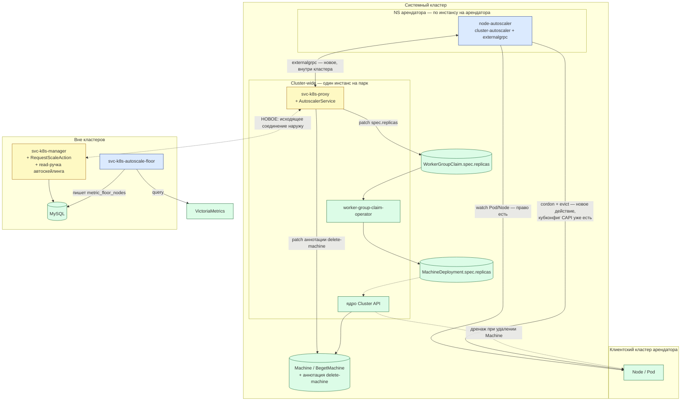
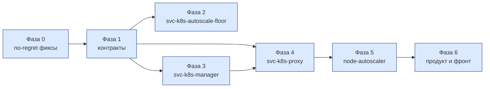

# K8S-728 — Автоскейлинг узлов Beget KaaS. Техническое задание на разработку

Документ самодостаточен: всё, что нужно для реализации, находится здесь. Ссылки ведут только на
исходный код платформы и на апстрим-проекты, а не на другие документы.

---

## 1. Предмет и цель

Реализовать автоматическое изменение числа узлов воркер-группы кластера под Cluster API так, чтобы
решение «нужно больше/меньше узлов» **никогда не создавало и не удаляло ресурсы в обход бэкенда**.

Причина ограничения: биллинг платформы считает факт из БД `svc-k8s-manager`, а не из кластера.
Биллинг узлов строго per-WorkerGroup — одна `customerOption` на группу, `count =
worker_group.desired_node_count`, ставка за узел в день; per-node биллинга нет. Любой путь, меняющий
число узлов мимо этого механизма, для биллинга не существует.

**Ядро решения:** компонент принятия решения не создаёт и не удаляет ресурсы сам — он просит бэкенд
изменить число реплик воркер-группы, тем же путём, каким это делает ручное изменение конфигурации.
Новая биллинг-модель не требуется: путь одобрения общий с уже работающим ручным.

**Движок** — `cluster-autoscaler` (далее CA), подключённый штатным протоколом `externalgrpc`, без
форка ядра.

**Разделение ответственности:** метрики владеют нижней границей (полом), CA — фактическим числом в
её пределах.

---

## 2. Ограничения, из которых выведена архитектура

Не пожелания, а то, что уже верно про платформу.

| # | Ограничение | Чем подтверждено |
|---|---|---|
| **К1** | В клиентский кластер арендатора нельзя деплоить ничего, кроме аддонов, опубликованных в маркетплейсе. Автоскейлинг аддоном не является, значит **своего компонента внутри клиентского кластера быть не может** | решение владельца платформы |
| **К2** | Компонент, которому нужен remote-kubeconfig в клиентский или infra-кластер конкретного арендатора, живёт **per-tenant, в NS арендатора в системном кластере**. Общий процесс на весь парк держал бы в себе учётные данные всех арендаторов сразу | решение владельца платформы |
| **К3** | Биллинг узлов строго per-WorkerGroup. `count` меняется только через `Updater::replaceBilling` из `updateConfiguration` | `svc-k8s-manager`, `app/handlers/external/controllers/k8s/v1/actions/workerGroup/UpdateConfigurationAction.php` |
| **К4** | `worker-group-claim-operator` при каждом расхождении перезаписывает `MachineDeployment.Spec.Replicas` значением из `WorkerGroupClaim.spec` и владеет `MachineDeployment` через `Owns()` без фильтрующего предиката. **Любой путь, минующий `WGC.spec.replicas`, будет откачен оператором** | `worker-group-claim-operator`, `internal/controller/workergroupclaim_controller.go:832` (`existing.Spec.Replicas = desired.Spec.Replicas`), `:938` (`Owns(&clusterv1.MachineDeployment{})`) |
| **К5** | У числа реплик в любой момент времени должен быть **один** источник решения. Двухконтурная схема «метрики двигают вверх, планировщик — вниз» вызывает борьбу двух контуров за одну переменную | общее свойство систем с двумя независимыми контурами управления |
| **К6** | Механизма «убрать конкретный узел, уменьшив размер группы» сегодня нет. `Service.DeleteNode` удаляет `Machine` напрямую, не трогая `replicas`, — `MachineDeployment` создаёт замену. Это корректная реализация существующей кнопки «Пересоздать узел», и она не меняется | `svc-k8s-proxy`, `internal/service/workergroup.go:589` |
| **К7** | `svc-k8s-proxy` сегодня — **только сервер**. Исходящего gRPC-клиента к `svc-k8s-manager` у него нет вовсе | `svc-k8s-proxy`, `internal/grpc/k8s-proxy/proto/workergroup.pb.go:601` — интерфейс `WorkerGroupServiceServer` из пяти RPC |
| **К8** | Внутренний контракт manager'а сегодня несёт только чтение: `find-all` / `find-one`. Ручки обновления нет | `svc-k8s-manager`, `app/handlers/internal/controllers/workerGroup/WorkerGroupController.php` |

---

## 3. Размещение компонентов

| Компонент | Статус | Где физически | Роль |
|---|---|---|---|
| **`node-autoscaler`** | новый | Системный кластер, **NS арендатора, по инстансу на арендатора** | Ядро CA + клиент `externalgrpc`. Решает, сколько узлов нужно группе, и физически дренирует узел перед уменьшением |
| **`svc-k8s-autoscale-floor`** | новый | **Вне кластеров**, рядом с бэкендом | Периодически читает VictoriaMetrics по каждой воркер-группе, считает метрический пол и пишет его в БД |
| `svc-k8s-proxy` | правится | **Системный кластер, один инстанс на весь парк** | Добавляется сервер `AutoscalerService` (`externalgrpc`) и **первый в истории сервиса исходящий клиент** к `svc-k8s-manager` |
| `svc-k8s-manager` | правится | **Вне кластеров** | Владелец БД и биллинга. Добавляются internal-ручки чтения состояния автоскейлинга и `RequestScale`, действие удаления узла и cron реконсиляции биллинга |
| `worker-group-claim-operator` | не меняется | Системный кластер, один инстанс на парк | Продолжает реплицировать `WGC.spec` в `MachineDeployment.spec` |
| Ядро Cluster API | не меняется | Системный кластер, один инстанс на парк | Управляет жизненным циклом `Machine`, читает аннотацию `delete-machine`, сам дренирует узел при удалении `Machine` |

`node-autoscaler` размещается per-tenant по К2: он держит remote-kubeconfig в клиентский кластер.
Берётся **уже выпущенный** Cluster API кубконфиг — `Secret` `<clusterName>-kubeconfig` в NS
арендатора, — поэтому новой инфраструктуры сертификатов не требуется и в клиентском кластере ничего
заводить не нужно (§7.2, риск Р3). Каждый инстанс монтирует ровно один такой `Secret` — своего
арендатора. Прав в системном кластере ему не нужно вовсе: все объекты Cluster API трогает
`svc-k8s-proxy`.



Единственное новое пересечение границы кластера — стрелка `svc-k8s-proxy → svc-k8s-manager`. До этой
задачи proxy наружу не стучался вовсе (К7), и именно эту точку следует покрыть сетевыми политиками в
первую очередь.

---

## 4. Разделение ответственности: пол и число

Один источник решения в каждый момент (К5) достигается разделением **что** от **сколько**.

### 4.1 Пол — два независимых поля

- `autoscale_min_nodes` — как сегодня, меняет только клиент вручную.
- `autoscale_metric_floor_nodes` — **новое** поле, пишет только `svc-k8s-autoscale-floor`.

Двум писателям нечего делить: у каждого своя колонка, общий мьютекс между клиентским путём и
сервисом пола не нужен. **Метрический пол не покидает БД** — в `WorkerGroupClaim` он не едет, во
внешнем контракте не выставляется и клиенту не редактируется.

### 4.2 Эффективный минимум

```
effective_min = min( max(autoscale_min_nodes, autoscale_metric_floor_nodes), autoscale_max_nodes )
```

Внешнее `min(...)` обязательно: без него метрический пол мог бы потребовать больше узлов, чем клиент
оплатил, — противоречивое состояние `min > max`, которое CA обработает некорректно. Зажатие полезно и
само по себе: это готовый сигнал «клиенту не хватает оплаченного потолка при текущей нагрузке».

Формула считается **в двух местах по одним и тем же полям одной и той же БД** — в
`AutoscalerService` при ответе на `NodeGroupMinSize` и в `RequestScaleAction` при проверке границ.
Единственный источник значений исключает рассинхрон между тем, что видит CA, и тем, что одобряет
manager.

Проверка границ в manager'е ведётся **против `effective_min`, а не против сырого
`autoscale_min_nodes`.** Иначе manager способен одобрить уменьшение, нарушающее метрический пол, и
второй, независимый от корректности CA уровень защиты окажется слабее, чем задуман.

### 4.3 Число — решает CA

CA решает через симуляцию размещения: Pending-поды вверх, PDB/affinity-aware консолидация вниз;
никогда ниже `effective_min`, никогда выше `autoscale_max_nodes`.

**Проверка пола стоит до дренажа и кумулятивна.** CA отбирает кандидатов на удаление в фазе
классификации «unneeded» и на каждом кандидате в пачке проверяет `size − deletionsInProgress ≤
MinSize()`, где `size` уменьшается по ходу отбора той же пачки, а `deletionsInProgress` учитывает
удаления, идущие в фоне. Групповое удаление, которое **кумулятивно** увело бы группу ниже
`effective_min`, не одобряется, даже если по отдельности каждый кандидат выглядел безопасным. Узел, не
прошедший проверку, не кордонируется и не дренируется вовсе.

> Источник: `sigs.k8s.io/cluster-autoscaler`, `pkg/core/scaledown/unneeded/nodes.go`
> (`unremovableReason` → `verifyMinSize`).

**Поднятие пола обязано быть активным.** Флаг `--enforce-node-group-min-size` (по умолчанию `false`)
**включается обязательно**:

- выключен — пол только пассивный тормоз: CA не даст себе сжаться ниже него, но не станет создавать
  узлы, чтобы его достичь;
- включён — CA каждый reconcile-цикл сверяет `TargetSize` с `MinSize` и доращивает группу тем же
  исполнителем, что и обычный рост от Pending-подов, в итоге тем же `NodeGroupIncreaseSize`. Новой
  ручки не требуется.

Без флага метрический пол не закрывает главный случай, ради которого заведён (§4.5): реальная
нагрузка высокая, `requests` не заданы, Pending не возникает — пассивный пол здесь бессилен. Война
контуров при этом не переоткрывается: флаг только поднимает число, никогда не опускает, и делает это
тем же путём через биллинг.

Флаг глобален для процесса, не per-группа. Для групп, где метрический пол не поднимает
`effective_min` выше клиентского `min_nodes`, поведение не меняется — разве что сам клиентский
`min_nodes` начинает поддерживаться активно, а не только тормозить сжатие.

**С чем именно сравнивается пол — с `TargetSize`, а не с числом `Ready`-узлов.** CA сверяет
`NodeGroupMinSize` с `NodeGroupTargetSize`, то есть с `WorkerGroupClaim.spec.replicas` (§5.1) —
с желаемым числом, а не с фактическим составом группы.

Это не деталь реализации, а условие корректности. Узел провизионится минутами, цикл CA — ~10 секунд.
Сравнивай CA пол с фактом, он каждый цикл видел бы прежнюю нехватку и заказывал бы недостающие узлы
заново, пока первые не станут `Ready`, — и перелетел бы через пол в разы. Со сравнением по
`TargetSize` этого не происходит: как только `RequestScale` одобрен и `desired_node_count` записан,
`WGC.spec.replicas` уже несёт целевое значение, и следующий опрос показывает `TargetSize == MinSize`.

Пример для пола `5` при трёх узлах в группе:

| Шаг | Что происходит |
|---|---|
| 1 | Сервис пола пишет `metric_floor_nodes = 5` (цикл — 5 минут, §6.2) |
| 2 | Кэш границ в `svc-k8s-proxy` протухает (TTL 30 с), `NodeGroupMinSize` начинает отдавать `effective_min = 5` |
| 3 | CA видит `TargetSize(3) < MinSize(5)`; перед вызовом проверяет `IsNodeGroupReadyToScaleUp` — если группа в backoff, попытка пропускается целиком, к нам обращения не будет вовсе |
| 4 | `NodeGroupIncreaseSize(2)` → `RequestScale(target = 5, reason = METRIC_FLOOR)` |
| 5 | Manager: мьютекс, средства, `5 ≤ max_nodes` → `desired_node_count = 5` → `UpdateWorkerGroup` → `WGC.spec.replicas = 5` |
| 6 | Следующий цикл: `TargetSize == MinSize`, рост прекращается — **ещё до того, как новые узлы стали `Ready`** |

Верхних ограничителя два, и оба остаются в силе: `effective_min` зажат `autoscale_max_nodes`
формулой §4.2, поэтому пол не может потребовать больше оплаченного потолка; и без
`--enforce-node-group-min-size=true` шага 4 не происходит вовсе.

> Источник: `pkg/core/scaleup/orchestrator/orchestrator.go` (`ScaleUpToNodeGroupMinSize`), место
> вызова — `pkg/core/static_autoscaler.go`.

### 4.4 Понижение пола ничего не инициирует

Когда сервис пола опускает `autoscale_metric_floor_nodes`, это снятие ограничения, а не команда на
удаление. Решение убрать конкретный узел остаётся целиком за CA: его цикл консолидации (по
`requests`, с учётом PDB/affinity) на своём обычном опросе увидит более низкую границу и, если у него
уже есть кандидат, уберёт его сам. Команда на удаление конкретного узла у метрик отсутствует
умышленно — иначе вернулась бы война двух контуров (К5).

### 4.5 Два механизма роста и `resources.requests`

У роста два независимых триггера, и от `requests` они зависят **по-разному**. Это различие
определяет, что платформа обещает клиенту, и разбирать их вместе нельзя.

| Механизм | Триггер | Обращается к подам? |
|---|---|---|
| **Реактивный** | под с `PodScheduled=Unschedulable` | да — под и есть триггер |
| **По полу** (`--enforce-node-group-min-size`) | `TargetSize < MinSize` | **нет, ни разу** |

**Путь пола не смотрит на поды — проверено по коду.** `ScaleUpToNodeGroupMinSize` сравнивает два
числа и ничего больше:

```go
targetSize, err := ng.TargetSize()
...
if targetSize >= ng.MinSize() {
    continue
}
...
newNodeCount := ng.MinSize() - targetSize
```

`nodeInfos[ng.Id()]` в этой функции используется только для проверки общекластерных ресурсных
лимитов (`IsNodeGroupResourceExceeded`, `CheckQuota`, `GetCappedNewNodeCount` — то есть
`--max-nodes-total` и подобные), а не для симуляции размещения. Вызывается функция из основного цикла
**безусловно**, вне ветки `shouldScaleUp`, которая требует Pending-подов.

> Источник: `pkg/core/scaleup/orchestrator/orchestrator.go:223-317`; место вызова —
> `pkg/core/static_autoscaler.go:592-601`.

**Следствие: для нагрузки без `requests` метрический пол — не частичная мера, а рабочий механизм
роста.** Если пол поднят, CA нарастит группу, даже когда весь workload кластера `BestEffort` и
`Unschedulable` не возникает никогда.

**Вниз без `requests` группа схлопывается до пола — тоже проверено.** Утилизация, по которой CA
решает «узел не нужен», считается как сумма `requests` подов, делённая на `allocatable`:

```go
podRequests := podutils.PodRequests(podInfo.Pod)
...
return float64(podsRequest.MilliValue()) / float64(nodeAllocatable.MilliValue()-daemonSetAndMirrorPodsUtilization.MilliValue()), nil
```

> Источник: `pkg/simulator/utilization/info.go:95-134`.

У `BestEffort`-подов `requests` равны нулю, значит утилизация узла — ноль независимо от реальной
загрузки, и **любой** узел выглядит кандидатом на консолидацию. Единственное, что останавливает
сжатие, — `verifyMinSize`:

```go
if size-deletionsInProgress <= nodeGroup.MinSize() {
    return simulator.NodeGroupMinSizeReached
}
```

> Источник: `pkg/core/scaledown/unneeded/nodes.go:318-329`; кумулятивность обеспечивает
> `nodeGroupSize[nodeGroup.Id()]--` на `:301`, выполняемый после одобрения каждого кандидата.

**Отсюда — ключевое свойство архитектуры для этого сегмента: при полностью `BestEffort`-нагрузке
число узлов группы равно `effective_min` практически всегда.** Вверх её ведёт пол, вниз консолидация
упирается в тот же пол. Управление числом узлов целиком переходит к метрическому полу, а CA работает
исполнителем.

**Что при этом действительно остаётся незакрытым:**

| Что | Почему |
|---|---|
| **Скорость реакции** | Реактивный путь отвечает на всплеск за секунды. Путь пола — за `FLOOR_PERIOD` плюс сглаживание окном `p95` (§6.2): по стартовым значениям до 5 минут на обнаружение поверх пятнадцатиминутного окна |
| **Потолок скорости роста** | Пол двигается на `FLOOR_STEP` за цикл — по стартовым значениям не быстрее одного узла в 5 минут. Реактивный путь заказывает всю нехватку разом |
| **Пол не знает о размещении** | Он оценивает агрегированную утилизацию группы, а не симулирует размещение конкретного пода. Affinity, topology spread и локальные тома в нём не учтены: узел добавится, но конкретный под может на него не сесть. Для чистого `BestEffort` это несущественно — такие поды садятся почти куда угодно; для смешанной нагрузки существенно |

Закрыть эти три строки средствами данной задачи нельзя, и в объём они не входят: это либо
продуктовая работа (текст в интерфейсе, документация «как готовить нагрузку», `LimitRange` как
opt-in-аддон), либо отдельный эпик VPA, который наблюдает факт потребления и сам подставляет
`requests`.

**Смешанная нагрузка конфликта не создаёт.** Если часть подов с `requests`, часть без, оба механизма
работают одновременно и независимо: реактивный отвечает на Pending от подов с `requests`, пол держит
нижнюю границу по факту. Оба только повышают число узлов — асимметрия К5 сохраняется.

**Что обязано быть названо клиенту до включения автоскейлинга:** без `resources.requests` группа не
реагирует на всплеск за секунды — она следует за метрическим полом с задержкой в минуты и растёт не
быстрее шага пола. Это работоспособно, но это **другое обещание**, чем «мгновенно скейлится по
нагрузке», и разница должна быть проговорена, а не обнаружена клиентом под нагрузкой.

**Упреждающего роста «до проблемы» в ядре нет ни у одного из двух механизмов.** Реактивный ждёт
`Unschedulable`, пол реагирует на уже случившуюся утилизацию; ни порога-прогноза, ни расписания в
ядре не существует. Официальный приём получить упреждающий запас — Deployment «pause-подов» с низким
`PriorityClass` внутри кластера — прямо конфликтует с К1. Если продукту нужен упреждающий резерв, он
оформляется отдельным аддоном маркетплейса, а не частью автоскейлинга по умолчанию.

Флаг `enable-proactive-scaleup` буфером **не является**: он подставляет в симуляцию недостающие поды
уже существующих контроллеров, у которых `replicas` подняты, но поды ещё не созданы. Он устраняет лаг
«контроллер решил → под появился», а не резервирует ёмкость на будущее.

> Источник: `pkg/processors/podinjection/pod_injection_processor.go`, `pkg/builder/autoscaler.go`.

---

## 5. Контракты

### 5.1 Откуда `AutoscalerService` берёт каждое значение

Правило: **границы — из БД, факт — из кластера.** Границы живут только в MySQL и приезжают по сети;
состав узлов и текущий целевой размер `svc-k8s-proxy` уже видит в системном кластере напрямую.

| RPC `externalgrpc` | Реализуется | Источник | Как получено |
|---|---|---|---|
| `NodeGroups` | да | БД | read-ручка manager'а, группы арендатора с `autoscale_enabled = true` |
| `NodeGroupMinSize` | да | БД | `effective_min` по формуле §4.2 |
| `NodeGroupMaxSize` | да | БД | `autoscale_max_nodes` |
| `NodeGroupTargetSize` | да | кластер | `WorkerGroupClaim.spec.replicas` — то самое поле, которое оператор реплицирует в `MachineDeployment` (К4) |
| `NodeGroupNodes` | да | кластер | `List` по `BegetMachine` с селектором `cluster-name` + `deployment-name`, тот же предикат, что у существующего `Service.listWorkerGroupMachines` (`internal/service/workergroup.go:448`) |
| `NodeGroupIncreaseSize` | да | — | `RequestScale`, всё-или-ничего (§5.5) |
| `NodeGroupDeleteNodes` | да | — | пометка `Machine` + `RequestScale`, всё-или-ничего (§5.5) |
| `NodeGroupGetOptions` | **нет — `Unimplemented`** | — | пороги консолидации задаются глобально флагами CA (§7.1) |
| `PricingNodePrice` | опционально | — | нужен только для `Balanced`-консолидации, вне MVP |
| остальные | `Unimplemented` | — | протокол это допускает |

Ответ read-ручки кэшируется в `svc-k8s-proxy` с TTL **30 секунд**: границы меняются редко, а CA
опрашивает `MinSize`/`MaxSize` на каждом цикле (~10 с) для каждой группы каждого арендатора. Без
кэша это дало бы сетевой вызов из кластера наружу в горячем пути. Кэш инвалидируется по TTL; отдельной
инвалидации по событию не требуется, потому что 30 секунд задержки границы ни на что не влияют.

### 5.2 Новая internal read-ручка на `WorkerGroupController` (`svc-k8s-manager`)

Тот же паттерн, что существующие `find-all` / `find-one`, тот же транспорт (К8).

```proto
// api0/cloud/k8s-manager, internal, НЕ customer-facing
message GetAutoscaleStateRequest {
  string cluster_id = 1;
}

message AutoscaleGroupState {
  string worker_group_id     = 1;
  string worker_group_name   = 2;
  string namespace           = 3;   // NS в системном кластере = логин клиента
  bool   autoscale_enabled   = 4;
  int32  min_nodes           = 5;
  int32  max_nodes           = 6;
  int32  metric_floor_nodes  = 7;
}

message GetAutoscaleStateResponse {
  repeated AutoscaleGroupState group = 1;
}
```

Отдаёт **только группы с `autoscale_enabled = true`**. Группа с выключенным автоскейлингом в ответе
не появляется, и CA о ней не знает вовсе — это и есть реализация reason-кода `DISABLED` на уровне
контракта, а не проверки.

### 5.3 `RequestScale` — новая internal-ручка (`svc-k8s-manager`)

```proto
message RequestScaleRequest {
  string cluster_id      = 1;
  string worker_group_id = 2;
  int32  target_replicas = 3;   // абсолютное число, не дельта — идемпотентность проще
  string reason          = 4;   // "UNSCHEDULABLE_PODS" | "CONSOLIDATION" | "METRIC_FLOOR"
  string request_id      = 5;   // идемпотентность при повторной доставке
}

message RequestScaleResponse {
  int32  accepted_replicas = 1;
  string state             = 2;  // "ACCEPTED" | "CLAMPED" | "REJECTED"
  string reason_code       = 3;  // из перечня §5.4
}
```

`RequestScaleAction` переиспользует ровно ту же цепочку, что существующий внешний
`UpdateConfigurationAction`, с одним отличием — группа ищется по `cluster_id` + `worker_group_id`, а
не по `CustomerID` из сессии: у автоскейлера сессии нет, клиента находит сам manager.

Порядок шагов:

1. поиск группы через `WorkerGroupServiceFactory`;
2. мьютекс реконфигурации (`SharedMutexTrait`, тот же, что у ручного пути — автоскейлер и клиент не
   меняют группу одновременно);
3. проверка статуса клиента (`CustomerBalanceChecker`) и средств (`PriceFetcher`) — **до** начала
   транзакции;
4. проверка границ против `effective_min` и `autoscale_max_nodes`;
5. запись `desired_node_count` в MySQL;
6. `proxy.UpdateWorkerGroup(replicas = target)`.

**`replaceBilling` здесь не вызывается.** Обоснование и механизм догона — §6.3.

`request_id` хранится в TTL-кэше на **10 минут**; повторный запрос с тем же идентификатором
возвращает ранее посчитанный ответ, не выполняя шаги 2–6.

### 5.4 Reason-коды

Для интерфейса поддержки «почему не скейлится»:

`SCALING_UP` · `AT_MAX_NODES` · `INSUFFICIENT_FUNDS` · `QUOTA_EXCEEDED` (сумма по группам больше
`nodes_per_cluster_limit`) · `RECONFIGURING` (мьютекс занят — клиент меняет группу руками) ·
`PROVISIONING_FAILED` (Cluster API не смог создать VPS) · `SCALE_DOWN_BLOCKED` (PDB или affinity не
дают дренировать) · `DISABLED` · `BELOW_FLOOR` (запрошено ниже метрического пола — у корректного CA
происходить не должно, но защита нужна и на стороне manager'а).

### 5.5 Инвариант «всё-или-ничего»

У `NodeGroupIncreaseSizeResponse` и `NodeGroupDeleteNodesResponse` тело **пустое**: протокол
`externalgrpc` умеет сообщить только успех или ошибку целиком, частичного исполнения сказать нечем.

Следствие обязательное, а не желательное: при `CLAMPED` или `REJECTED` от manager'а
`AutoscalerService` **не применяет запрошенное изменение частично** и не отчитывается успехом, а
возвращает CA ошибку на весь вызов. Для `DeleteNodes` перед возвратом ошибки снимаются **все**
аннотации, выставленные в этом вызове.

Тихое частичное исполнение с отчётом «успех» рассинхронизирует внутренний учёт CA
(`nodeDeletionTracker`, ожидание узлов) с реальностью, и разойдётся неявно, а не сразу.

На ошибке CA сам вызывает `RegisterFailedScaleUp` и включает backoff **для всей node group**: первая
пауза 5 минут, рост до 30 минут, сброс через 3 часа без новых ошибок. Шторма повторных запросов при
устойчивом отказе не будет — CA ограничивает себя сам.

**Существенное следствие, которое надо знать явно:** backoff общий на всю группу. Если пол не
достигается из-за нехватки средств, та же группа на время backoff'а (до 30 минут) не среагирует и на
настоящий Pending-под — причина отказа для CA одна и та же. Это разумное поведение, но не мгновенное.

### 5.6 Выбор конкретного узла на удаление

Контроллер `MachineSet` в Cluster API при выборе кандидата на удаление читает аннотацию
`cluster.x-k8s.io/delete-machine` и рассматривает такие `Machine` **прежде** обычной политики
(`Random` / `Newest` / `Oldest`). На этом строится общий примитив.

Новый метод в `svc-k8s-proxy`, `internal/service`:

```go
// MarkMachineForDeletion выставляет или снимает cluster.x-k8s.io/delete-machine
// на Machine, стоящей за узлом meta.Name (инвариант Machine.Name == Node.Name).
// mark=false — компенсация при отказе вышестоящего запроса на уменьшение replicas.
func (s *Service) MarkMachineForDeletion(actx *appctx.Context, meta Meta, mark bool) error {
    const deleteMachineAnnotation = "cluster.x-k8s.io/delete-machine"

    machine := &clusterv1.Machine{}
    if err := s.Client.Get(actx.Context, client.ObjectKey{Name: meta.Name, Namespace: meta.Namespace}, machine); err != nil {
        return fmt.Errorf("failed to get Machine %s/%s: %w", meta.Namespace, meta.Name, err)
    }
    patch := client.MergeFrom(machine.DeepCopy())
    if mark {
        if machine.Annotations == nil {
            machine.Annotations = map[string]string{}
        }
        machine.Annotations[deleteMachineAnnotation] = "true"
    } else {
        delete(machine.Annotations, deleteMachineAnnotation)
    }
    return s.Client.Patch(actx.Context, machine, patch)
}
```

Один примитив — два вызывающих:

| Вызывающий | Шаг 1: пометить | Шаг 2: уменьшить `replicas` | Откат при отказе шага 2 |
|---|---|---|---|
| **CA** через `AutoscalerService.NodeGroupDeleteNodes` | прямой вызов метода в процессе, новый RPC не нужен — тот же бинарь | `RequestScale` (§5.3) | `mark = false` для всех помеченных в этом вызове |
| **Новая кнопка «Удалить узел»** | новый RPC `MarkNodeForDeletion` на существующем `WorkerGroupService` | новое internal-действие `RemoveNodeAction` (§6.4) | тот же RPC с `mark = false` |

```proto
// api0/cloud/k8s-proxy, WorkerGroupService
message MarkNodeForDeletionRequest {
  Metadata meta = 1;
  bool     mark = 2;
}

message MarkNodeForDeletionResponse {
  bool success = 1;
}
```

**Существующий `Service.DeleteNode` не трогается.** Он остаётся реализацией кнопки «Пересоздать
узел»: удаляет `Machine` напрямую, `replicas` не меняет, `MachineDeployment` создаёт замену того же
размера (К6). Новый примитив живёт рядом, для другой, новой кнопки.

`Machine.spec.nodeDrainTimeout` этим контрактом **не управляется** — это платформенная настройка
администраторов, глобальная. Следствие для узла с нереализуемым PDB — §9, риск Р2.

### 5.7 Изоляция арендатора на канале `externalgrpc`

Ни один RPC протокола не несёт параметра идентичности вызывающей стороны, а `NodeGroups` вообще не
имеет аргументов. При одном `AutoscalerService` на весь парк это **функциональное требование, а не
только вопрос безопасности**: без привязки соединения к арендатору `NodeGroups` вернул бы каждому
`node-autoscaler` группы всего парка, и каждый инстанс попытался бы управлять чужими группами.

**Механизм MVP: отдельный слушатель на арендатора.** `AutoscalerService` поднимает по адресу на
арендатора; `node-autoscaler` получает свой адрес флагом `--cloud-provider-gid`. Арендатор
определяется тем, какой слушатель принял соединение; все ответы и все проверки скоупятся этим
арендатором.

Криптографической привязки соединения к арендатору в MVP **нет** — принятый риск Р1, §9.

### 5.8 Миграция БД

```sql
ALTER TABLE worker_group
  ADD COLUMN autoscale_metric_floor_nodes INT UNSIGNED NOT NULL DEFAULT 0;
```

Отдельная колонка, свой писатель, не связана мьютексом с `autoscale_min_nodes` /
`autoscale_max_nodes`. Значение по умолчанию `0` даёт корректное поведение для группы, по которой
пол ещё ни разу не считался: `effective_min = min(max(min_nodes, 0), max_nodes) = min_nodes`.

### 5.9 Чего в контрактах НЕ появляется

- **`AutoscalingSpec` в `UpdateWorkerGroupRequest` не добавляется.** Границы и пол остаются в БД и
  отдаются CA по сети (§5.1); в `WorkerGroupClaim` им ехать незачем. `UpdateWorkerGroupRequest`
  остаётся в текущем виде — `meta`, `configuration`, `label`, `taint`, `replicas`,
  `coredns_address`, `image`, `ssh_key_ids`, `client_versions`, `k8s_version`.
- **Внешний контракт `AutoscaleConfiguration{enabled, min_nodes, max_nodes}` не расширяется.**
  `metric_floor_nodes` клиенту не показывается и им не редактируется.

---

## 6. Что разработать — по компонентам

### 6.0 Фаза 0 — no-regret фиксы (первыми, независимо от остального)

Существующие дефекты ручного пути. Не связаны с автоскейлингом по своей природе, но блокируют
безопасное использование полей, на которые опирается весь остальной план.

| # | Дефект | Где | Что сделать | Почему первым |
|---|---|---|---|---|
| **Ф0-1** | `autoscale_enabled` не пишется при обновлении. `Updater::updateConfigurationInternal` пишет `autoscale_min_nodes` и `autoscale_max_nodes`, но не `autoscale_enabled`, хотя `getAutoscaleEnabled()` на параметрах есть. При создании оно пишется. **Выключить автоскейлинг через API уже включённой группы сегодня невозможно** | `svc-k8s-manager`, `app/lib/workerGroup/actions/Updater.php:109-110`; для сравнения — `Creator.php:112` | Добавить запись `autoscale_enabled` в `update`, как в `create` | `NodeGroups` (§5.2) фильтрует по этому полю — иначе группу нельзя вывести из-под управления CA |
| **Ф0-2** | Валидации `1 ≤ min ≤ max ≤ nodes_per_cluster_limit` нет вообще. `min > max` спокойно пишется в БД | `svc-k8s-manager`, валидаторы create/update воркер-группы | Проверка границ в обоих валидаторах, код ошибки `INVALID_AUTOSCALE_CONFIG` | `RequestScaleAction` и `AutoscalerService` читают `min`/`max` из БД и доверяют им — при мусоре в БД `effective_min` ненадёжен целиком |
| **Ф0-3** | Деструктивная реконсиляция узлов. `Service.listWorkerGroupMachines` при ошибке `List` логирует **`Warn` и возвращает пустой срез**; `InternalUpdater::saveNodes` на пустом списке через `array_diff` удаляет **все** строки `node` этой группы. Один сбой листинга стирает состав узлов | `svc-k8s-proxy`, `internal/service/workergroup.go:454-460`; `svc-k8s-manager`, `app/lib/workerGroup/actions/InternalUpdater.php` | Чинить с **обеих** сторон: proxy возвращает ошибку вместо пустого списка, `GetWorkerGroup` на ней падает; manager не удаляет строки при ошибке или пустом ответе, только логирует и повторяет | Автоскейлинг повышает частоту прохода этого пути с «редкие ручные изменения» до нескольких раз в день — баг, который сегодня срабатывает редко, начнёт срабатывать часто |
| **Ф0-4** | `InsufficientFundsException` выбрасывается из середины транзакции — отказ по средствам оставляет группу в промежуточном состоянии | `svc-k8s-manager`, стек биллинга `UpdateConfigurationAction` | Вынести проверку средств до начала транзакции изменения | `RequestScaleAction` переиспользует этот же стек; унаследованная незавершённая транзакция стала бы новым, более частым источником рассинхрона БД и факта |

### 6.1 Фаза 1 — контракты

Три независимых расширения proto, каждое — одним MR на файл.

| Контракт | Что добавляется |
|---|---|
| `api0/cloud/k8s-manager`, internal | `GetAutoscaleState` (§5.2) и `RequestScale` (§5.3) на `WorkerGroupController` |
| `api0/cloud/k8s-proxy`, `WorkerGroupService` | `MarkNodeForDeletion(meta, mark)` (§5.6) |
| MySQL, `worker_group` | колонка `autoscale_metric_floor_nodes` (§5.8) |

### 6.2 Фаза 2 — `svc-k8s-autoscale-floor` (новый сервис)

Отдельный процесс вне кластеров. Читает VictoriaMetrics по каждой воркер-группе, пишет в БД.

**Алгоритм — пороговый шаг ±1 узел за цикл:**

```
u = p95 по окну от max(cpu_used_percent, memory_used_percent) по узлам группы

если u > FLOOR_UP_THRESHOLD    →  floor = floor + FLOOR_STEP
если u < FLOOR_DOWN_THRESHOLD  →  floor = floor - FLOOR_STEP
иначе                          →  floor не меняется

floor зажимается в [0, autoscale_max_nodes]
```

Свойства, обязательные к реализации:

- **не более одного шага за цикл** — период цикла задаёт потолок скорости изменения пола;
- **гистерезис структурный**: между порогами есть зона, где пол не меняется вовсе, поэтому колебание
  утилизации вокруг одного порога не гоняет пол вверх-вниз;
- **идемпотентность**: повторный прогон на тех же данных даёт то же значение;
- **отсутствие данных ≠ ноль**: если по группе нет метрик за окно (новая группа, сбой сбора), пол
  **не меняется**, а не обнуляется;
- запись **только** в `autoscale_metric_floor_nodes`, никаких других колонок сервис не трогает.

Стартовые значения параметров (все конфигурируемы):

| Параметр | Значение | Смысл |
|---|---|---|
| `FLOOR_PERIOD` | **5 минут** | Период пересчёта. Сопоставим со временем «создание VPS → узел Ready», поэтому пол не убегает вперёд от того, что успевает провизиониться |
| `FLOOR_WINDOW` | 15 минут | Окно, по которому берётся `p95` |
| `FLOOR_UP_THRESHOLD` | 80 % | Выше — пол растёт |
| `FLOOR_DOWN_THRESHOLD` | 40 % | Ниже — пол падает |
| `FLOOR_STEP` | 1 узел | Шаг за цикл |

### 6.3 Фаза 3 — `svc-k8s-manager`

| Компонент | Что разработать |
|---|---|
| `GetAutoscaleStateAction` (новое, internal) | Отдаёт группы арендатора с `autoscale_enabled = true` и их границы (§5.2) |
| `RequestScaleAction` (новое, internal) | Приём и одобрение запроса на изменение `replicas` (§5.3). Переиспользует `WorkerGroupServiceFactory`, `SharedMutexTrait`, `PriceFetcher` / `BillingServiceFactory` — весь стек `UpdateConfigurationAction`, но без `CustomerID` из сессии. **Биллинг не вызывает** |
| Cron реконсиляции биллинга (новое) | Периодически: измерить факт → сверить с `count` текущей `customerOption` через `getById` → dry-run pre-check → `create` / `replace` **только если разошлось**. Образец — существующий метеринг по факту для S3-квоты. **Период — 1 час** |
| `RemoveNodeAction` (новое, internal) | Действие для новой кнопки «Удалить узел», §6.4 |
| `WorkerNodeMetricProvider` (правка) | `app/lib/analytic/instance/provider/WorkerNodeMetricProvider.php:53` считает `$nodeCount = $workerGroup->desired_node_count` — то есть от желаемого, а не от факта. Привести к факту. Не блокер запуска, но обязательно до промо метрик клиенту |

**Почему биллинг полностью отвязан от `RequestScale`.** `replaceByTemplateId` при каждом вызове
создаёт **новую** опцию — примитива «обновить на месте» не существует, значит частота вызова
единственный рычаг против шторма. При опросе CA раз в ~10 секунд синхронный вызов гарантировал бы
шторм `customerOption`.

**Ручной путь клиента не тронут.** `UpdateConfigurationAction` как и сегодня биллит синхронно, в
момент изменения. Отложенность касается только нового, CA-driven пути.

**Cron сверяется с фактом, а не с `desired_node_count`** — с реальным списком `Machine`. Иначе узел,
зависший в `Terminating` (риск Р2, §9), останется недосчитан в биллинге бессрочно, а не временно.

Рассмотренные и отклонённые альтернативы декаплинга:

| Вариант | Почему отклонён |
|---|---|
| Синхронно, без дебаунса | Шторм `customerOption` при опросе CA раз в ~10 с |
| Троттлинг внутри `RequestScaleAction` без cron'а | Опция может **никогда** не догнать факт, если после пропуска новых запросов не случится; с догоняющим cron'ом вырождается в выбранный вариант |
| Асимметрия по направлению (рост синхронно, уменьшение сверкой) | Реализуемо, но соотношение «временная недоплата при росте против временной переплаты при падении» должен утвердить продукт, а не инженерное решение по умолчанию |
| Порог отклонения вместо окна по времени | Точнее при резких колебаниях, но добавляет параметр поверх периода без чёткой выгоды на старте |

### 6.4 Фаза 4 — `svc-k8s-proxy`

| Компонент | Что разработать |
|---|---|
| `AutoscalerService` (новый gRPC-сервер) | Полный набор RPC из §5.1. Слушатель на арендатора (§5.7). Кэш границ с TTL 30 с |
| Исходящий gRPC-клиент к `svc-k8s-manager` | Первый в истории сервиса (К7). Требует отдельной сетевой политики. Адрес manager'а — конфигурация деплоя |
| `Service.MarkMachineForDeletion` | Новый метод (§5.6) |
| `MarkNodeForDeletion` RPC | Тонкая обёртка над предыдущим, на существующем `WorkerGroupService` |
| Обработка `CLAMPED` / `REJECTED` | Инвариант «всё-или-ничего» (§5.5) |

Действие «Удалить узел» целиком (`RemoveNodeAction` в manager'е + `MarkNodeForDeletion` в proxy):

1. `proxy.MarkNodeForDeletion(X, mark = true)`;
2. `desired_node_count − 1` через логику `UpdateConfigurationAction`, **с синхронным
   `replaceBilling`** — это действие клиента, и биллится оно как любое ручное изменение группы,
   а не через часовой cron;
3. `proxy.UpdateWorkerGroup(replicas = target)`;
4. при отказе шага 2 или 3 — `MarkNodeForDeletion(X, mark = false)`.

Дренаж в этом потоке делает **штатный Machine-контроллер Cluster API**; доступа бэкенда в клиентский
кластер для этого не требуется вовсе.

### 6.5 Фаза 5 — `node-autoscaler` (новый репозиторий)

| Что | Как |
|---|---|
| Сборка | Ядро `sigs.k8s.io/cluster-autoscaler` + встроенный провайдер `externalgrpc`, **без форка ядра**. Отдельный репозиторий и образ, минимальная обвязка деплоя |
| Деплой | Per-tenant, в NS арендатора в системном кластере, тот же паттерн размещения, что у остальных контроллеров ярусов арендатора |
| Флаги | §7.1 |
| Доступ в клиентский кластер | Монтирование `Secret` `<clusterName>-kubeconfig` из NS арендатора, §7.2. Своего `ServiceAccount` и `ClusterRole` в клиентском кластере **не заводится** |

### 6.6 Фаза 6 — продукт и фронт (не блокирует технический периметр)

UI-контролы диапазона `min`/`max`; новая кнопка «Удалить узел» рядом с существующей «Пересоздать
узел»; reason-коды в интерфейсе поддержки; текст о требовании `resources.requests` (§4.5).

### 6.7 Порядок и зависимости



- **Фаза 0 первая и независимая:** наслаивать новую логику поверх сломанной валидации и деструктивной
  реконсиляции значит унаследовать их в новом коде и удвоить стоимость починки позже.
- **Фаза 1 блокирует всё остальное:** без стабильного контракта фазы 2–4 будут переделывать
  интерфейсы друг под друга.
- **Фазы 2 и 3 идут параллельно;** сервис пола зависит только от миграции БД.
- **Фаза 4 после фазы 3** — `AutoscalerService` тестируется против настоящих ручек manager'а. До их
  готовности разработка возможна на заглушке, приёмка — нет.
- **Фаза 5 последняя из технических:** `node-autoscaler` — потребитель контракта, без готового
  `AutoscalerService` тестировать его не на чем.

---

## 7. Конфигурация

### 7.1 Флаги `node-autoscaler`

```
--cloud-provider=externalgrpc
--cloud-provider-gid=<адрес слушателя ЭТОГО арендатора>
--kubeconfig=<путь к смонтированному Secret <clusterName>-kubeconfig, ключ value>
--enforce-node-group-min-size=true
```

`--enforce-node-group-min-size=true` **обязателен**: без него метрический пол не создаёт узлы, а
только тормозит сжатие (§4.3).

Пороги консолидации задаются здесь же, глобально, потому что `NodeGroupGetOptions` отвечает
`Unimplemented` (§5.1):

```
--scale-down-utilization-threshold=<значение>
--scale-down-unneeded-time=<значение>
```

Остальное — дефолты CA (`--initial-node-group-backoff-duration=5m`,
`--max-node-group-backoff-duration=30m`, `--node-group-backoff-reset-timeout=3h`,
`--cordon-node-before-terminating=true`); не переопределять без отдельного обоснования.

### 7.2 Доступ в клиентский кластер

CA дренирует узел **сам**, своим клиентом к клиентскому кластеру, и обойти это без форка ядра нельзя.
Цепочка вызовов безусловна и не различает провайдеров:

```
unneeded.Nodes.unremovableReason → verifyMinSize        // проверка пола ДО актуации
Actuator.startDeletion
  → Actuator.taintNodesSync                             // синхронно кордонит и тейнтит
  → Actuator.deleteNodesAsync
    → GroupDeletionScheduler.prepareNodeForDeletion
      → Evictor.DrainNode                               // эвикция подов через Pod Eviction API, с учётом PDB
    → deleteNodesFromCloudProvider
      → nodeGroup.DeleteNodes(nodes)                    // ЗДЕСЬ и только здесь зовётся провайдер
```

Между тейнтованием и вызовом провайдера ветвления по типу провайдера нет; условного флага «провайдер
дренирует сам» в коде не существует. `--cordon-node-before-terminating` управляет только параметром
самого кордона внутри `taintNode`, а не тем, происходит ли эвикция.

> Источник: `sigs.k8s.io/cluster-autoscaler`,
> `pkg/core/scaledown/actuation/{actuator,group_deletion_scheduler,delete_in_batch}.go`.

Значит `node-autoscaler` обязан иметь в клиентском кластере право на `patch` `Node` (cordon и taint)
и на `create` `pods/eviction`. Вопрос только в том, каким кредитом это право выдано.

**Решение MVP: использовать кубконфиг, который Cluster API уже выпустил.** Отдельный `ServiceAccount`
и узкий `ClusterRole` в клиентском кластере не заводятся.

| Что | Значение |
|---|---|
| Источник кредита | `Secret` `<clusterName>-kubeconfig` в NS арендатора **системного** кластера |
| Ключ данных | `value` |
| Кто его создаёт | Cluster API при провижининге кластера — новой инфраструктуры сертификатов не требуется |
| Как получает `node-autoscaler` | монтированием этого `Secret`, путь передаётся флагом `--kubeconfig` (§7.1) |
| Объём прав | административный на клиентский кластер |

**Прецедент существует и работает.** `worker-group-claim-operator` уже читает этот же `Secret` тем же
способом и этим же кредитом **пишет в `Node` клиентского кластера**, раскладывая метки:

```go
name := md.Spec.ClusterName + kubeconfigSecretSuffix   // "-kubeconfig"
key := types.NamespacedName{Name: name, Namespace: md.Namespace}
...
kubeconfig, ok := secret.Data[remote.KubeconfigKey]    // "value"
return r.Clients.GetOrCreate(key.String(), kubeconfig)
```

> Источник: `worker-group-claim-operator`,
> `internal/controller/nodelabeldelivery_controller.go:221-238`, `internal/remote/client.go:15`.

Cordon — это patch `Node`, то есть **тот же класс операции, который платформа этим кредитом уже
выполняет**. Действительно новым остаётся только `create pods/eviction`.

**Почему узкая роль не заводится сейчас.** `ClusterRole` и `ClusterRoleBinding` — объекты **внутри
клиентского кластера**, и их появление там требует механизма доставки, которого в этой задаче нет:
пришлось бы либо заводить ещё один канал записи в клиентские кластеры, либо раскатывать роль на весь
уже существующий парк, прежде чем автоскейлинг заработает хоть у кого-то. Кубконфиг же выпущен и
лежит на месте по факту провижининга — у каждого кластера, включая созданные до этой задачи.

**Изоляция по арендаторам при этом не слабее, а строже прецедента.** `node-autoscaler` разворачивается
per-tenant (К2) и монтирует **один** `Secret` — кубконфиг своего арендатора; кубконфигов остальных он
не видит. Существующий `worker-group-claim-operator` cluster-wide и читает `Secret` любого арендатора
по мере надобности.

Цена решения названа прямо и записана риском **Р3** (§9): компрометация пода `node-autoscaler` даёт
не cordon и eviction, а полный административный доступ к клиентскому кластеру одного арендатора.

Дренаж со стороны Cluster API, который сработает следом при фактическом удалении `Machine`, застанет
уже пустой узел — безобидное резервное дублирование, не основной механизм.

**Целевое состояние, если Р3 решат закрывать** — узкий `ClusterRole`, отдельный от существующего
read-only `beget:metrics-reader` и не расширяющий права `capi-ccm` / `capi-csr-approver`:

```yaml
rules:
  - apiGroups: [""]
    resources: ["nodes"]
    verbs: ["get", "list", "watch", "patch"]     # patch — только cordon (unschedulable + taint)
  - apiGroups: [""]
    resources: ["pods/eviction"]
    verbs: ["create"]
  - apiGroups: [""]
    resources: ["pods"]
    verbs: ["get", "list", "watch"]
```

Отдельной задачей к нему потребуется механизм доставки в клиентские кластеры и раскатка на парк;
после этого `node-autoscaler` переводится на свой `ServiceAccount`, а монтирование
административного кубконфига снимается.

### 7.3 Сводка периодов и порогов

| Параметр | Значение | Где |
|---|---|---|
| Период пересчёта метрического пола | **5 минут** | `svc-k8s-autoscale-floor` |
| Окно `p95` утилизации | 15 минут | `svc-k8s-autoscale-floor` |
| Пороги пола вверх / вниз | 80 % / 40 % | `svc-k8s-autoscale-floor` |
| Шаг пола за цикл | 1 узел | `svc-k8s-autoscale-floor` |
| Период реконсиляции биллинга | **1 час** | `svc-k8s-manager` |
| TTL кэша границ | 30 секунд | `svc-k8s-proxy` |
| TTL идемпотентности `request_id` | 10 минут | `svc-k8s-manager` |
| Цикл CA | ~10 секунд (дефолт) | `node-autoscaler` |
| Backoff группы при отказе | 5 → 30 минут, сброс 3 часа (дефолты) | `node-autoscaler` |

Все значения конфигурируемы. Приведённые — стартовые, а не выведенные из замера: они подобраны из
соображений §6.2 и §6.3 и подлежат пересмотру по эксплуатационным данным.

### 7.4 Отсутствие проблемы конфигурации в периметре клиента

`enabled` / `min` / `max` / `metric_floor` — не CRD в клиентском кластере, а поля в БД бэкенда,
отдаваемые по gRPC. Клиент имеет `system:masters` в своём кластере, но **не имеет доступа к
системному кластеру** и не может прочитать или изменить эту конфигурацию никаким способом, которым он
администрирует свой кластер. `ValidatingAdmissionPolicy` для защиты конфигурации от собственного
администратора кластера не требуется — конфигурация физически вне его периметра.

---

## 8. Критерии приёмки

Формат: **Дано / Когда / Тогда**.

### 8.1 Рост

| # | Дано | Когда | Тогда |
|---|---|---|---|
| А1 | Группа ниже `max_nodes`, под с `requests` не помещается | Планировщик выставил `Unschedulable` | Новый узел создаётся, `desired_node_count` меняется сразу, `WGC.spec.replicas` доезжает до `MachineDeployment` |
| А2 | Группа на `max_nodes` | Под с `requests` не помещается | Под остаётся `Pending`, `reason_code = AT_MAX_NODES`, узел не создаётся |
| А3 | Под без `requests`, реальная нагрузка высокая | — | **Реактивный** путь не срабатывает: `Unschedulable` не возникает. Это не отказ роста — рост идёт по полу, см. А4 |
| А4 | Весь workload группы `BestEffort`, метрический пол поднялся выше `TargetSize` | Сервис пола записал новое `metric_floor_nodes` | Узел создаётся **без единого Pending-пода**, через `NodeGroupIncreaseSize`, `reason = METRIC_FLOOR`. Проверяется именно на полностью `BestEffort`-нагрузке: путь пола к подам не обращается вовсе (§4.5) |
| А8 | Группа с полностью `BestEffort`-нагрузкой, пол стабилен | Прошло несколько циклов CA | Число узлов сошлось к `effective_min` и держится на нём: вверх ведёт пол, вниз консолидация упирается в `verifyMinSize`. Отклонение от `effective_min` в установившемся режиме — дефект |
| А5 | Клиент заблокирован за неуплату | Любой триггер роста | `RequestScale` отклонён с `INSUFFICIENT_FUNDS` **до** обращения к Cluster API; уже работающие узлы не тронуты |
| А6 | А5 повторяется несколько циклов | — | CA переходит в backoff на всю группу (5 → 30 мин, сброс 3 ч); реактивный рост той же группы в этом окне тоже не срабатывает — ожидаемо, не дефект |
| А7 | Блокировка дошла до реальной остановки | Биллинг выставил `ClusterClaim.spec.extraEnvs.begetCltSuspend = true` | Узлы останавливает **внешний механизм**, вне периметра этой задачи; `replicas` и `desired_node_count` не меняются — это остановка, а не удаление |

### 8.2 Уменьшение

| # | Дано | Когда | Тогда |
|---|---|---|---|
| Б1 | Узел недогружен по `requests`, PDB и affinity разрешают | CA завершил симуляцию | CA сам кордонит, дренирует и вызывает `NodeGroupDeleteNodes`; `Machine` помечена аннотацией **до** уменьшения `replicas`; `MachineSet` удаляет именно её |
| Б2 | Узел недогружен, но PDB или anti-affinity не разрешают | — | Ни один узел не удаляется, `reason_code = SCALE_DOWN_BLOCKED`. Обхода нет — риск Р2, §9 |
| Б3 | Сервис пола опустил `metric_floor_nodes` | — | Число узлов **не меняется само по себе** — снято только ограничение снизу |
| Б4 | Клиент меняет `max_nodes`, сервис пола одновременно меняет `metric_floor_nodes` | Оба изменения приходят почти одновременно | Оба применяются без потери: раздельные колонки, раздельные писатели, общего объекта записи нет |
| Б5 | Клиент понижает `max_nodes` ниже текущего фактического числа | — | Рост выше нового потолка запрещён немедленно; существующие узлы **не сносятся принудительно** — только обычным циклом консолидации (Б1/Б2) |
| Б6 | За один цикл найдено N кандидатов на удаление | Симуляция консолидации CA | Отбор кумулятивный: как только гипотетическое удаление довело бы группу до `effective_min`, все оставшиеся кандидаты отбрасываются — группа не опустится ниже пола, даже если по отдельности каждый кандидат выглядел безопасным |
| Б7 | Manager одобрил уменьшение на меньшее число узлов, чем запрошено (`CLAMPED`) | CA просил удалить 3 узла, одобрен 1 | Аннотации сняты **со всех трёх**, CA получает ошибку на весь вызов; ни один узел не удаляется. CA пересчитает кандидатов на следующем цикле |

### 8.3 Ручное управление узлом

| # | Дано | Когда | Тогда |
|---|---|---|---|
| В1 | Клиент нажимает «Пересоздать узел» | — | Поведение **не меняется**: `Machine` удаляется напрямую, `replicas` не трогается, `MachineDeployment` создаёт замену того же размера |
| В2 | Клиент нажимает «Удалить узел» (новая кнопка) | — | `MarkNodeForDeletion(mark = true)` → `desired_node_count − 1` с **синхронным** `replaceBilling` → штатный дренаж Machine-контроллером Cluster API; при отказе — `mark = false`, аннотация снята |

### 8.4 Изоляция

| # | Дано | Когда | Тогда |
|---|---|---|---|
| Д1 | В парке два арендатора с включённым автоскейлингом | `node-autoscaler` арендатора А вызывает `NodeGroups` | В ответе **только** группы арендатора А; групп арендатора Б в нём нет |
| Д2 | Группа с `autoscale_enabled = false` | `node-autoscaler` того же арендатора вызывает `NodeGroups` | Группы в ответе нет вовсе — CA о ней не знает и не пытается ею управлять |

### 8.5 Эксплуатация

| # | Дано | Когда | Тогда |
|---|---|---|---|
| Г1 | `node-autoscaler` арендатора недоступен | — | Автоскейлинг **только этого** арендатора не работает; ручной API продолжает работать; остальные арендаторы не задеты |
| Г2 | `AutoscalerService` или `RequestScaleAction` недоступны | — | Все `node-autoscaler` получают ошибку на связи, включают backoff; **ничего не меняется молча** — fail-safe. Ручной путь через внешний API продолжает работать, он этими компонентами не пользуется |
| Г3 | Нагрузка часто колеблется | Несколько `RequestScale` подряд за минуты | Скейл применяется **без задержки** на каждый запрос; billing-опция правится один раз, по окну реконсиляции |
| Г4 | Новая группа с `autoscale_enabled = true`, пол ещё не считался | — | `metric_floor_nodes = 0`, `effective_min = min_nodes`; группа ведёт себя как обычный CA без метрического пола до первого прогона сервиса пола |
| Г5 | Сервис пола недоступен | — | `metric_floor_nodes` застывает на последнем значении; `effective_min` устаревает, но остаётся зажат `max_nodes` — предел ущерба структурный |
| Г6 | Сбой листинга машин в `svc-k8s-proxy` | `List` по `BegetMachine` вернул ошибку | Строки `node` в БД **не удаляются**; ошибка распространяется вверх, синхронизация повторится на следующем цикле (Ф0-3) |

---

## 9. Принятые риски и открытые вопросы

### Принятые риски — решение владельца, разработку не блокируют

| # | Риск | Что именно принято |
|---|---|---|
| **Р1** | **Нет криптографической изоляции арендатора на канале `externalgrpc`.** Арендатор определяется тем, какой слушатель принял соединение (§5.7), но соединение ничем не привязано к арендатору. Процесс внутри системного кластера, дотянувшийся до чужого адреса, выдаст себя за чужого арендатора | Принято. Единственная оставшаяся защита — проверки `RequestScaleAction` по конкретной группе: средства, границы, мьютекс. Это **заведомо не то же самое**, что изоляция периметра компрометации одним арендатором, заявленная в К2 для доступа в клиентский кластер. Закрытие — отдельной задачей: mTLS с per-tenant идентичностью в сертификате (CN/SAN = `cluster_id`) и проверкой на `AutoscalerService` |
| **Р3** | **`node-autoscaler` работает с административным кубконфигом арендатора, а не с узкой ролью.** Компрометация пода даёт полный административный доступ к клиентскому кластеру одного арендатора — включая чтение всех `Secret` — вместо `patch nodes` и `create pods/eviction` (§7.2) | Принято. Периметр по-прежнему ограничен одним арендатором (К2), но глубина внутри него максимальная. Основание: узкая роль — объект внутри клиентского кластера, её появление там требует механизма доставки, которого нет, и раскатки на весь существующий парк до запуска; кубконфиг же уже выпущен Cluster API и уже используется платформой для записи в `Node` клиентского кластера. Закрытие — отдельной задачей: узкий `ClusterRole` (шаблон в §7.2), механизм его доставки, перевод `node-autoscaler` на свой `ServiceAccount` и снятие монтирования кубконфига |
| **Р2** | **Узел с нереализуемым PDB не удаляется никак.** У CA принудительного пути для обычной консолидации нет: `StartForceDeletion` и `ForceDeleteNodes` в основном reconcile-цикле не вызываются — они зашиты только для двух случаев сломанной инфраструктуры (узел не зарегистрировался; узел не создался). `Machine.spec.nodeDrainTimeout` — платформенная настройка администраторов, вне контракта этой задачи, и её пересмотр отложен до отдельной фичи с CSI | Принято как **существующее ограничение платформы, а не регрессия**. Следствия: клиент, выставивший нереализуемые PDB на все узлы группы и понизивший `max_nodes`, сжаться не сможет; действие «Удалить узел» (В2) PDB заранее **не проверяет** и на таком узле оставит его в `Terminating`, тогда как `desired_node_count` уже уменьшен. Смягчение — реконсиляция биллинга сверяется с фактическим списком `Machine` (§6.3), поэтому зависший узел остаётся посчитанным |

### Открытые вопросы — не блокируют реализацию, требуют ответа до промо

| # | Вопрос | Кому |
|---|---|---|
| О1 | Гранулярность тарификации при дневной ставке и субсуточном обороте узлов. Черновой ответ — «по максимальному числу одновременно работавших узлов за сутки» — с биллингом не согласован | Продукт + биллинг |
| О2 | p99 «создание узла → узел `Ready`» против таймаута регистрации CA (дефолт 15 минут) и доля подов с заданными `resources.requests` в реальных клиентских кластерах. Оба числа не измерены. От второго зависит не работоспособность автоскейлинга — она обеспечена полом в любом случае (§4.5), — а то, для какой доли парка обещание сводится к «следует за полом с задержкой в минуты» вместо «реагирует за секунды», и насколько агрессивно надо настраивать `FLOOR_PERIOD` и `FLOOR_STEP` | Ops / observability, отдельный замер |
| О3 | Нужен ли клиенту упреждающий запас ёмкости сверх метрического пола. Официальный приём CA требует Deployment внутри клиентского кластера и конфликтует с К1 — оформляется отдельным аддоном маркетплейса, если нужен | Продукт |
| О4 | Стратегия и безопасные значения `--scale-down-utilization-threshold` / `--scale-down-unneeded-time`. В MVP значения глобальные (§7.1); per-групповая настройка через `NodeGroupGetOptions` — отдельная задача, и при её появлении надо проверить, не создаёт ли она скрытый второй контур влияния на число узлов в обход К5 | Техкоманда |
| О5 | Поведение `node-autoscaler`, когда узлы его группы останавливаются внешним механизмом `begetCltSuspend`: теряет ли он доступ к apiserver клиентского кластера целиком, пытается ли действовать над остановленными, но формально существующими узлами. По коду CA не проверялось | Техкоманда, отдельное чтение кода |
| О6 | Пороги и окно метрического пола (§6.2) заданы из соображений, а не из замера. После набора эксплуатационных данных проверить, не колеблется ли пол и успевает ли он за реальными всплесками | Техкоманда, после запуска |

---

## 10. Явно вне объёма

- **Реализация фронта.** Контракт самодостаточен; UI — фаза 6, отдельная задача.
- **Сокращение отставания пола от реактивного пути** (§4.5): скорость реакции, потолок скорости
  роста и неучёт affinity/topology при оценке пола. Рост без `requests` как таковой работает — через
  пол; речь именно об этих трёх свойствах. Полный ответ — отдельный эпик VPA либо продуктовая работа.
- **Внутреннее устройство провижининга VPS** (`capi-provider-beget`, `svc-vps-manager`) — не
  меняется. Схемы этой задачи останавливаются на `Machine` / `BegetMachine`.
- **Расширение прав существующих контроллеров ярусов арендатора** (`capi-ccm`,
  `capi-csr-approver`) — не трогаются.
- **Per-node биллинг и переработка биллинг-модели** — существующая per-WorkerGroup модель достаточна.
- **Управление `Machine.spec.nodeDrainTimeout`** — платформенная настройка администраторов,
  пересмотр отложен до отдельной фичи с CSI (риск Р2).
- **Форк ядра `cluster-autoscaler`** — используется штатный протокол `externalgrpc` как есть.

---

## 11. Источники проверки

Код платформы прочитан напрямую в клонах репозиториев; файлы и строки названы по месту в тексте:
`svc-k8s-proxy` (`internal/service/workergroup.go`, `internal/grpcService/workergroup.go`,
`internal/handler/workergroup.go`, `internal/grpc/k8s-proxy/proto/workergroup.pb.go`,
`cmd/svc-k8s-proxy/app.go`), `svc-k8s-manager` (`app/lib/workerGroup/actions/{Updater,Creator,InternalUpdater,Requester}.php`,
`app/lib/cluster/actions/StatusSynchronizer.php`, `app/lib/workerGroup/WorkerGroupEventHandler.php`,
`app/handlers/internal/controllers/workerGroup/WorkerGroupController.php`,
`app/handlers/external/controllers/k8s/v1/params/WorkerGroupUpdateConfigurationParams.php`),
`worker-group-claim-operator` (`internal/controller/workergroupclaim_controller.go`).

**Механика ядра `cluster-autoscaler`.** Ядро вынесено из репозитория `k8s.io/autoscaler` в отдельный
модуль **`sigs.k8s.io/cluster-autoscaler`**; в `k8s.io/autoscaler/cluster-autoscaler` остались
`main.go`, провайдеры и обвязка. Это существенно для сборки `node-autoscaler` (§6.5): каталогов
`core/`, `pkg/core`, `pkg/simulator` в самом репозитории `autoscaler` больше нет.

Прочитано и сверено в этой сессии по модулю
`sigs.k8s.io/cluster-autoscaler v0.0.0-20260821162314-33c3f97bf274` (соответствует
`k8s.io/autoscaler` на ревизии `a4ab9c7c3a11bf9323da6cf4b555b4141aba57b3` от 27 августа 2026):

| Утверждение | Где | Что прочитано |
|---|---|---|
| Путь пола не обращается к подам; сравнивается `TargetSize` с `MinSize`; доращивание на всю нехватку разом (§4.3, §4.5) | `pkg/core/scaleup/orchestrator/orchestrator.go:223-317` | `targetSize, err := ng.TargetSize()`; `if targetSize >= ng.MinSize() { continue }`; `newNodeCount := ng.MinSize() - targetSize` |
| Вызов безусловен, вне ветки, требующей Pending-подов; гейт по флагу (§4.3, §4.5) | `pkg/core/static_autoscaler.go:592-601` | `if a.EnforceNodeGroupMinSize { … ScaleUpToNodeGroupMinSize(nodes, templateNodeInfos) }` |
| Проверка пола стоит до актуации и кумулятивна (§4.3, критерий Б6) | `pkg/core/scaledown/unneeded/nodes.go:286`, `:301`, `:318-329` | вызов `verifyMinSize` в `unremovableReason`; `nodeGroupSize[nodeGroup.Id()]--` после одобрения кандидата; `if size-deletionsInProgress <= nodeGroup.MinSize()` |
| Утилизация считается по `requests`, а не по факту (§4.5) | `pkg/simulator/utilization/info.go:95-134` | `podRequests := podutils.PodRequests(podInfo.Pod)`; итог — `podsRequest / (allocatable − daemonSetAndMirrorPodsUtilization)` |

Перенесено из подготовительных материалов и **своей сверкой в этой сессии не подтверждено**:
безусловность дренажа самим CA и порядок `taintNodesSync → DrainNode → DeleteNodes` (§7.2,
`pkg/core/scaledown/actuation/*`); поведение `enable-proactive-scaleup` (§4.5,
`pkg/processors/podinjection/*`); дефолты и семантика backoff группы (§5.5); пустые тела ответов
`NodeGroupIncreaseSizeResponse` / `NodeGroupDeleteNodesResponse` и состав из 15 RPC (§5.1, §5.5,
`cloudprovider/externalgrpc/protos/externalgrpc.proto`). Всё перечисленное лежит в тех же двух
деревьях и проверяется тем же способом — при реализации соответствующей фазы сверить.

Механика аннотации `cluster.x-k8s.io/delete-machine` и поведения `Machine.spec.nodeDrainTimeout` —
по документации Cluster API, **не по исходному коду**: клонов Cluster API при подготовке этого
документа не было. Первое используется в реализации и подлежит проверке пробой при разработке
(§5.6); второе в задаче не используется вовсе и приведено как фон для риска Р2.
