# K8S-728: пользовательские сценарии и поведение системы

Компаньон к [K8S-728-signal-based-autoscaling.md](K8S-728-signal-based-autoscaling.md) (механизм и
контракт) и [K8S-728-architecture-diagram.md](K8S-728-architecture-diagram.md) (расположение
компонентов). Здесь — не «как устроено», а **«что видит и что получает пользователь»**: сценарий
поведения нагрузки → пошаговый порядок действий автоматики → что видит клиент. Обоснование
механизмов здесь не пересказывается — ссылка на раздел, где оно уже дано.

Статус: черновик для обсуждения, синхронизирован с остальными документами на момент написания.

---

## Как читать этот документ

Каждый сценарий — четыре части: **условие** → **порядок действий** (пронумерованные шаги
автоматики) → **диаграмма** (та же последовательность, зрительно) → **что видит клиент**.
Диаграмма и нумерованный список описывают одно и то же — читайте тот, что удобнее, оба
самодостаточны.

Обозначения на диаграммах: `Под` — рабочая нагрузка в клиентском кластере, `KS` — kube-scheduler,
`NA` — `node-autoscaler`, `PRX` — `svc-k8s-proxy`/`AutoscalerService`, `MGR` — `svc-k8s-manager`,
`WGC` — `WorkerGroupClaim`, `OP` — `worker-group-claim-operator`, `CAPI` — `MachineSet`/Machine-контроллер,
`M` — конкретная `Machine`, `FLOOR` — метрический cron, `VM` — VictoriaMetrics, `U` — клиент (UI/API).

Сценарии сгруппированы: **А** — рост, **Б** — уменьшение, **В** — ручное управление конкретным
узлом, **Г** — эксплуатационные и краевые случаи.

---

## А. Рост числа узлов

### А1. Пик нагрузки, `requests` заданы, в группе есть запас до `max_nodes`

**Условие:** новый или существующий под не помещается на имеющиеся узлы по заявленным `requests`.

**Порядок действий:**
1. `kube-scheduler` не может разместить под → выставляет `PodScheduled=Unschedulable`.
2. `node-autoscaler` видит это на своём watch, симулирует размещение — решает, какой группе не
   хватает узла.
3. `node-autoscaler` → `NodeGroupIncreaseSize(delta)` на `AutoscalerService`.
4. `AutoscalerService` → `RequestScale(target=current+delta, reason=UNSCHEDULABLE_PODS)` к manager'у.
5. Manager: мьютекс свободен, `effective_min ≤ target ≤ max_nodes`, средства достаточны — одобрено.
6. Manager пишет `desired_node_count`, зовёт `proxy.UpdateWorkerGroup(replicas=target)`.
7. `svc-k8s-proxy` патчит `WGC.spec.replicas`.
8. `worker-group-claim-operator` реплицирует в `MachineDeployment.spec.replicas`.
9. `MachineSet` создаёт новую `Machine` → инфраструктура (вне объёма) → узел `Ready`.
10. `kube-scheduler` размещает под на новом узле.

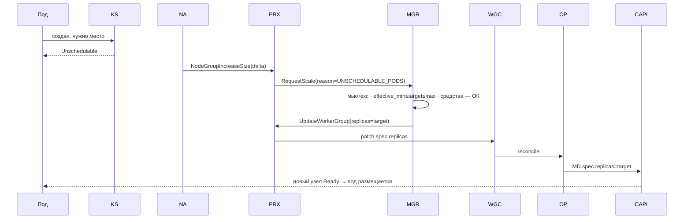

**Что видит клиент:** под какое-то время был `Pending`, затем поехал; счёт вырос на один узел в день
(§О2 биллинг).

### А2. Пик нагрузки, `requests` заданы, группа уже на `max_nodes`

**Условие:** то же самое, но группа уже достигла оплаченного потолка.

**Порядок действий:**
1–4. Как в А1.
5. Manager: `target > max_nodes` → `REJECTED`, `reason_code=AT_MAX_NODES`.
6. `AutoscalerService` возвращает `node-autoscaler` ошибку.
7. Ни `replicas`, ни `Machine` не меняются.

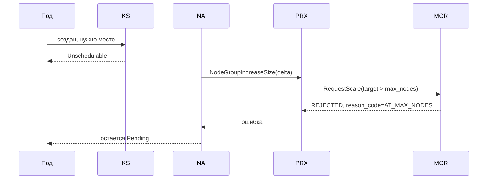

**Что видит клиент:** под остаётся `Pending`; событие/причина `AT_MAX_NODES`
([основной документ §3.4](K8S-728-signal-based-autoscaling.md#34-reason-коды-для-ui-почему-не-скейлится-уже-запрошено-продуктом)).
Это не сбой — оплаченный предел работает так, как обещан.

### А3. Пик нагрузки, но `requests` у пода не заданы

**Условие:** контейнер без `resources.requests` (`BestEffort`).

**Порядок действий:**
1. `kube-scheduler` вычисляет требование пода как 0 (нет `requests`) и размещает его на первый
   подходящий узел независимо от реальной загрузки.
2. `Unschedulable` не выставляется никогда.
3. `node-autoscaler` не видит события, действий не предпринимает.

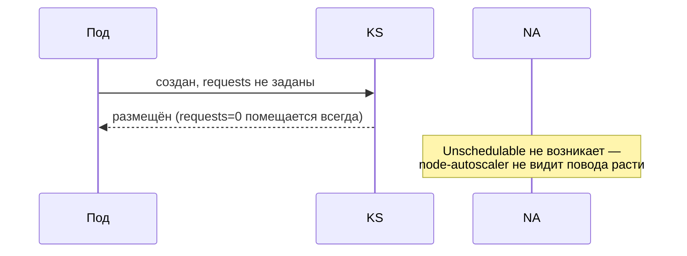

**Что видит клиент:** нагрузка на существующих узлах растёт, новые узлы не появляются, приложение
тормозит без видимой причины скейлинга. Разобрано и обосновано в
[основном документе §2.4](K8S-728-signal-based-autoscaling.md#24-пределы-движка-реактивность-и-отсутствие-requests) —
известное, задокументированное ограничение, не входит в объём исправления этим документом.

### А4. Высокая реальная нагрузка без `requests`, метрический пол это обнаруживает

**Условие:** тот же случай, что А3, но реальная утилизация группы (по факту, не по заявкам)
устойчиво высокая.

**Порядок действий:**
1. Cron читает загрузку группы через `svc-statistic`/VictoriaMetrics.
2. Cron пишет `autoscale_metric_floor_nodes` (своя колонка, свой писатель).
3. На очередном reconcile-цикле `node-autoscaler` опрашивает `NodeGroupMinSize()`.
4. `AutoscalerService` отдаёт `effective_min = min(max(min_nodes, metric_floor), max_nodes)` — выше,
   чем раньше.
5. `node-autoscaler` видит `TargetSize < effective_min`, при включённом
   `--enforce-node-group-min-size` сам доращивает группу — **без единого Pending-пода**.
6–10. Дальше тот же путь, что А1 шаги 3–9, только `reason=METRIC_FLOOR`.

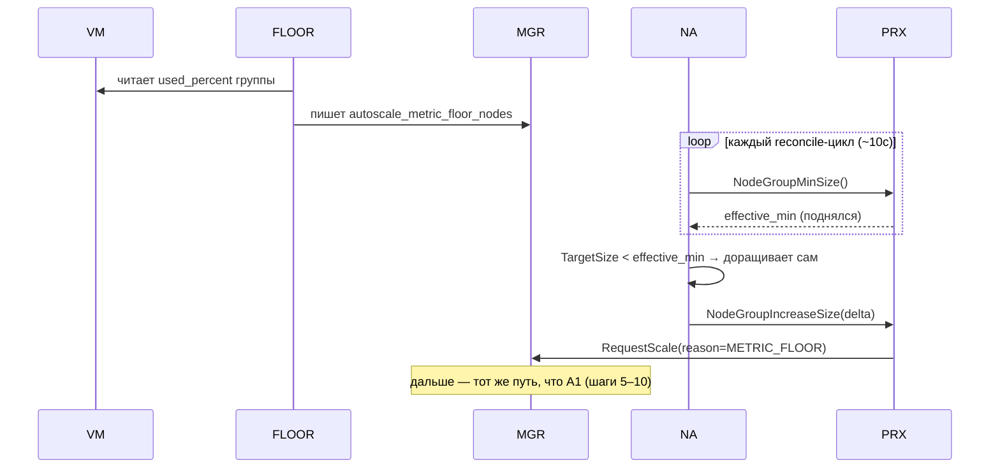

**Что видит клиент:** узлы появляются без видимого триггера («без Pending-подов») — это ожидаемо и
единственный способ закрыть А3 частично; полностью А3 не закрывается (нет роста выше того, что
метрики способны заметить как «нагрузку», а не «заявку»). Механика и обоснование обязательности
флага —
[основной документ §2.2](K8S-728-signal-based-autoscaling.md#22-разделение-ответственности-пол-и-число).

### А5. Клиент заблокирован за неуплату

**Условие:** любой из триггеров роста (А1 или А4) срабатывает у клиента с `INSUFFICIENT_FUNDS`.

**Порядок действий:**
1–4. Как в А1 или А4, в зависимости от триггера.
5. Manager: `CustomerBalanceChecker` — клиент заблокирован → `REJECTED`,
   `reason_code=INSUFFICIENT_FUNDS`, **до** обращения к CAPI.

Это отдельная, более ранняя линия защиты — она **не** останавливает уже работающие узлы и не
взаимодействует с механизмом остановки (см. А7). Она только не пускает новый запрос на рост, пока
клиент заблокирован.

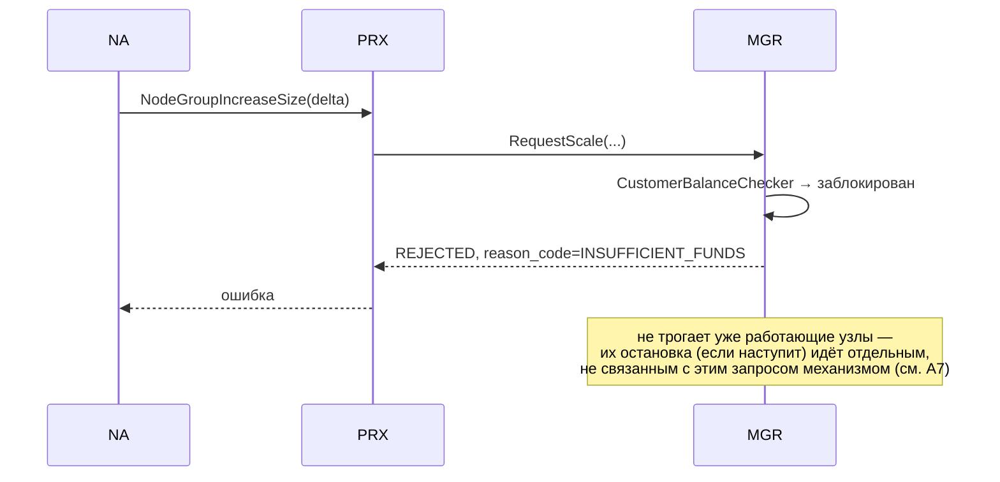

**Что видит клиент:** под остаётся `Pending` либо пол не достигается; причина —
`INSUFFICIENT_FUNDS`. Обоснование —
[основной документ §5.3](K8S-728-signal-based-autoscaling.md#53-пересечение-с-блокировкой-за-неуплату).

### А6. Устойчивый отказ роста включает backoff, который также блокирует реактивный рост

**Условие:** А5 повторяется несколько циклов подряд (деньги так и не появились).

**Порядок действий:**
1. Очередная попытка (см. А5) завершается ошибкой.
2. `node-autoscaler` (штатный код CA) вызывает `RegisterFailedScaleUp`.
3. `clusterStateRegistry` включает backoff **для всей node group**: первая пауза 5 минут, до 30 минут
   при повторных отказах, сброс через 3 часа без новых ошибок.
4. На следующих reconcile-циклах `IsNodeGroupReadyToScaleUp` видит backoff и пропускает попытку —
   к `AutoscalerService` вообще не обращается, ни за метрический пол, ни за настоящий Pending-под.
5. По истечении окна backoff — новая попытка (снова с шага 1 сценария А5, если деньги так и не
   появились).

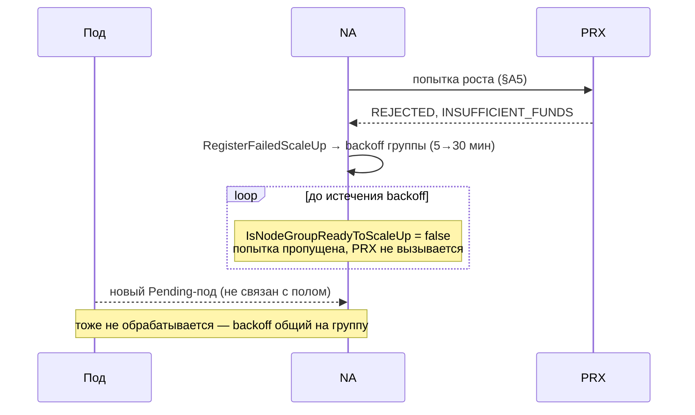

**Что видит клиент:** до 30 минут группа не реагирует даже на настоящий, не связанный с полом
Pending-под — потому что причина отказа (деньги) для CA не различается по источнику запроса.
Дефолты и провенанс — основной документ, §2.2.

### А7. Клиент заблокирован — уже работающие узлы останавливаются внешним механизмом

**Условие:** неуплата дошла до реальной блокировки клиента (не только отказа новым `RequestScale`,
как в А5).

**Порядок действий:**
1. Биллинг выставляет `ClusterClaim.spec.extraEnvs.begetCltSuspend=true`.
2. **Внешние механизмы** (не `RequestScaleAction`, не `node-autoscaler`, не что-либо из этого
   документа) останавливают все узлы арендатора.
3. `replicas`/`desired_node_count` в БД и в `WorkerGroupClaim.spec` при этом **не меняются** —
   узлы не удаляются, а именно останавливаются.
4. Что дальше видит и как реагирует `node-autoscaler` (теряет ли доступ к apiserver клиентского
   кластера, пытается ли что-то предпринять над остановленными, но формально существующими узлами)
   — **не проверено**, открытый вопрос §О10 основного документа.

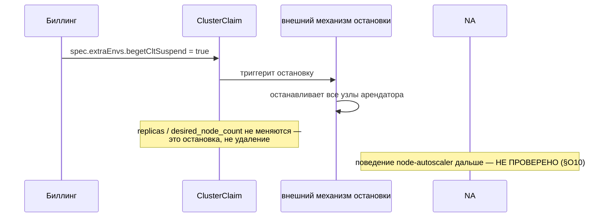

**Что видит клиент:** узлы перестают отвечать; счёт продолжает считаться от `desired_node_count`
(остановка — не удаление, число узлов в биллинге не падает само по себе). Этот механизм полностью
внешний по отношению к автоскейлингу — ни `RequestScaleAction`, ни `node-autoscaler` его не вызывают
и не участвуют в нём.

---

## Б. Уменьшение числа узлов

### Б1. Нагрузка спала, `requests` заданы, PDB/affinity разрешают освободить узел

**Условие:** узел по симуляции CA (на `requests`, не на реальной загрузке) недогружен, и все его
поды можно безопасно переразместить.

**Порядок действий:**
1. `node-autoscaler` на очередном цикле классифицирует узлы группы как «unneeded» — для каждого
   кандидата, **до** кордона и дренажа, проверяет `size − deletionsInProgress ≤ effective_min`
   (`verifyMinSize`, §2.2 основного документа): если удаление опустило бы группу до/ниже пола —
   узел исключается из списка кандидатов немедленно, дальше не идёт.
2. Узел X проходит эту проверку (в группе достаточно узлов выше `effective_min`), PDB/affinity тоже
   разрешают.
3. `node-autoscaler` кордонирует и тейнтит узел X.
4. `node-autoscaler` эвиктит поды узла X (Pod Eviction API, с учётом PDB).
5. `node-autoscaler` → `NodeGroupDeleteNodes([X])` на `AutoscalerService`.
6. `AutoscalerService` помечает `Machine` X аннотацией `cluster.x-k8s.io/delete-machine`.
7. `AutoscalerService` → `RequestScale(target=current-1, reason=CONSOLIDATION)`.
8. Manager одобряет, пишет `desired_node_count`, зовёт `UpdateWorkerGroup`.
9. `svc-k8s-proxy` → `WGC.spec.replicas`, оператор → `MachineDeployment.spec.replicas`.
10. `MachineSet` выбирает `Machine` X (аннотирована) первой и удаляет её.
11. Machine-контроллер CAPI дренирует X ещё раз — узел уже пуст, безобидный no-op.
12. `AutoscalerService` отвечает `node-autoscaler` успехом.

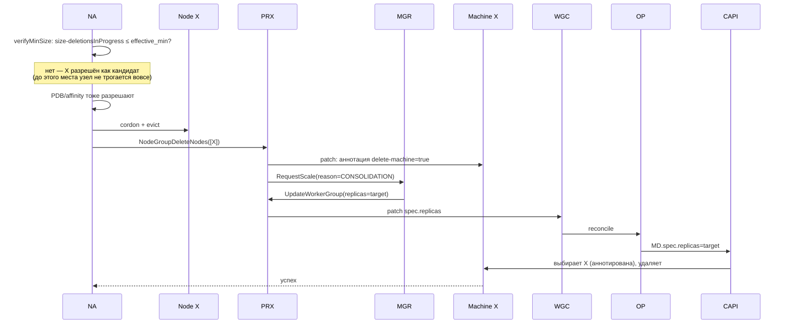

**Что видит клиент:** число узлов и счёт уменьшаются автоматически, без вмешательства.

### Б2. Нагрузка спала, но ни один узел не проходит проверки безопасности

**Условие:** PDB, anti-affinity, локальные тома или другие ограничения не дают CA безопасно убрать
ни один узел, хотя по `requests` группа выглядит недогруженной.

**Порядок действий:**
1. `node-autoscaler` на очередном цикле проверяет каждый узел группы как кандидата.
2. Для всех узлов симуляция переразмещения находит блокирующее ограничение (PDB/anti-affinity/PV).
3. Ни один узел не проходит — `node-autoscaler` не вызывает ни `DeleteNodes`, ни что-либо ещё.

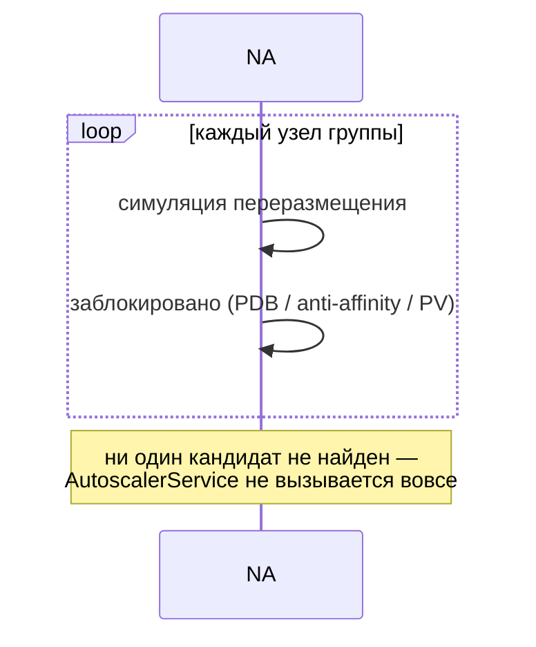

**Что видит клиент:** число узлов и счёт не уменьшаются, несмотря на видимо низкую нагрузку.
Известное, а не скрытое ограничение — стоит явно объяснять в поддержке через reason-код
`SCALE_DOWN_BLOCKED` ([основной документ §3.4](K8S-728-signal-based-autoscaling.md#34-reason-коды-для-ui-почему-не-скейлится-уже-запрошено-продуктом)).

**Обхода нет — ни автоматического, ни ручного, сегодня.** Кнопка «Удалить узел» (В2) эту ситуацию
не решает: она не проверяет PDB заранее, и попытка удалить именно такой узел приведёт не к успеху,
а к узлу, зависшему в `Terminating` (В2, §О11 основного документа). Если клиент сам выставил PDB,
делающие группу несжимаемой, и одновременно понизил `max_nodes` — платформа сегодня не может
удовлетворить оба условия сразу. Известное ограничение, не входит в объём этой задачи.

### Б3. Нагрузка спала, метрический пол опущен

**Условие:** cron снижает `autoscale_metric_floor_nodes`.

**Порядок действий:**
1. Cron видит снижение реальной загрузки, пишет более низкое значение
   `autoscale_metric_floor_nodes`.
2. На следующем опросе `AutoscalerService` отдаёт более низкий `effective_min`.
3. Это **только снимает ограничение** — само по себе не вызывает ни одного действия.
4. Реальное решение убрать узел по-прежнему принимает `node-autoscaler` своим обычным циклом
   консолидации — см. Б1 (сработает, если найдёт кандидата) или Б2 (не сработает, если нет).

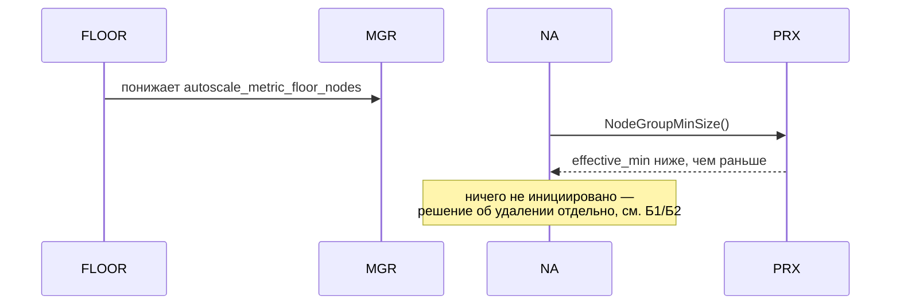

**Что видит клиент:** число узлов может остаться прежним даже после видимого снижения нагрузки, если
CA не находит безопасного кандидата (Б2) или requests не позволяют это увидеть (аналог А3, но для
downside). Обоснование —
[основной документ §2.2](K8S-728-signal-based-autoscaling.md#22-разделение-ответственности-пол-и-число).

### Б4. Клиент вручную меняет `min`/`max` одновременно с работой cron'а

**Условие:** клиент в UI поднимает `max_nodes`, в тот же момент cron пересчитывает
`autoscale_metric_floor_nodes`.

**Порядок действий (два независимых потока, без координации между собой):**
1. Клиент → `UpdateConfigurationAction` (существующий внешний путь) → пишет `autoscale_max_nodes`.
2. Параллельно cron → пишет `autoscale_metric_floor_nodes` (другая колонка).
3. Оба значения независимо доезжают до `WGC.spec` через `UpdateWorkerGroup`.
4. `AutoscalerService` при следующем опросе читает **оба** актуальных значения и считает
   `effective_min`/`max_nodes` из них — в любом порядке прихода изменений.

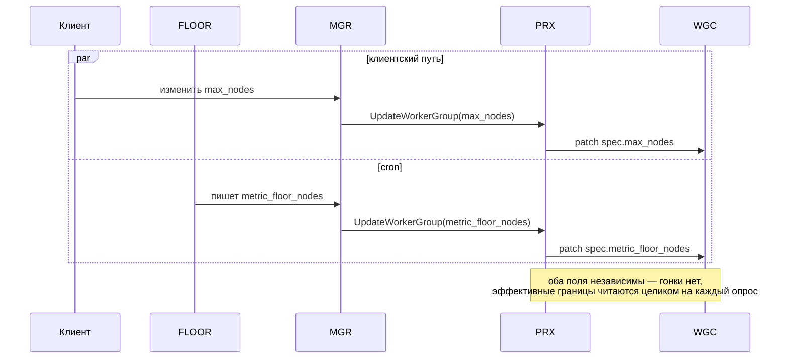

**Что видит клиент:** оба изменения применяются корректно, независимо от порядка. Разобрано в
[основном документе, §О1 (закрыт)](K8S-728-signal-based-autoscaling.md#8-открытые-вопросы).

### Б5. Клиент понижает `max_nodes` ниже текущего фактического числа узлов

**Условие:** в группе сейчас 10 узлов, клиент меняет потолок на 5.

**Порядок действий:**
1. Клиент → `UpdateConfigurationAction` → `autoscale_max_nodes=5`.
2. Значение доезжает до `WGC.spec.max_nodes` тем же путём, что и в Б4.
3. На следующем опросе `AutoscalerService` отдаёт `NodeGroupMaxSize()=5` — `node-autoscaler`
   немедленно перестаёт разрешать рост группы выше 5.
4. Существующие 10 узлов **не сносятся принудительно** — уменьшение возможно только обычным циклом
   консолидации (Б1/Б2), с той же PDB/affinity-проверкой, что и всегда.

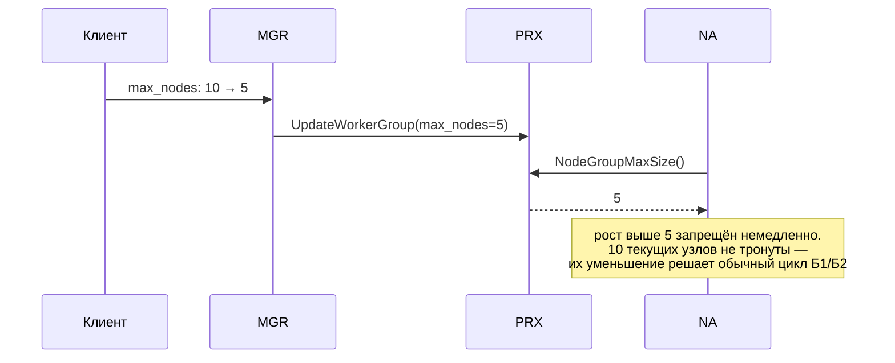

**Что видит клиент:** после понижения потолка счёт **не падает мгновенно** — только когда/если CA
сам решит убрать лишние узлы по своей обычной логике. Прямая симметрия сценария Б3 — та же
асимметрия, тот же принцип К5. Стоит явно проговорить в интерфейсе: «текущие узлы не будут
остановлены принудительно».

### Б6. Мониторинг находит сразу много кандидатов на удаление в одном цикле

**Условие:** нагрузка резко упала, и по симуляции CA сразу несколько узлов группы выглядят
недогруженными одновременно — а не один, как в Б1.

**Порядок действий:**
1. `node-autoscaler` классифицирует узлы группы, находит N кандидатов, недогруженных по `requests`.
2. Кандидатов проверяет **не по отдельности против исходного размера группы, а последовательно, с
   уменьшающимся счётчиком**: первый кандидат проверяется против текущего размера, если проходит —
   счётчик для этой группы уменьшается на 1 **до** проверки следующего кандидата.
3. Как только гипотетическое удаление довело бы группу до `effective_min` — все оставшиеся
   кандидаты в этом проходе отбрасываются, сколько бы их ни было, независимо от того, что
   по отдельности каждый из них выглядел «безопасным».
4. Дальше — Б1 для каждого одобренного узла из пункта 2.

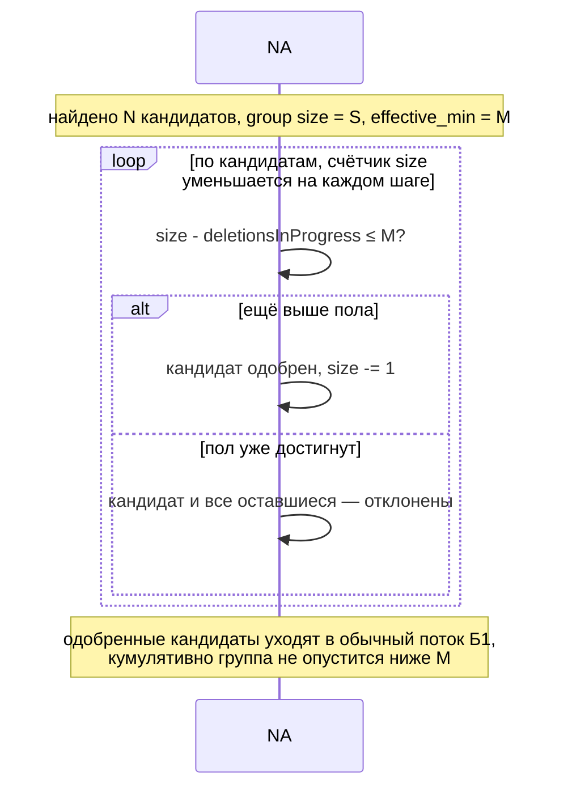

**Что видит клиент:** даже при резком одновременном обнаружении множества «лишних» узлов
консолидация в этом цикле остановится ровно на `effective_min`, а не выселит все найденные
кандидаты подряд. Механизм — проверено по коду, `pkg/core/scaledown/unneeded/nodes.go`
(`unremovableReason`), основной документ §2.2.

---

## В. Ручное управление конкретным узлом

### В1. Кнопка «Пересоздать узел» (уже существует, не меняется)

**Условие:** клиент считает конкретный узел сломанным и хочет его заменить, сохранив размер группы.

**Порядок действий:**
1. Клиент нажимает «Пересоздать узел X» → внешний API (`DeleteNodeAction`).
2. Manager → `NodeService::deleteNode()` → `proxy.DeleteNode(X)` (существующий RPC, не меняется).
3. `svc-k8s-proxy` получает `Machine` X и удаляет её напрямую — `replicas` не трогает.
4. `MachineSet` видит нехватку одной машины при неизменном числе реплик → создаёт новую `Machine`
   того же размера.

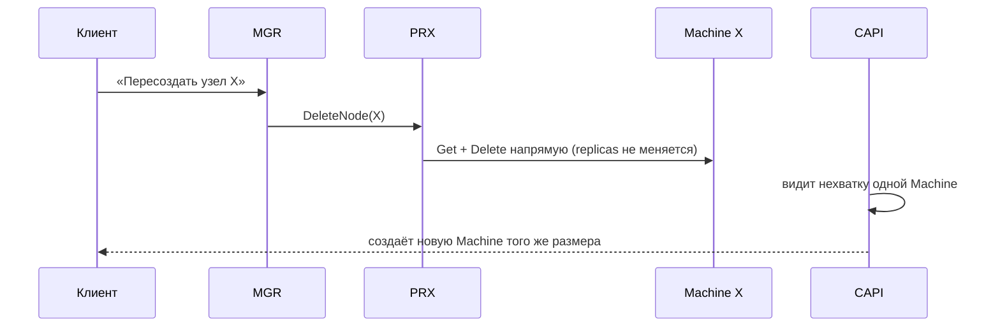

**Что видит клиент:** узел исчезает и почти сразу появляется новый того же размера; число узлов и
счёт не меняются.

### В2. Кнопка «Удалить узел» (новая возможность)

**Условие:** клиент хочет насовсем убрать конкретный узел, уменьшив размер группы.

**Порядок действий:**
1. Клиент нажимает «Удалить узел X» (новая кнопка) → manager.
2. Manager → `proxy.MarkNodeForDeletion(X, mark=true)` — новый RPC.
3. `svc-k8s-proxy` ставит аннотацию `cluster.x-k8s.io/delete-machine` на `Machine` X.
4. Manager, тем же путём, что ручное изменение конфигурации, уменьшает `desired_node_count` на 1 и
   зовёт `UpdateWorkerGroup(replicas=target)`.
5. `svc-k8s-proxy` → `WGC.spec.replicas`, оператор → `MachineDeployment.spec.replicas`.
6. `MachineSet` выбирает `Machine` X (аннотирована) первой.
7. Machine-контроллер CAPI (штатный, не наш код) дренирует узел X — **единственный** дренаж в этом
   потоке, CA не участвует, доступ бэкенда в клиентский кластер для этого не требуется.
8. `Machine` X удаляется, инфраструктура снесена (вне объёма).

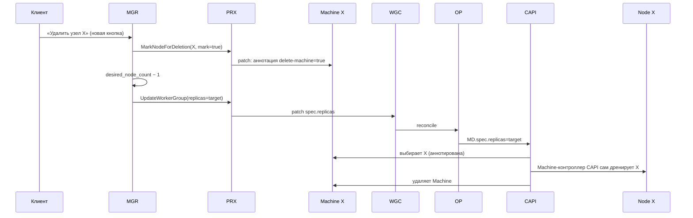

**Что видит клиент:** число узлов и счёт уменьшаются на единицу; это новая возможность, которой
сегодня не существует ([О5, закрыт](K8S-728-signal-based-autoscaling.md#8-открытые-вопросы)).

**Риск, который стоит знать заранее.** В2 не проверяет заранее, отпустит ли PDB выбранный узел —
в отличие от пути CA (Б1), у него нет предварительной симуляции. Если на узле X есть
PDB-заблокированные поды, шаг 7 не завершится: узел зависнет в `Terminating` бессрочно, а
`desired_node_count` (шаг 4) уже уменьшен — платформа в этот момент недосчитывает реально
работающую инфраструктуру. Известное ограничение, не решено этим документом
([О11 основного документа](K8S-728-signal-based-autoscaling.md#8-открытые-вопросы)) — до фичи с
CSI и пересмотра `nodeDrainTimeout` администраторами платформы этот риск сохраняется для любого
узла с PDB, а не только в намеренном сценарии Б2.

---

## Г. Эксплуатационные и краевые случаи

### Г1. `node-autoscaler` недоступен для конкретного арендатора

**Условие:** per-tenant инстанс упал или ещё не задеплоен.

**Порядок действий:**
1. `kube-scheduler` продолжает штатно выставлять `Unschedulable`, если подов не хватает.
2. Смотреть на это некому — `node-autoscaler` этого арендатора не работает.
3. Число узлов остаётся на последнем значении, пока инстанс не поднимется снова.
4. Ручной путь (`UpdateConfigurationAction` → `RequestScale` в нём не участвует) продолжает работать
   независимо — он не проходит через `node-autoscaler` вовсе.

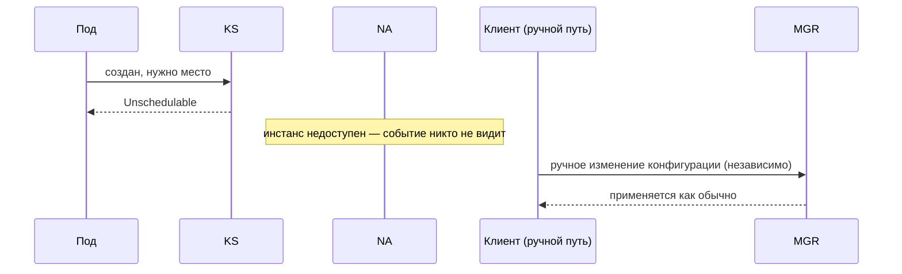

**Что видит клиент:** число узлов зафиксировано на последнем значении; ручное изменение через API/UI
продолжает работать как сегодня.

### Г2. `svc-k8s-proxy` (`AutoscalerService`) или `svc-k8s-manager` (`RequestScaleAction`) недоступны

**Условие:** один из этих двух cluster-wide компонентов упал.

**Порядок действий:**
1. `node-autoscaler` любого арендатора пытается вызвать `NodeGroupIncreaseSize`/`NodeGroupDeleteNodes`.
2. Соединение или вызов завершается ошибкой (недоступность, таймаут).
3. `node-autoscaler` регистрирует неудачу, включает backoff по тому же механизму, что А6.
4. Ничего не меняется молча — fail-safe.

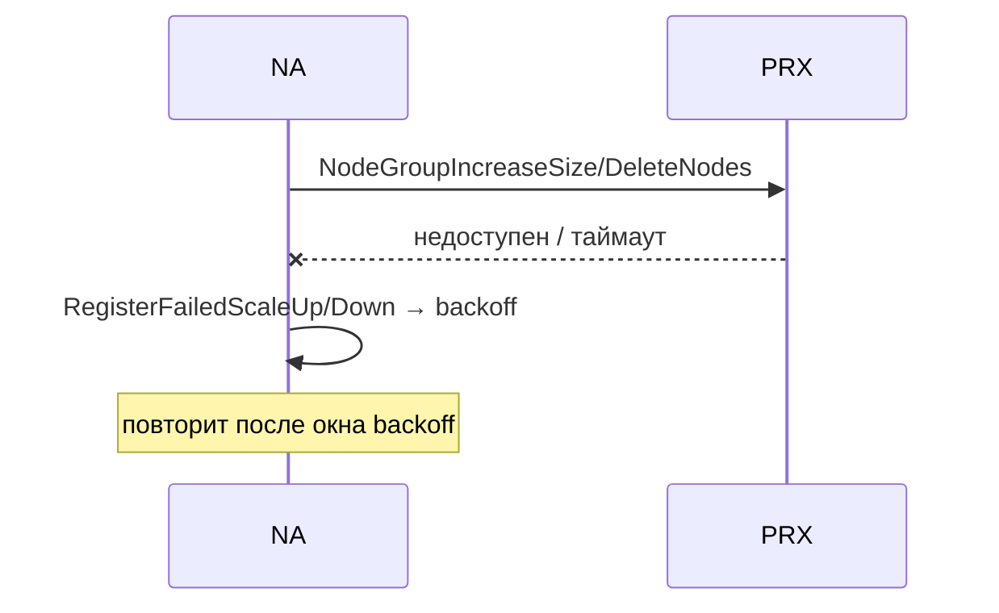

**Что видит клиент:** во время сбоя автоскейлинг встал для всех арендаторов сразу; ручной путь через
внешний API продолжает работать, он этим компонентам не пользуется. Полная таблица влияния —
[architecture-diagram.md §7](K8S-728-architecture-diagram.md#7-влияние-что-произойдёт-если-компонент-недоступен-или-скомпрометирован).

### Г3. Нестабильная, часто колеблющаяся нагрузка (churn)

**Условие:** нагрузка скачет так, что `RequestScale` вызывается часто в обе стороны за короткое
время.

**Порядок действий:**
1. Несколько `RequestScale` подряд (рост, затем падение, затем снова рост) за короткое окно.
2. Каждый одобренный запрос **сразу** меняет `desired_node_count` и вызывает `UpdateWorkerGroup` —
   без задержки.
3. Ни один из этих вызовов не создаёт и не обновляет billing-опцию — `RequestScaleAction` биллинг не
   трогает вовсе (§4.1 основного документа).
4. Отдельный, независимый по расписанию cron позже (по своему окну) сравнивает факт с текущей
   опцией и обновляет её **один раз**, если они разошлись.

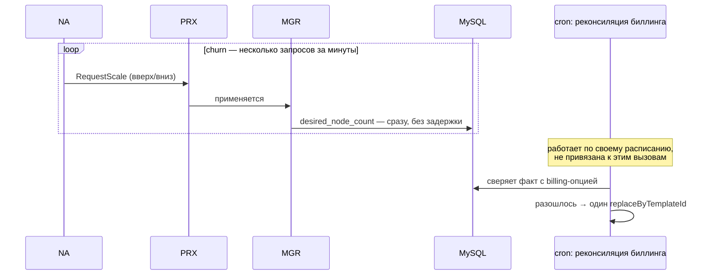

**Что видит клиент:** число узлов реагирует быстро и точно; в счёте/истории биллинга изменения
появляются с задержкой до окна реконсиляции, а не на каждое колебание.

### Г4. Новая `WorkerGroup` с включённым автоскейлингом, метрической истории ещё нет

**Условие:** группа только что создана, `autoscale_enabled=true`, cron ещё ни разу не считал
`autoscale_metric_floor_nodes` для неё.

**Порядок действий:**
1. Группа создаётся, `autoscale_metric_floor_nodes` — значение по умолчанию (0) из миграции.
2. `node-autoscaler` подключается и опрашивает `NodeGroupMinSize()`.
3. `effective_min = min(max(min_nodes, 0), max_nodes) = min_nodes` — метрической надбавки ещё нет.
4. Группа ведёт себя как «голый» CA: рост по Pending-подам (А1/А3/А4-без-пола), уменьшение — по
   обычной консолидации (Б1/Б2).
5. Когда cron впервые посчитает пол для этой группы, дальше — обычное поведение А4/Б3.

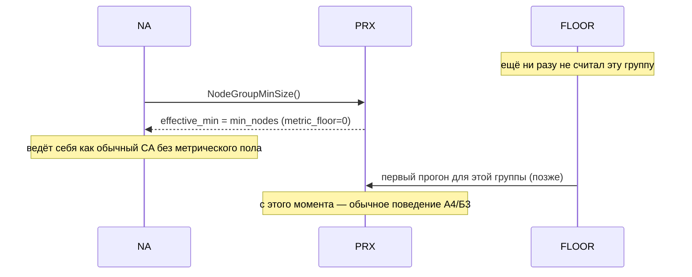

**Что видит клиент:** первое время после создания группы автоскейлинг работает как «голый» CA,
метрический пол подключается после первого цикла cron'а. Не требует отдельной обработки —
естественное следствие формулы `effective_min`.

---

## Источники

Все механизмы, на которые ссылается этот документ, обоснованы и проверены по коду в
[K8S-728-signal-based-autoscaling.md](K8S-728-signal-based-autoscaling.md) и
[K8S-728-architecture-diagram.md](K8S-728-architecture-diagram.md) — здесь они не переобосновываются,
только разложены по сценариям с явным порядком действий и диаграммой для каждого.
