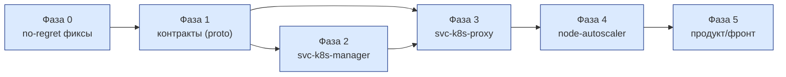

# K8S-728: перечень и порядок работ

Компаньон к [K8S-728-signal-based-autoscaling.md](K8S-728-signal-based-autoscaling.md) (механизм),
[K8S-728-architecture-diagram.md](K8S-728-architecture-diagram.md) (расположение) и
[K8S-728-user-scenarios.md](K8S-728-user-scenarios.md) (поведение). Здесь — **что конкретно делать,
в каком порядке и почему именно в этом порядке**: по каждому компоненту — текущее состояние,
ожидаемая функциональность после работы, что разработать, как сконфигурировать, обоснование.

Статус: черновик для обсуждения, синхронизирован с тремя другими документами на момент написания.

---

## Порядок фаз и почему именно такой

- **Фаза 0 первая и независимая**, потому что это баги, существующие уже сегодня в ручном пути —
  наслаивать новую логику (`RequestScale`, метрический пол) поверх сломанной валидации и
  деструктивной реконсиляции значит унаследовать их в новом коде и удвоить стоимость починки позже.
- **Фаза 1 блокирует всё остальное** — без стабильного контракта (какие поля, какой RPC) фазы 2 и 3
  писать не от чего оттолкнуться, они будут переделывать интерфейсы друг под друга.
- **Фазы 2 и 3 параллелятся** после фазы 1: manager можно разрабатывать и тестировать заглушкой
  вместо `svc-k8s-proxy`, а `svc-k8s-proxy` — заглушкой вместо CA. Они сходятся только на реальном
  вызове между собой.
- **Фаза 4 последняя из технических**, потому что `node-autoscaler` — потребитель контракта, а не
  его источник: без готового `AutoscalerService` тестировать его попросту не на чем.
- **Фаза 5 продуктовая и explicitly отложенная** — она не блокирует технический периметр (§6
  основного документа: фронт вне скоупа), но без её решений (О2, О6, О8) часть эксплуатационных
  параметров остаётся черновыми.

---

## Фаза 0 — no-regret фиксы (независимая, делать первой)

Существующие дефекты ручного пути, не связанные с автоскейлингом по своей природе, но
**блокирующие безопасное использование полей**, на которые опирается весь остальной план.

| Компонент | Текущее состояние | Ожидаемая функциональность | Что разработать | Почему первым |
|---|---|---|---|---|
| `svc-k8s-manager`, `Updater.php:109-110` | Пишет `autoscale_min_nodes`/`autoscale_max_nodes` при update, но **не** `autoscale_enabled` | Выключение автоскейлинга через API работает | Добавить запись `autoscale_enabled` в `update`, аналогично `Creator.php:112` при `create` | Без этого поле `enabled` в новом контракте (`AutoscalingSpec`, фаза 1) бессмысленно расширять — выключить всё равно нельзя |
| `svc-k8s-manager`, валидаторы WG | Валидации `1 ≤ min ≤ max ≤ nodes_per_cluster_limit` **нет вообще** — `min > max` спокойно пишется в БД | Невалидная конфигурация не сохраняется | Проверка границ в обоих валидаторах (create/update), код ошибки `INVALID_AUTOSCALE_CONFIG` | `RequestScaleAction` (фаза 2) читает `min`/`max` из БД и доверяет им без переповторной проверки — если там может быть мусор, весь `effective_min` (§2.2 основного документа) ненадёжен |
| `svc-k8s-manager`, `InternalUpdater::saveNodes` | Деструктивно реконсилит: сетевая ошибка листинга машин от proxy превращается в пустой список → удаление **всех** строк `node` группы | Сбой листинга не приводит к потере данных о нодах | Отличать «машин нет» от «не удалось получить список» — не удалять при ошибке, только логировать и повторить | Автоскейлинг резко повышает частоту вызовов этого пути (рост/сжатие несколько раз в день вместо редких ручных изменений) — баг, который сегодня редко срабатывает, начнёт срабатывать часто |
| `svc-k8s-manager`, биллинг-исключения | `InsufficientFundsException` выбрасывается из середины транзакции | Отказ по средствам не оставляет группу в промежуточном состоянии | Вынести проверку средств до начала транзакции изменения | `RequestScaleAction` (фаза 2) переиспользует этот же стек — унаследованная незавершённая транзакция стала бы новым, более частым источником рассинхрона БД↔факт (§4 основного документа) |

---

## Фаза 1 — контракты

Три независимых proto-расширения. Делаются одним MR на файл (не по одному полю за раз — правило
`api0`: добавление второго поля отдельным MR дороже, чем сразу расширяемая структура).

| Контракт | Текущее состояние | Ожидаемая функциональность | Что разработать | Почему так |
|---|---|---|---|---|
| `api0/cloud/k8s-manager`, internal | Ручки обновления `WorkerGroup` нет вовсе (`WorkerGroupController` internal несёт только `find-all`/`find-one`) | `RequestScaleRequest{cluster_id, worker_group_id, target_replicas, reason, request_id}` → `RequestScaleResponse{accepted_replicas, state, reason_code}` | Новое internal-сообщение и RPC, `state ∈ {ACCEPTED, CLAMPED, REJECTED}` | `request_id` — идемпотентность при повторной доставке; `reason` — для аналитики и reason-кодов в UI (§3.4 основного документа) |
| `api0/cloud/k8s-proxy`, `WorkerGroupService` | `DeleteNode` есть, точечного «пометить на удаление» нет | Новый RPC `MarkNodeForDeletion(meta, mark: bool)` | Тонкая обёртка над `Service.MarkMachineForDeletion` (фаза 3) | Общий примитив для CA (внутренний вызов в процессе) и для будущей кнопки «удалить узел» (внешний RPC от manager'а) — §3.5 основного документа |
| `api0/cloud/k8s-proxy`, `workerGroup.proto`, `UpdateWorkerGroupRequest` | Несёт только `int32 replicas` — `AutoscalingSpec` не доезжает до кластера вовсе | Пятиполевая структура: `enabled`, `min_nodes`, `max_nodes` — редактируются клиентом; `metric_floor_nodes` — пишет только cron, не выставляется во внешнем контракте | Новое сообщение `AutoscalingSpec`, добавлено полем в `UpdateWorkerGroupRequest`; в `WorkerGroupClaim.spec` едет как есть, `effective_min` считает `svc-k8s-proxy` при чтении (фаза 3) | §6 основного документа — предпосылка для любого использования `min`/`max`, включая ручное; `metric_floor_nodes` — резолюция О1 |
| MySQL, `worker_group` | Нет колонки под метрический пол | Новая колонка `autoscale_metric_floor_nodes`, пишет только cron (фаза 2) | Миграция, аналогичная существующим `autoscale_min_nodes`/`autoscale_max_nodes` | Отдельная колонка — то, что делает О1 закрытым без общего мьютекса (§2.2) |

---

## Фаза 2 — `svc-k8s-manager`

Можно разрабатывать и тестировать без готового `svc-k8s-proxy`/`node-autoscaler` — заглушкой на месте
исходящих вызовов к proxy.

| Компонент | Текущее состояние | Ожидаемая функциональность | Что разработать | Как сконфигурировать | Почему |
|---|---|---|---|---|---|
| `RequestScaleAction` (новый, internal `WorkerGroupController`) | Не существует | Принимает запрос от proxy, валидирует против `effective_min` (не сырого `min_nodes` — §3.3 основного документа) и одобряет/отклоняет/урезает изменение `replicas` | Переиспользует `WorkerGroupServiceFactory`, `SharedMutexTrait`, `PriceFetcher`/`BillingServiceFactory` — тот же стек, что `UpdateConfigurationAction`, но без `CustomerID` из сессии: клиент группы находится по `cluster_id`/`worker_group_id` из запроса | — | Один и тот же путь одобрения для ручного и автоматического скейла — биллинг корректен «бесплатно» (Идея документа целиком, §3.3) |
| Реконсиляция биллинга (полный декаплинг от `RequestScale` — **выбранный вариант, §4.1 основного документа**, альтернативы там же) | `replaceBilling` вызывается синхронно на каждое изменение — при частых автоматических запросах это шторм `customerOption` | Сам скейл применяется мгновенно; биллинг-опция синхронизируется периодически, по факту; ручной путь клиента (`UpdateConfigurationAction`) не тронут — биллит как сегодня, синхронно | Отдельный cron по образцу `UpdateBillingOptionsQuotaAction` (S3): факт → сверка с `count` текущей опции → `replaceByTemplateId`, только если разошлось и прошло окно дебаунса | Окно дебаунса — открытый параметр, порядок величины как у S3 (часы) — **О3, требует решения техкоманды** | `replaceByTemplateId` **всегда** создаёт новую опцию (проверено по коду `OptionReplacer.php`) — примитива «обновить на месте» нет, значит частота вызова — единственный рычаг против шторма |
| Метрический cron (пол) | Не существует | Периодически читает загрузку группы, пишет `autoscale_metric_floor_nodes` | Читает `svc-statistic` (существующий канал), пишет новую колонку напрямую — без мьютекса, без `SharedMutexTrait` (это и есть резолюция О1) | Период пересчёта — не в реальном времени, разумный порядок величины — минуты | §2.2 основного документа; отдельное поле снимает конфликт с ручным путём структурно |
| Новая возможность «удалить узел» (условно `RemoveNodeAction`) | `NodeService::deleteNode()` существует и корректен для семантики «Пересоздать узел» — не трогается | Постоянное уменьшение группы на конкретный узел | Новое действие: `MarkNodeForDeletion(mark=true)` к proxy → `desired_node_count - 1` через логику `RequestScaleAction`/`UpdateConfigurationAction` → откат (`mark=false`) при отказе | — | §3.5 основного документа, О5 (закрыт) — новая, а не переделанная возможность |

---

## Фаза 3 — `svc-k8s-proxy`

Зависит от контрактов фазы 1 и от того, что `RequestScaleAction` в manager'е уже готов принимать
вызовы (фаза 2) — тестируется против него напрямую.

| Компонент | Текущее состояние | Ожидаемая функциональность | Что разработать | Как сконфигурировать | Почему |
|---|---|---|---|---|---|
| `AutoscalerService` (новый gRPC-сервер, `externalgrpc`) | Не существует | Отвечает CA на весь набор RPC, нужный для роста и безопасного уменьшения | `NodeGroups`, `NodeGroupTargetSize`, `NodeGroupMinSize`/`MaxSize` (считает `effective_min`, §2.2), `NodeGroupIncreaseSize`, `NodeGroupDeleteNodes`, `NodeGroupNodes`, `NodeGroupGetOptions` (для О8), опционально `PricingNodePrice`. Остальные RPC — `Unimplemented`, протокол это допускает | Слушает на адресе, который `node-autoscaler` (фаза 4) получает флагом `--cloud-provider-gid` | Один сервис на систему, без per-tenant разделения (proxy — cluster-wide, §2 architecture-diagram). **⚠️ О9, известная брешь без решения (§5.4 основного документа): канал `externalgrpc` не несёт идентичности арендатора — начинать эту строку нельзя без решения по скоупу** |
| `IncreaseSize`/`DeleteNodes` — обработка `CLAMPED` | — | Возвращает CA либо полный успех, либо ошибку — **никогда** частичное исполнение | `NodeGroupIncreaseSizeResponse`/`NodeGroupDeleteNodesResponse` пустые (проверено по proto) — реализация обязана быть всё-или-ничего | — | Иначе внутренний учёт CA (`nodeDeletionTracker`, ожидание узлов) разойдётся с реальностью незаметно — основной документ, §2.2 |
| `Service.MarkMachineForDeletion` (новый метод `internal/service`) | `Service.DeleteNode` существует, для «Пересоздать узел» не трогается | Ставит/снимает аннотацию `cluster.x-k8s.io/delete-machine` на `Machine` по имени узла | `Get` + `Patch` через тот же `Client`, что у `DeleteNode`; `mark=false` — компенсация при отказе | — | Общий примитив для CA (прямой вызов в процессе) и для `MarkNodeForDeletion` RPC (§3.5) |
| Исходящий gRPC-клиент к `svc-k8s-manager` | Не существует — proxy сегодня только сервер | Вызывает `RequestScale` при принятии решения от CA | Новое сетевое направление, первое в истории сервиса — требует отдельной сетевой политики (см. architecture-diagram §3, «свежая граница») | Адрес manager'а — конфигурация деплоя | Без этого `AutoscalerService` не сможет провести решение CA через биллинг |

---

## Фаза 4 — `node-autoscaler` (новый репозиторий)

Зависит от того, что `AutoscalerService` (фаза 3) уже отвечает на реальные вызовы.

| Компонент | Текущее состояние | Ожидаемая функциональность | Что разработать | Как сконфигурировать | Почему |
|---|---|---|---|---|---|
| Сборка | Не существует | Ядро `cluster-autoscaler` (`sigs.k8s.io/cluster-autoscaler`) + встроенный провайдер `externalgrpc`, без форка ядра | Отдельный репозиторий/образ, минимальная обвязка деплоя | — | Использовать штатный протокол как есть — не форкать CA (RND, обоснование выбора движка) |
| Флаги запуска | — | Реактивный рост по Pending, активный рост до пола, безопасное уменьшение | `--cloud-provider=externalgrpc`, `--cloud-provider-gid=<адрес AutoscalerService>`, **`--enforce-node-group-min-size=true`** (обязателен — без него пол не защищает от отсутствия `requests`, §2.2), `--kubeconfig=<клиентский кластер арендатора>` | Остальные (`--initial-node-group-backoff-duration` и т. п.) — дефолты CA, не переопределять без отдельного обоснования (О8) | Единственный флаг, без которого механика документа не работает как задумано — `--enforce-node-group-min-size` |
| Деплой | — | Per-tenant, в NS арендатора в системном кластере | Деплоймент/манифест по инстансу на арендатора, тот же паттерн размещения, что у существующих контроллеров ярусов | — | §2 architecture-diagram — периметр компрометации ограничен одним арендатором структурно |
| RBAC в клиентском кластере | Read-only `beget:metrics-reader` уже есть | Плюс cordon + `pods/eviction` — новое право | Новый узкий `ClusterRole`, отдельный от `metrics-reader`, не расширяющий права других контроллеров ярусов | — | §5.1 основного документа — CA сам дренирует узел перед вызовом `NodeGroupDeleteNodes`, обойти без форка нельзя |

---

## Фаза 5 — продукт и фронт (явно отложено, не блокирует технический периметр)

| Что | Статус | Блокирует |
|---|---|---|
| UI-контролы «диапазон узлов» (min/max) | Контракт готов с фазы 1, UI не реализован | Ничего технического — контракт самодостаточен |
| Кнопка «Удалить узел» (В2 в user-scenarios) | Бэкенд готов с фазы 2–3 | Ничего технического |
| Reason-коды в интерфейсе поддержки | Коды определены (§3.4 основного документа) | Ничего технического |
| О2 — гранулярность тарификации elastic-узлов | Открыт, нужно решение продукта+биллинга | Ничего блокирует — черновой ответ («по пику дня») уже совместим с фазой 2 |
| О6 — упреждающий запас (буфер) сверх пола | Открыт, конфликтует с К1, решение — через отдельный аддон маркетплейса | Не входит в объём фаз 0–4 вовсе |
| О8 — стратегия `ScaleDownUtilizationThreshold`/`ScaleDownUnneededTime` через `NodeGroupGetOptions` | Открыт | Не блокирует MVP — `NodeGroupGetOptions` можно оставить `Unimplemented` до решения |

---

## Источники

Все решения, отражённые в этом перечне, обоснованы и проверены по коду в
[K8S-728-signal-based-autoscaling.md](K8S-728-signal-based-autoscaling.md) — здесь они не
переобосновываются, только разложены по компонентам и порядку.
